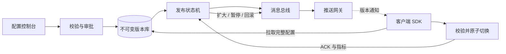

# 如何设计支持灰度的线上配置分发系统？

## 一句话回答

> 配置分发系统应以不可变版本为核心，服务端保存配置内容、版本、灰度规则和发布状态，通过长连接推送变更通知、客户端主动拉取完整配置的“推拉结合”方式保证及时性；客户端原子切换并回传版本，服务端根据实例标签分批灰度、观察指标、扩大范围或回滚，最终通过定期拉取和版本对账修复漏通知。

## 面试考察点

- 能否区分配置内容分发与变更通知。
- 是否理解只推送和只轮询各自的问题。
- 能否设计不可变版本、原子发布和回滚。
- 是否知道灰度需要稳定实例标识、规则快照和范围统计。
- 能否处理离线实例、网络分区、重复通知和乱序更新。
- 是否具备权限、审计、审批、验证和容灾意识。

## 需求和目标

系统需要支持：

- 配置修改后秒级通知在线微服务。
- 网络断开或通知丢失后最终能够收敛到正确版本。
- 按服务、环境、机房、实例、标签或百分比灰度。
- 灰度期间稳定命中同一批实例。
- 支持暂停、继续、扩大范围和一键回滚。
- 客户端配置应用失败时保留旧版本。
- 查询每个实例当前使用的版本。
- 完整权限、审批和操作审计。

还需要定义不同配置的一致性级别。日志级别可以最终一致，支付开关等关键配置可能要求更严格的发布确认和失败熔断。

## 总体架构



```text
管理控制台 / OpenAPI
        ↓
权限、审批、校验
        ↓
配置管理服务
  ├── 配置版本库
  ├── 灰度规则与发布状态机
  ├── 发布审计
  └── 版本查询
        ↓ 发布事件
消息总线 / 变更日志
        ↓
推送网关集群 ── 长连接 ── 客户端 SDK
                           ├── 收到通知
                           ├── 拉取配置
                           ├── 本地校验
                           ├── 原子切换
                           ├── 持久化快照
                           └── 回传 ACK 与指标
```

## 为什么采用推拉结合

### 只使用推送的问题

推送配置全文会让服务端维护复杂重试状态，网络中断时容易漏消息；大配置还会占用长连接带宽。客户端收到半包、重复或乱序内容时处理复杂。

### 只使用定时拉取的问题

轮询间隔决定延迟。为了秒级生效而高频轮询，会给服务端带来大量空请求；间隔过长又无法及时更新。

### 推荐方案

服务端只推送轻量通知：

```json
{
  "namespace": "order-service",
  "environment": "prod",
  "version": 1024,
  "checksum": "sha256:...",
  "releaseId": "rel-20260722-001"
}
```

客户端收到后使用普通 HTTP/gRPC 拉取目标版本全文。若通知丢失，定期轮询版本号或重连时对账仍能发现更新。

## 配置数据模型

### Namespace

按应用和功能划分配置命名空间，例如：

```text
prod/order-service/database
prod/order-service/feature-flags
prod/order-service/rate-limit
```

权限、发布和订阅都以 Namespace 为边界，避免一个巨大配置文件导致无关服务全部刷新。

### 不可变版本

每次修改生成新版本，已发布版本不可原地覆盖：

```text
Version 1021 → Version 1022 → Version 1023
```

版本记录包含：

- 配置内容或内容地址。
- 内容哈希。
- 创建人、审批人和时间。
- 变更说明与工单。
- Schema 版本。
- 前一个版本。
- 敏感字段加密信息。

不可变版本让审计、回滚、缓存和客户端去重更加简单。

## 发布状态机

```text
DRAFT
  ↓ 校验和审批
READY
  ↓ 开始灰度
GRAY_RUNNING
  ├── 暂停 → PAUSED
  ├── 失败 → ROLLING_BACK
  └── 扩大 → FULL_RELEASING
                 ↓
             COMPLETED
```

所有状态迁移使用数据库条件更新或版本号，避免两个管理员同时发布造成状态覆盖。

## 配置发布流程

1. 用户创建草稿并提交配置。
2. 服务端执行语法、类型、Schema 和业务规则校验。
3. 展示与当前版本的 Diff 和影响范围。
4. 高风险配置进入双人审批或工单流程。
5. 生成不可变目标版本和 Release ID。
6. 创建灰度规则快照，计算目标实例集合。
7. 发布事件写入可靠事件表或消息队列。
8. 推送网关通知目标客户端。
9. 客户端拉取、校验、应用并回传 ACK。
10. 服务端根据成功率和监控决定扩大、暂停或回滚。

## 灰度规则怎么设计

支持组合条件：

- 应用和环境。
- 机房、Region、Zone。
- 实例 ID 或 IP 白名单。
- 集群、泳道或 Kubernetes Label。
- 实例版本。
- 稳定百分比。

```json
{
  "service": "order-service",
  "environment": "prod",
  "conditions": {
    "zone": ["cn-shanghai-a"],
    "labels": { "releaseLane": "gray" }
  },
  "percentage": 10
}
```

## 百分比灰度如何稳定命中

不能每次随机选择 10%，否则实例重连或服务端重算后目标集合不断变化。使用稳定哈希：

```text
bucket = hash(releaseId + instanceId) % 10000
命中条件：bucket < grayPercentage × 100
```

同一 Release 下实例结果稳定，扩大从 10% 到 30% 时，原 10% 仍然保留。若希望跨发布始终固定一组测试实例，可以改用应用 ID 与实例 ID 计算，或明确设置灰度标签。

## 实例身份怎么确定

客户端注册时上报：

- 应用 ID、环境和集群。
- 稳定 Instance ID。
- Region、Zone、IP 和主机名。
- 应用版本和 SDK 版本。
- Kubernetes Pod、Deployment、标签。
- 当前配置版本。

Pod 名称可能随重建变化，若灰度要求实例重启后仍保持稳定，需要使用 Deployment、泳道或业务实例标识，而不是只依赖临时 Pod UID。

## 长连接推送怎么实现

可以使用 gRPC Streaming、WebSocket、SSE 或长轮询。配置中心常使用长轮询，因为实现和代理兼容性较好；大规模低延迟场景可以使用专用推送网关维持连接。

推送网关无状态化：客户端可连接任意节点，订阅关系保存在本地并通过一致性哈希、共享注册中心或事件广播让发布触达所有网关。

## 推送通知是否需要逐条可靠

通知可以重复，也可能丢失。客户端以版本号为准：

- 通知版本等于当前版本：忽略。
- 通知版本小于当前版本：说明乱序，忽略。
- 通知版本大于当前版本：拉取目标版本。

最终一致性由定期版本检查、重连全量对账和服务端实例版本巡检保证。这样不必为每条短暂通知建立永久强一致投递。

## 客户端 SDK 应用流程

```text
收到版本通知
   ↓
拉取目标版本与元数据
   ↓
校验哈希、签名、Schema
   ↓
解析为新配置对象
   ↓
执行本地预检查
   ↓
原子替换当前配置引用
   ↓
执行变更监听器
   ↓
持久化本地快照并回传 ACK
```

不能边下载边修改正在使用的 Map。应构造完整不可变配置对象，校验成功后一次交换引用，确保业务线程只能看到旧版本或新版本，不会看到半更新状态。

## 客户端监听器失败怎么办

配置更新可能要求重建连接池、刷新线程池或切换路由。SDK 将应用过程分为：

1. Parse：解析配置。
2. Validate：业务校验。
3. Prepare：准备新资源。
4. Commit：原子切换。
5. Cleanup：异步释放旧资源。

Prepare 失败继续使用旧配置并回报失败。Commit 后 Cleanup 失败不应回滚业务配置，但要告警并重试清理。

## 配置是否都支持热更新

不是。配置应标记应用模式：

- Dynamic：可以运行时原子更新。
- Restart Required：保存新版本，但实例重启后生效。
- Immutable：线上禁止修改。

例如部分 JVM 启动参数和底层端口无法安全热更新。配置中心不能假装所有配置都能动态生效。

## ACK 回执设计

客户端回传：

```json
{
  "instanceId": "order-prod-001",
  "releaseId": "rel-20260722-001",
  "targetVersion": 1024,
  "status": "APPLIED",
  "appliedAt": "2026-07-22T10:00:02Z",
  "checksum": "sha256:...",
  "errorCode": null
}
```

状态可以包括 RECEIVED、DOWNLOADED、VALIDATED、APPLIED、FAILED。大规模实例不一定保存每个阶段的永久明细，可以保存最终状态并把过程事件发送到日志系统。

## 如何判断灰度成功

不能只看 ACK 成功。还要观察目标实例的业务指标：

- 错误率和超时率。
- P95/P99 延迟。
- CPU、内存、线程和连接池。
- 下游调用成功率。
- 配置相关业务指标。
- 与对照组的差异。

发布系统可设置自动门禁：连续观察 10 分钟，错误率不超过阈值且 ACK 成功率达到 99%，才允许扩大范围。

## 灰度扩大策略

```text
指定测试实例
    ↓
1% 实例
    ↓ 观察
10% 实例
    ↓ 观察
30% 实例
    ↓ 观察
100% 全量
```

每一阶段保存目标范围快照和指标。扩大发布是同一个 Release 的范围变化，不应重新生成内容版本，否则很难确认不同实例使用的是不是同一份配置。

## 回滚怎么设计

回滚不是修改当前版本内容，而是创建一个新 Release，把目标版本指向上一份已验证配置：

```text
当前 Version 1024 有问题
        ↓
创建 Rollback Release
目标内容 = Version 1023
        ↓
按紧急策略推送所有受影响实例
```

仍要使用版本单调递增，例如发布序号 1025 的内容等于历史 1023。客户端只接受更大的发布序号，避免乱序消息把配置再次切回错误版本。

## 离线实例和新启动实例

离线实例重新连接时，上报当前版本，服务端根据它的标签和当前发布规则返回应使用的目标版本。

新启动实例不能只从镜像内置默认配置启动后再等待推送。应先从本地快照或配置中心获得可用配置，再进入 Ready 状态接收流量。

如果配置中心暂时不可用：

- 优先加载本地最后成功快照。
- 校验快照签名和过期策略。
- 对禁止使用过期配置的关键服务保持 Not Ready。
- 后台继续重连，不阻塞业务线程。

## 本地快照和容灾

客户端每次成功应用后，将完整配置和元数据原子写入本地文件：先写临时文件、fsync、再 rename。进程重启可以加载最近快照。

快照包含敏感数据时必须加密，并限制文件权限。过旧配置是否允许启动由 Namespace 策略决定。

## 服务端存储设计

关系数据库保存：

- Namespace 和权限。
- 配置版本与哈希。
- 发布单和状态机。
- 灰度规则快照。
- 审批和审计。

配置大对象可放对象存储，数据库保存地址与校验值。热点版本内容放缓存和 CDN，避免大量客户端同时回源数据库。

## 发布事件如何保证不丢

配置版本与发布事件使用 Transactional Outbox：同一数据库事务中写发布状态和待投递事件，后台投递消息总线。即使服务进程在提交后崩溃，事件仍可重试。

推送通知允许重复，网关和客户端按 Release ID、版本号幂等。

## 服务端高可用

- 管理服务和推送网关多实例部署。
- 数据库高可用并定期备份恢复演练。
- 消息总线多副本。
- 多机房部署并明确主发布 Region。
- 配置读取路径与管理写入路径隔离。
- 推送故障时客户端轮询兜底。

网络分区期间不同 Region 不能同时接受冲突发布。可以使用单 Leader、租约或共识存储串行化同一 Namespace 发布。

## 配置分发风暴

全量发布到 10 万实例时，所有客户端同时拉取会冲击服务端。解决方式：

- 通知和拉取增加小范围随机抖动。
- 版本内容使用 CDN 或分层缓存。
- 网关分批推送。
- 相同内容使用 ETag 和哈希去重。
- 客户端指数退避重试。
- 限制单 Namespace 同时发布数量。

灰度发布天然也能降低瞬时分发压力。

## 配置依赖和发布顺序

若多个服务配置存在依赖，例如服务端先支持新字段、客户端再启用，需要发布编排：

```text
先发布兼容代码
   ↓
确认所有服务支持新配置
   ↓
灰度启用新配置
   ↓
全量后清理旧字段
```

配置 Schema 应向后兼容。客户端遇到未知字段通常忽略，缺少字段使用安全默认值，但关键字段缺失必须拒绝应用。

## 敏感配置安全

- 密钥和密码在存储中加密。
- 传输使用 TLS 和双向身份认证。
- 客户端按应用身份只能读取授权 Namespace。
- 控制台展示敏感值时脱敏。
- 发布和读取记录审计日志。
- 密钥轮换使用双版本过渡，不直接瞬间替换。

配置中心拥有影响全站的能力，管理员权限必须最小化，并支持双人审批和紧急操作告警。

## 可观测性

核心指标包括：

- 发布到首个实例、50%、95%、99% 实例的延迟。
- 各版本实例数量和分布。
- ACK 成功率、失败原因和超时实例。
- 长连接数、重连率、通知积压。
- 拉取 QPS、缓存命中率和错误率。
- 灰度组与对照组业务指标差异。
- 使用过期本地快照的实例数量。

应能从 Release 页面直接查看“哪些实例还没更新、为什么失败、当前使用哪个版本”。

## 一个发布故障案例

某限流配置把单位从“每秒”误写成“每分钟”，语法校验通过但业务值异常。系统先灰度到 1% 实例，监控发现这些实例请求拒绝率明显高于对照组，自动暂停发布并触发回滚。回滚 Release 使用更高发布序号指向旧内容，30 秒内灰度实例恢复；随后增加业务规则校验，限制阈值变化不能超过原值的 50%。

这个案例说明语法正确不等于业务安全，灰度必须结合业务指标和自动门禁。

## 常见误区

- 只用 MQ 推送完整配置，不做客户端拉取和对账。
- 使用随机数每次重新选择 10% 灰度实例。
- 直接覆盖当前配置，没有不可变版本。
- 收到通知后逐项修改正在使用的 Map。
- ACK 成功就认为业务没有问题。
- 回滚使用旧版本号，导致客户端因版本倒退拒绝。
- 配置中心不可用时所有应用都无法启动。
- 所有配置都默认支持热更新。

## 核心考点清单

- 采用通知推送、内容拉取、定期对账的推拉结合模式。
- 配置版本不可变，发布状态通过 Release 状态机管理。
- 灰度使用实例标签和稳定哈希，扩大范围时保持原目标集合。
- 客户端完整校验后原子切换，失败继续使用旧版本。
- ACK 证明配置应用，业务指标决定灰度是否健康。
- 回滚创建更高发布序号并指向历史内容，避免版本倒退。
- 离线和漏通知通过重连对账、定期拉取和本地快照恢复。

## 高频追问与参考回答

### 追问 1：为什么不直接通过 Kafka 推送配置全文？

Kafka 适合传递变更事件，但客户端可能离线、重复或乱序消费。推送版本通知、客户端按版本拉取全文，更容易缓存、校验、重试和最终对账。

### 追问 2：怎么保证所有服务及时收到？

在线实例通过长连接秒级通知；通知丢失由定期版本检查和重连对账发现；服务端通过实例 ACK 和版本分布监控未更新实例并重试或告警。

### 追问 3：10% 灰度如何保证实例集合不变？

使用 `hash(releaseId + instanceId) % 10000` 计算稳定 Bucket。扩大百分比时阈值增加，原有实例仍在集合中。

### 追问 4：客户端更新一半失败怎么办？

客户端先构建完整新配置并完成校验与资源准备，最后原子交换引用。任何 Commit 前失败都继续使用旧版本并回传 FAILED，不会暴露半更新状态。

### 追问 5：回滚为什么还要使用更高版本号？

网络中可能存在旧通知。保持发布序号单调递增，客户端只接受更高序号，可以防止乱序消息把实例再次切回有问题的内容。

### 追问 6：配置中心挂了服务还能启动吗？

一般配置可加载本地最后成功快照并后台重连；关键配置可设置最大过期时间，超过后实例保持 Not Ready。策略由配置风险决定，不能统一强制启动或失败。

### 追问 7：灰度发布如何自动扩大？

每阶段设置观察时长、ACK 成功率和业务指标阈值。满足门禁后状态机自动扩大目标比例，异常则暂停或自动创建回滚 Release。

### 追问 8：如何避免十万实例同时拉取打垮配置中心？

使用分批通知、随机抖动、CDN 和多级缓存；客户端通过 ETag 与内容哈希避免重复下载，并采用指数退避而不是立即重试。

<!-- depth-standard:start -->
## 源码与实现定位

| 入口 | 阅读重点 |
| --- | --- |
| 不可变 config version/diff | 审计与回滚 |
| 客户端 applied_version | 收敛证据 |

源码或系统表应按上表顺序追踪：先确认入口实际走到哪条路径，再用运行时数据验证，而不是仅凭类名或配置推测。

## 参数配置与可复现实验

```text
version=20260723.42; canary=1%; guard=error_rate<1%; autoRollback=true
```

发布非法值、断线客户端和灰度指标恶化，测收敛与回滚。

## 验证步骤与预期结果

### 1. 固定输入和基线

先在没有故障注入的环境执行上述配置，固定数据规模、并发度、运行时版本和预热时间。以「版本收敛率」为主基线，记录值应满足「记录活动/稳态基线」；同时保存 版本收敛率与最大落后、配置应用失败率，使后续变化能够回到同一时间轴比较。

### 2. 从实现入口确认路径

在「不可变 config version/diff」确认请求确实进入「审计与回滚」对应的实现，再沿「客户端 applied_version」观察「收敛证据」。如果入口路径都未命中，就不应继续调整下游参数，而应先检查调用条件、版本或路由是否与假设一致。

### 3. 注入本文特有的失败模式

优先复现「客户端逐字段修改看到半新半旧状态」，并把单一变量逐级放大，直到「版本收敛率」越过「超过容量或 SLO」。随后再分别验证「灰度规则不稳定让用户反复切组」和「回滚只改配置却未回滚不兼容代码」，三类故障分开执行，避免多个变量同时变化而无法归因。

### 4. 执行止损和根因修复

第一轮只应用「Schema/领域校验」，确认它能控制影响范围；第二轮应用「快照原子替换」，验证核心链路恢复；最后落实「稳定灰度+业务守护」，消除同类问题再次出现的条件。每一步都保留变更前后数据，不用“感觉变快了”替代测量。

### 5. 通过退出条件

实验只有同时满足三项才算通过：「版本收敛率」回到「记录活动/稳态基线」、「端到端 P99」回到「小于预算」、「状态差异」回到「0」，并且业务结果差异为零。若性能恢复但结果不一致，仍应视为失败；若指标恢复后很快再次越线，则说明只完成了临时止损，没有消除根因。

## 量化基线

| 指标 | 样例基线/口径 | 风险线 | 结论 |
| --- | --- | --- | --- |
| 版本收敛率 | 记录活动/稳态基线 | 超过容量或 SLO | 触发降级 |
| 端到端 P99 | 小于预算 | 突破预算 | 停止扩量 |
| 状态差异 | 0 | 任意非零 | 补偿并对账 |

这些数值是实验口径或示例告警线，不是可复制到所有系统的固定答案；上线阈值应由本系统稳态、峰值和故障演练共同确定。

## 事故复盘：错误线程池配置一分钟内扩散到全量实例

发布系统只校验 JSON 格式，没有校验 corePoolSize<=maximumPoolSize，客户端应用后大量任务被拒绝。增加领域 Schema、1% 实例预检和错误率守护后，非法值在控制面直接拒绝。

| 失败模式 | 首要证据 | 第一处置动作 |
| --- | --- | --- |
| 客户端逐字段修改看到半新半旧状态 | 版本收敛率与最大落后 | Schema/领域校验 |
| 灰度规则不稳定让用户反复切组 | 配置应用失败率 | 快照原子替换 |
| 回滚只改配置却未回滚不兼容代码 | 灰度组业务 SLO | 稳定灰度+业务守护 |

## 发布与回滚检查点

- **发布前**：确认「不可变 config version/diff」对应实现和上述配置在目标版本仍然有效，并保存「版本收敛率」基线。
- **灰度中**：同时观察 版本收敛率与最大落后、配置应用失败率、灰度组业务 SLO；任一指标越过表中风险线，就停止继续扩量。
- **回滚时**：先执行「Schema/领域校验」控制影响，再回退代码或参数；涉及持久状态时必须额外核对结果差异。
- **发布后**：至少覆盖一个完整峰值周期，确认「客户端逐字段修改看到半新半旧状态」没有再次出现，才关闭变更观察窗口。

## 设计边界与工程取舍

> 配置发布本质是生产变更系统，必须具备类型校验、版本、灰度、守护、回滚和审计；推送成功不代表业务安全。
<!-- depth-standard:end -->
