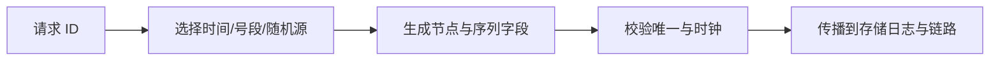

# 分布式唯一 ID 有哪些生成方案？

## 面试考察点

- 是否先明确唯一、趋势递增、吞吐和信息暴露要求。
- 能否比较 UUID、中心序列、号段和雪花算法。
- 是否考虑时钟回拨、节点号冲突和容量上限。

## 核心答案

> UUID 去中心化且简单，但较长、随机写入索引成本高；数据库或 Redis 自增容易理解但依赖中心服务；数据库号段把一段 ID 分配到应用内生成，减少远程访问；雪花算法把时间、节点和序列编码进整数，吞吐高且趋势递增，但依赖时钟与节点标识治理。

没有方案同时天然满足绝对递增、无中心、无限可用和零协调，应按业务约束取舍。

## 雪花算法要点

时间位决定可用年限，节点位决定并发节点数，序列位决定单毫秒吞吐。时钟回拨可选择短暂等待、使用逻辑时间、切换备用节点位或拒绝发号并告警，不能默默生成重复 ID。

## 先区分 ID 的业务目标

| 目标 | 关注点 | 可能方案 |
| --- | --- | --- |
| 全局唯一 | 不重复、可验证 | UUID、雪花、号段 |
| 趋势递增 | 索引局部性、分页 | 号段、雪花、数据库序列 |
| 严格有序 | 全局协调和可用性 | 单点序列、分区内序列 |
| 不暴露业务量 | 难猜、不可枚举 | 随机 ID、加密映射 |
| 高吞吐低延迟 | 本地生成、少依赖 | 雪花、号段缓存 |

一个订单主键可以趋势递增，但对外展示的订单号可能需要不可枚举；这两个需求可以用内部 ID 与外部展示号分离解决，而不是让一个格式满足所有场景。

## 号段模式的故障处理

中心服务为节点分配 `[max_id, max_id + step)`，应用在本地内存中递增。号段耗尽前异步预取下一段，中心短暂故障时仍可继续使用当前段；进程重启后会浪费未使用号段，但通常不影响唯一性。

要处理预取并发、号段重复、数据库事务、步长过大和所有号段耗尽。若本地缓存两段并切换失败，必须停止发号或切换备用中心，不能回退到一个未经协调的初始值。

## 雪花位分配示例

```text
1 bit 符号位（保留）
41 bit 时间戳（自定义 epoch）
10 bit 节点标识
12 bit 毫秒内序列
```

该布局每毫秒每节点最多 4096 个 ID，节点最多 1024 个；时间位寿命取决于 epoch。真实系统还需考虑序列溢出时等待下一毫秒、同一节点多进程、容器 IP 变化和时钟回拨。

## 时钟回拨策略

小幅回拨可等待物理时间追上上次时间；较大回拨可切换备用节点位或进入逻辑时间模式；无法证明唯一时应拒绝发号并告警。用“把回拨时间加回去”可能导致未来窗口与真实时间混乱，必须记录逻辑时间和恢复状态。

## 工程治理

节点号由可靠注册中心或部署系统分配并设租约，防止容器重启后冲突。监控发号延迟、序列耗尽和时间偏移；ID 若对外暴露，还要评估是否泄漏业务量与生成时间。

## 常见误区

趋势递增不等于严格全局递增，多节点雪花 ID 在极近时间仍可能交错。唯一 ID 也不等于业务幂等键，同一业务请求重试可能生成两个不同 ID。

## ID 与索引、分页

趋势递增主键改善 B+Tree 插入局部性，但多个节点的雪花 ID 只保证大致按时间增长，不保证严格全局排序。按 ID 游标分页应接受节点间交错；需要严格业务时间，使用 `(occurred_at, id)` 组合游标。ID 长度、符号范围和 JSON/JavaScript 精度也要纳入接口设计。

## 安全与隐私

连续可猜 ID 会暴露注册量、订单增长和资源枚举风险。对外 ID 可使用随机化、Hashids 变体或独立展示号，但要注意可逆性、碰撞和查询成本；不要把“不可猜”误认为授权，服务端仍需校验资源归属。

## 线上治理

节点号由可靠注册中心或部署系统分配并设租约，防止容器重启后冲突。监控发号延迟、序列耗尽、时间偏移、拒绝率和碰撞告警；对外 API 明确 ID 是否可排序、是否可能跳号、是否可能转成字符串。

## 高频追问与参考回答

### 追问：为什么随机 UUID 不适合 InnoDB 主键？

随机键会让聚簇索引插入位置分散，增加页分裂、缓存局部性和二级索引存储成本；是否可接受仍取决于规模与实现。

### 追问：雪花算法能保证严格递增吗？

单节点按时间和序列递增，但多节点生成结果会交错，不能保证全局严格递增。若业务依赖严格顺序，应使用协调序列或业务版本。

### 追问：节点号冲突会发生什么？

两个节点在同一时间窗口产生相同序列可能生成重复 ID。节点号必须由租约/注册中心分配并监控，容器重启和网络分区都要测试。

### 追问：ID 服务不可用时应该继续发号吗？

号段模式可在已分配号段内继续，雪花可本地生成；一旦无法证明唯一性，应拒绝或切换可靠备用，而不是静默降级为时间戳。

## 总结

发号方案要明确顺序、可用性、吞吐和泄漏边界，并把时钟、节点和容量异常纳入长期运维。

<!-- depth-standard:start -->
## 机制全景图

下面把「分布式唯一 ID 有哪些生成方案？」从输入到结果压缩成一条可复述的主链路。面试时先用图建立全局坐标，再进入局部实现，能避免只背零散结论。



## 完整链路：从输入到结果

沿着「请求 ID → 选择时间/号段/随机源 → 生成节点与序列字段 → 校验唯一与时钟 → 传播到存储日志与链路」观察输入、状态与输出，下面每个阶段都对应一个可以在源码、日志或系统表中验证的位置。

### 1. 请求 ID

ID 需求先明确唯一范围、趋势递增、长度、信息泄漏、生成吞吐和多机房容灾。

### 2. 选择时间/号段/随机源

Snowflake 用时间戳、节点号和序列，号段服务从数据库批量领取区间，UUID 则靠随机空间。

### 3. 生成节点与序列字段

节点号分配和序列溢出必须受控，容器弹性环境不能手工写死重复 workerId。

### 4. 校验唯一与时钟

时钟回拨会让时间型 ID 重复或停发，应检测、等待、切换逻辑时钟或隔离节点。

### 5. 传播到存储日志与链路

ID 要作为请求、订单、消息和日志的统一关联键，跨边界不能重新生成导致证据链断裂。

## 源码与实现定位

| 入口 | 阅读重点 |
| --- | --- |
| worker_id 租约表 | 节点号唯一 |
| 数据库 UNIQUE(id) | 最终碰撞裁决 |

源码或系统表应按上表顺序追踪：先确认入口实际走到哪条路径，再用运行时数据验证，而不是仅凭类名或配置推测。

## 参数配置与可复现实验

```text
id=(timestamp<<22)|(workerId<<12)|sequence
```

模拟时钟回拨、同 workerId 和单毫秒序列耗尽，统计停发/冲突。

## 验证步骤与预期结果

### 1. 固定输入和基线

先在没有故障注入的环境执行上述配置，固定数据规模、并发度、运行时版本和预热时间。以「生成失败率」为主基线，记录值应满足「记录活动/稳态基线」；同时保存 生成失败/等待数、时钟偏差，使后续变化能够回到同一时间轴比较。

### 2. 从实现入口确认路径

在「worker_id 租约表」确认请求确实进入「节点号唯一」对应的实现，再沿「数据库 UNIQUE(id)」观察「最终碰撞裁决」。如果入口路径都未命中，就不应继续调整下游参数，而应先检查调用条件、版本或路由是否与假设一致。

### 3. 注入本文特有的失败模式

优先复现「workerId 重复」，并把单一变量逐级放大，直到「生成失败率」越过「超过容量或 SLO」。随后再分别验证「时钟回拨未处理」和「把趋势递增误认为全局严格连续」，三类故障分开执行，避免多个变量同时变化而无法归因。

### 4. 执行止损和根因修复

第一轮只应用「workerId 租约+启动检测」，确认它能控制影响范围；第二轮应用「回拨切逻辑时钟/隔离」，验证核心链路恢复；最后落实「存储保留唯一约束」，消除同类问题再次出现的条件。每一步都保留变更前后数据，不用“感觉变快了”替代测量。

### 5. 通过退出条件

实验只有同时满足三项才算通过：「生成失败率」回到「记录活动/稳态基线」、「端到端 P99」回到「小于预算」、「状态差异」回到「0」，并且业务结果差异为零。若性能恢复但结果不一致，仍应视为失败；若指标恢复后很快再次越线，则说明只完成了临时止损，没有消除根因。

## 量化基线

| 指标 | 样例基线/口径 | 风险线 | 结论 |
| --- | --- | --- | --- |
| 生成失败率 | 记录活动/稳态基线 | 超过容量或 SLO | 触发降级 |
| 端到端 P99 | 小于预算 | 突破预算 | 停止扩量 |
| 状态差异 | 0 | 任意非零 | 补偿并对账 |

这些数值是实验口径或示例告警线，不是可复制到所有系统的固定答案；上线阈值应由本系统稳态、峰值和故障演练共同确定。

## 事故复盘：容器扩容后出现极少量主键冲突

多个实例从环境变量读取相同 workerId，毫秒内序列也相同。改用租约式节点号分配、启动冲突检测和数据库唯一约束兜底后才安全。

| 失败模式 | 首要证据 | 第一处置动作 |
| --- | --- | --- |
| workerId 重复 | 生成失败/等待数 | workerId 租约+启动检测 |
| 时钟回拨未处理 | 时钟偏差 | 回拨切逻辑时钟/隔离 |
| 把趋势递增误认为全局严格连续 | 节点号租约冲突 | 存储保留唯一约束 |

## 发布与回滚检查点

- **发布前**：确认「worker_id 租约表」对应实现和上述配置在目标版本仍然有效，并保存「生成失败率」基线。
- **灰度中**：同时观察 生成失败/等待数、时钟偏差、节点号租约冲突；任一指标越过表中风险线，就停止继续扩量。
- **回滚时**：先执行「workerId 租约+启动检测」控制影响，再回退代码或参数；涉及持久状态时必须额外核对结果差异。
- **发布后**：至少覆盖一个完整峰值周期，确认「workerId 重复」没有再次出现，才关闭变更观察窗口。

## 方案对比与选型

| 方案 | 更适合的场景 | 主要收益 | 代价与边界 |
| --- | --- | --- | --- |
| 数据库自增/号段 | 单库或可接受集中分配 | 简单/趋势递增 | 中心依赖或批次空洞 |
| Snowflake | 高吞吐本地生成 | 趋势递增、无中心请求 | 时钟和节点号治理复杂 |
| UUID/ULID | 跨环境独立生成 | 碰撞概率低、接入简单 | 索引局部性、长度或排序语义不同 |

选型至少带上 峰值流量、数据规模、依赖容量、一致性目标和故障预算，并用上面的量化基线验证；未知数据应明确为待测假设。

## 设计边界与工程取舍

> 分布式 ID 只能在明确假设下保证唯一；最终存储仍应保留唯一约束，趋势递增也不等于业务时间顺序。

工程落地遵循：先定义 SLO 与不变量，再通过限流、隔离、异步和补偿保护核心链路。回答时直接引用「worker_id 租约表」、配置实验和事故数据，比复述固定模板更有说服力。
<!-- depth-standard:end -->
