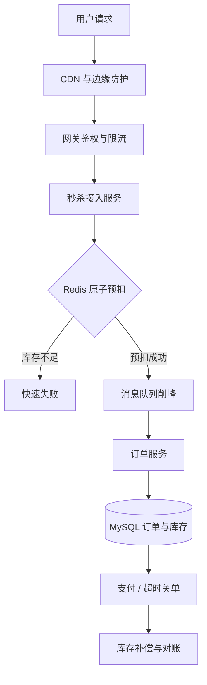

# 如何设计一个高并发秒杀系统？

## 先说结论

> 秒杀系统的核心是把远大于库存的瞬时流量挡在核心链路之外，通过资格校验、限流和缓存快速失败，用 Redis 或专用库存服务原子预扣库存，再通过消息队列异步创建订单，并依靠唯一约束、幂等、超时释放和对账保证不超卖、不少卖与最终一致。

## 第一步：明确需求和容量

设计之前先确认：

- 商品数量和每人限购数量。
- 活动时间、持续时长和参与用户数。
- 峰值请求 QPS 与预期成功订单数。
- 是否允许排队，以及用户能接受的响应时间。
- 库存是否必须绝对不超卖。
- 下单后支付时限和未支付库存释放规则。
- 是否支持多个机房、多个地区和多种商品。
- 活动失败时的降级和补偿策略。

例如库存只有 1 万件、峰值请求 100 万 QPS，真正需要进入下单链路的请求不到 1%。架构目标不是让数据库处理 100 万 QPS，而是快速、准确地淘汰绝大多数失败请求。

## 总体架构



```text
用户端
  ↓ 静态资源/CDN
边缘防护：验证码、风控、IP 限流
  ↓
API Gateway：鉴权、用户限流、活动校验
  ↓
秒杀接入服务：本地售罄标记、资格校验
  ↓
Redis / 库存服务：原子预扣、去重
  ↓
Kafka / RocketMQ：削峰、异步下单
  ↓
订单服务 + MySQL：最终订单、唯一约束
  ↓
支付与超时关单
  ↓
库存释放、对账和补偿
```

## 前端和 CDN 层

秒杀页面、图片和脚本全部静态化并通过 CDN 分发，避免活动开始时流量进入应用服务器。

前端可以：

- 活动开始前显示倒计时，但服务端时间才是最终判断依据。
- 按钮点击后立即置灰，减少用户连续点击。
- 请求携带一次性秒杀令牌。
- 对轮询订单结果设置退避，避免固定高频查询。

前端限制只能改善体验，不能作为安全边界，所有校验必须在服务端重复执行。

## 接入层流量治理

### 1. 身份和资格校验

校验登录状态、活动范围、用户等级、地区、黑名单和购买资格。资格可以在活动前预计算并缓存，避免高峰期查询复杂数据库条件。

### 2. 多维度限流

按 IP、设备、账号、活动和接口共同限流。只按 IP 会误伤公司或校园网络，只按账号无法抵御批量账号。

### 3. 验证码和动态路径

活动开始前通过验证码增加自动化成本，验证成功后发放短时令牌或动态请求路径。它不能完全阻止脚本，但能减少无效流量直接冲击库存接口。

### 4. 快速失败

活动未开始、已结束、用户无资格、重复请求和本地已售罄都应在接入层直接返回，不进入库存服务和数据库。

## 本地售罄标记

秒杀服务可以缓存商品是否售罄。一旦库存服务返回库存为 0，就把该商品标记为售罄，后续请求在进程内快速失败。

本地标记只能用于减少流量，不能作为库存真值。若发生库存回补，需要通过广播事件或短 TTL 清除标记。

## 库存为什么不能直接打数据库

数据库行锁能通过条件更新防超卖：

```sql
UPDATE sku_stock
SET available = available - 1
WHERE sku_id = ? AND available > 0;
```

这在普通流量下正确，但秒杀瞬时并发会让大量请求竞争同一行，形成锁等待、连接池耗尽和数据库抖动。应先在高吞吐的库存层筛选出有限成功请求，再异步进入数据库。

## Redis 原子预扣库存

使用 Lua 脚本把重复校验和库存扣减放在一个原子操作中：

```lua
local userKey = KEYS[1]
local stockKey = KEYS[2]

if redis.call('EXISTS', userKey) == 1 then
  return -2
end

local stock = tonumber(redis.call('GET', stockKey) or '-1')
if stock <= 0 then
  return -1
end

redis.call('DECR', stockKey)
redis.call('SET', userKey, '1', 'EX', ARGV[1])
return stock - 1
```

脚本返回：

- `-2`：用户已请求成功或正在处理中。
- `-1`：库存不足。
- 非负数：预扣成功后的剩余库存。

脚本必须控制执行时间，不能在 Redis 中做复杂遍历。热点商品的单 Key 仍可能成为 Redis 热点，需要容量验证和专用集群隔离。

## Redis 库存从哪里来

活动开始前通过发布流程把数据库库存装载到 Redis，并记录活动版本。装载必须可重复执行且有校验：

```text
数据库活动库存
   ↓ 审批和冻结
生成库存版本
   ↓
写 Redis 库存与活动元数据
   ↓
校验数量、过期时间和分片
   ↓
活动进入 READY 状态
```

不能由应用实例启动时随意覆盖库存，否则重启可能把已经扣减的库存重置。

## 异步下单和消息队列

预扣成功后发送下单消息，快速返回“排队中”。消息中至少包含：

- 全局请求 ID。
- 活动 ID、商品 ID 和库存版本。
- 用户 ID 和购买数量。
- 预扣时间。
- 价格快照或价格版本。

消息队列削平瞬时流量，让订单服务按数据库承载能力消费。队列不是无限缓冲，必须评估积压量、保留时间和消费恢复能力。

## Redis 扣减成功但消息发送失败怎么办

这是关键一致性窗口。可选方案：

### 方案一：Redis Stream / 库存与事件同存储原子写

Lua 脚本在扣库存时同时写入 Redis Stream 或待发送集合，由可靠任务投递 MQ。减少扣减与事件之间的窗口，但增加 Redis 数据治理复杂度。

### 方案二：请求记录状态机

扣减前创建请求记录，记录 `INIT → RESERVED → SENT → ORDERED`，后台扫描长期停留状态并补发或释放库存。

### 方案三：专用库存服务日志

库存服务把扣减事件写入可恢复日志，再异步发布。复杂度更高，适合超大规模核心活动。

无论采用哪种方案，都需要定期对账，不能假设每一步永远成功。

## 订单服务如何防重复

同一请求可能因 MQ 重试被消费多次。订单表建立业务唯一约束：

```sql
UNIQUE KEY uk_activity_user_sku
  (activity_id, user_id, sku_id)
```

或者以请求 ID 建立唯一索引。消费时在数据库事务中创建订单和库存流水；唯一键冲突后查询已有订单并返回成功，不再次扣减。

如果允许同用户购买多件或多个订单，唯一键需要包含购买批次或资格 ID，不能机械复制。

## 数据库最终扣减怎么做

Redis 预扣限制进入订单链路的数量，数据库仍应使用条件更新或唯一库存流水作为最终防线：

```sql
UPDATE activity_stock
SET sold = sold + 1, version = version + 1
WHERE activity_id = ?
  AND sold < total
  AND version = ?;
```

若数据库扣减失败，订单事务回滚，并触发 Redis 库存补偿。补偿操作必须携带请求 ID 并幂等，防止重复加库存。

## 不超卖和不少卖

- 不超卖：成功订单数不能超过活动库存，是强约束。
- 不少卖：系统异常释放了本应成功的库存，或扣减后没有形成订单，属于可用性和最终一致性问题。

核心策略通常是优先保证不超卖，再通过补偿、对账和库存回补减少少卖。

## 未支付订单怎么释放库存

订单创建后进入待支付状态，并写入延迟消息或时间轮。到期后执行条件关单：

```sql
UPDATE orders
SET status = 'CLOSED'
WHERE id = ? AND status = 'PENDING_PAYMENT';
```

只有成功从待支付转为关闭的事务才能释放库存。支付回调与关单可能并发，需要状态机和数据库条件更新决定唯一结果。

库存释放后是否重新开放秒杀取决于业务：活动仍进行时可回补 Redis 并清除售罄标记；活动临近结束时也可以不再回补，避免复杂波动。

## 用户如何查询结果

秒杀接口返回请求 ID 和排队状态，用户通过结果查询接口获取：

- 排队中。
- 抢购成功，返回订单号。
- 库存不足。
- 资格不符。
- 系统异常，可重试或退款。

查询结果可放 Redis，前端轮询必须指数退避并设置最长时间。更复杂场景可通过 WebSocket 或推送通知，但仍要保留查询兜底。

## 热点 Key 和 Redis 容灾

单个爆款库存 Key 无法简单通过普通分片提高单 Key 写并发。可选策略：

- 使用独立 Redis 集群隔离秒杀流量。
- 把库存拆成多个桶，请求按用户哈希选择桶。
- 桶售罄后尝试其他桶，但要控制重试次数。
- 使用本地资格券进一步减少访问 Redis 的请求。

库存分桶提高吞吐，但会增加余量碎片、跨桶回补和对账复杂度。只有单 Key 实测成为瓶颈时才引入。

## 数据库和 MQ 容量保护

- 订单消费者使用有界线程池。
- 数据库连接池设置合理上限，避免连接风暴。
- MQ 消费速率与数据库写能力匹配。
- 下游支付、营销和通知通过独立事件异步处理。
- 非核心字段延后填充，缩短订单事务。
- 监控 MQ Lag、创建订单速率和数据库锁等待。

## 防刷和安全

- 用户、设备、IP 和行为风控。
- 秒杀令牌绑定用户、活动和短过期时间。
- 请求参数签名与防重放 Nonce。
- 限制接口只能在活动窗口访问。
- 服务端重新计算价格，不能相信客户端金额。
- 审计异常成功率、相同地址和设备聚集。

## 降级策略

当依赖异常或容量达到阈值：

- 关闭次要活动和推荐内容。
- 所有新请求返回排队或稍后再试。
- 暂停库存回补，优先保证不超卖。
- 只保留订单创建核心链路，通知异步延后。
- Redis 或 MQ 不可用时快速失败，不直接把全量流量切到数据库。

降级开关必须预先实现并演练，事故中临时开发来不及。

## 对账和补偿

至少对比：

```text
初始库存
- Redis 成功预扣
- 数据库成功订单
- 已关闭订单
+ 已回补库存
= 理论剩余库存
```

按请求 ID 核对预扣记录、MQ 事件、订单、支付和库存流水。差异进入补偿队列或人工审核，所有补偿动作幂等并留审计日志。

## 压测方案

压测不能只测平均 QPS，应覆盖：

- 活动开始瞬间的阶跃流量。
- 库存远小于请求量。
- 热点用户和单商品。
- Redis、MQ、数据库延迟上升。
- 消费者重启和消息重复。
- 支付与关单并发。
- 单机房故障和实例扩缩容。

关注 P99、错误率、Redis 延迟、MQ Lag、数据库连接和锁等待，以及最终库存与订单对账结果。

## 容易踩坑的地方

- 使用前端按钮防止重复下单。
- 所有请求直接进入数据库条件更新。
- Redis 扣减成功就认为订单一定成功。
- MQ 可以无限堆积，不需要容量上限。
- 只保证不超卖，不做少卖和丢消息对账。
- 分布式锁包住整个秒杀流程。
- Redis 故障时自动降级为直接扣数据库。

## 常见问题

### 追问 1：Redis 扣库存怎么保证不超卖？

使用 Lua 在单次原子执行中检查库存和扣减，避免并发读改写；数据库创建订单时仍使用条件更新或库存流水作为最终防线。

### 追问 2：Redis 扣成功但下单失败怎么办？

请求状态记录会停留在预扣状态，后台补偿任务根据超时和订单结果幂等释放库存；同时对账发现无订单预扣并修复。

### 追问 3：为什么不用分布式锁？

单商品全局锁会把请求串行化，锁获取和续期也增加开销。Lua 原子操作更适合短小库存判断；跨系统流程则依靠状态机和最终一致，不应持有长锁。

### 追问 4：如何解决 Redis 热点 Key？

先通过接入层过滤和本地售罄标记减少请求；单 Key 确实达到瓶颈时，可隔离集群或库存分桶，但要处理余量碎片和回补复杂度。

### 追问 5：MQ 消息重复会不会重复下单？

订单表以请求 ID 或活动、用户、商品建立唯一约束，消费者重复执行时查询已有订单并返回成功，不重复扣减库存。

### 追问 6：用户支付和超时关单并发怎么办？

两者都使用订单状态条件更新，只有一个能从待支付状态迁移成功。关单成功才释放库存，支付成功则不能再关单。

### 追问 7：怎么证明没有超卖和少卖？

通过预扣流水、MQ 事件、订单、支付和库存流水按请求 ID 对账，验证成功订单不超过初始库存，并对无订单预扣、重复释放等差异执行幂等补偿。
