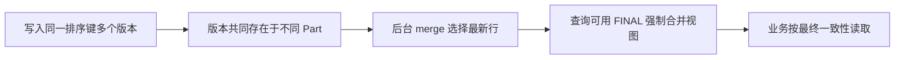

# ReplacingMergeTree 如何实现去重？

## 面试考察点

- 是否知道去重依据是排序键而非整行。
- 能否解释后台 Merge 的异步和不确定时机。
- 是否理解版本列与 `FINAL` 的性能权衡。

## 核心答案

> ReplacingMergeTree 在数据片段后台合并时，对排序键相同的行保留一行；指定版本列后通常保留版本最大的行。合并是异步的，因此写入后旧版本可能暂时共存，它提供最终去重而不是写入时唯一约束。

没有版本列时保留哪一行取决于合并顺序，不应承担明确的业务版本选择。

## 查询语义

`FINAL` 可在查询阶段合并重复版本，获得更接近最终状态的结果，但会增加 CPU、内存和读取成本。高频查询更适合通过版本聚合、物化结果或数据管道预处理，而不是所有请求都加 FINAL。

## 为什么“写入即去重”是误解

ReplacingMergeTree 先把每批 INSERT 写成独立 part，后台再按分区、排序范围选择 parts 合并。重复记录只有在相关 part 恰好被合并时才会折叠；合并调度受 part 数量、磁盘、分区、负载和配置影响，不能假设几秒内一定完成。

```text
part A: (order_id=1, version=1, status=CREATED)
part B: (order_id=1, version=2, status=PAID)
        ↓ 后台 Merge
part C: (order_id=1, version=2, status=PAID)
```

合并前普通 SELECT 可能返回两行。若业务把结果直接 sum，会发生重复统计；如果需要“当前状态”，必须在查询模型上显式处理版本。

## 版本列的选择

版本应表达同一业务键的单调更新顺序，例如数据库递增版本、事件序号或可靠的逻辑时钟。仅用应用服务器时间戳会受到时钟漂移、相同毫秒和乱序投递影响；仅用 Kafka offset 又只能在单分区内有序，跨分区需额外设计。

```sql
CREATE TABLE order_state (
  order_id String,
  version UInt64,
  status LowCardinality(String),
  updated_at DateTime64(3)
)
ENGINE = ReplacingMergeTree(version)
ORDER BY order_id;
```

`ORDER BY` 中的业务键决定什么被视为重复。若把 version 也放进排序键，版本不同的记录不再是同一排序键，去重不会按预期发生。

## 查询当前版本的替代方式

对低频审计可使用 `FINAL`。对高频查询，常见方案是 `argMax(status, version)`、按 key 聚合取最大版本，或通过物化视图把最新状态维护到另一张查询表。选择时要比较扫描数据量、实时性、写放大和查询复杂度。

```sql
SELECT order_id, argMax(status, version) AS current_status
FROM order_state
GROUP BY order_id;
```

这类聚合也要考虑分布式场景的最终合并，不能只在每个分片取局部最大版本后直接返回。

## 删除与撤销事件

分析系统中“删除”通常也建模成一条更高版本的删除标记，而不是立即物理删除。查询过滤 `is_deleted = 0`，后台合并后旧版本逐步消失。涉及隐私合规或强制删除时，还需设计 mutation、分区删除、备份清理和可验证的删除流程，不能只依赖逻辑标记。

## 运行维护要点

监控 parts、后台 merge 队列、磁盘空间、合并吞吐、重复率和 FINAL 查询比例。频繁手工 `OPTIMIZE TABLE ... FINAL` 会重写大量数据、竞争 I/O，并可能阻塞正常合并；它只能作为受控维护动作，根因通常是小批写入或错误的数据模型。

## 设计要点

排序键必须包含稳定的业务唯一键，同时兼顾常用过滤条件。版本可用单调递增序号或可靠事件版本，不能只依赖可能碰撞或乱序的低精度时间。

## 常见误区

ReplacingMergeTree 不是 OLTP 的 `UNIQUE KEY`，不能阻止重复插入。手工 `OPTIMIZE FINAL` 也不应作为高频业务操作，它可能触发昂贵的大合并。

## 高频追问与参考回答

### 追问：如何支持删除？

常见做法是写入带删除标记的新版本，查询过滤删除状态；具体引擎版本也可能支持删除标记参数，但仍要考虑合并前的查询语义。

### 追问：为什么同一个 order_id 仍会查到多条？

因为对应 parts 尚未完成合并，或 ORDER BY 没有把 order_id 作为去重键。先检查表定义和 part 状态，再选择 FINAL、聚合或物化查询模型。

### 追问：ReplacingMergeTree 能保证事件不重复吗？

不能阻止重复写入，只能最终折叠相同排序键的版本。写入链路仍应具备幂等键、重放策略和重复监控。

### 追问：版本相同怎么办？

结果可能依赖合并顺序，语义不确定。业务应避免为同一键产生相同版本的不同内容，或增加可比较的次级版本规则。

## 总结

ReplacingMergeTree 用后台合并实现按排序键的最终去重，版本、查询语义和合并成本必须一起设计。

<!-- depth-standard:start -->
## 机制全景图

下面把「ReplacingMergeTree 如何实现去重？」从输入到结果压缩成一条可复述的主链路。面试时先用图建立全局坐标，再进入局部实现，能避免只背零散结论。



## 完整链路：从输入到结果

沿着「写入同一排序键多个版本 → 版本共同存在于不同 Part → 后台 merge 选择最新行 → 查询可用 FINAL 强制合并视图 → 业务按最终一致性读取」观察输入、状态与输出，下面每个阶段都对应一个可以在源码、日志或系统表中验证的位置。

### 1. 写入同一排序键多个版本

ReplacingMergeTree 的“重复”由 ORDER BY 键定义，主键设计不当会误合并不同业务行。

### 2. 版本共同存在于不同 Part

新旧版本写入后可同时可见，因为去重通常发生在未来某次后台 merge。

### 3. 后台 merge 选择最新行

带 version 列时 merge 保留版本最大行；没有版本时保留顺序受 Part 合并影响。

### 4. 查询可用 FINAL 强制合并视图

SELECT FINAL 在查询时执行替换语义，结果更准确但增加 CPU、内存和延迟。

### 5. 业务按最终一致性读取

高频查询可通过 argMax 聚合、物化视图或应用侧版本过滤，接受明确的一致性窗口。

## 源码与实现定位

| 入口 | 阅读重点 |
| --- | --- |
| ReplacingSortedAlgorithm | 版本替换逻辑 |
| system.parts | 旧新版本所在 Part |

源码或系统表应按上表顺序追踪：先确认入口实际走到哪条路径，再用运行时数据验证，而不是仅凭类名或配置推测。

## 参数配置与可复现实验

```sql
SELECT id,argMaxState(value,version) FROM state GROUP BY id;
```

同键写 3 个乱序版本，比较普通查询、FINAL 与 argMax 的正确性和成本。

## 验证步骤与预期结果

### 1. 固定输入和基线

先在没有故障注入的环境执行上述配置，固定数据规模、并发度、运行时版本和预热时间。以「同键版本数」为主基线，记录值应满足「记录稳态基线」；同时保存 同键版本数、merge 延迟，使后续变化能够回到同一时间轴比较。

### 2. 从实现入口确认路径

在「ReplacingSortedAlgorithm」确认请求确实进入「版本替换逻辑」对应的实现，再沿「system.parts」观察「旧新版本所在 Part」。如果入口路径都未命中，就不应继续调整下游参数，而应先检查调用条件、版本或路由是否与假设一致。

### 3. 注入本文特有的失败模式

优先复现「把后台 merge 当实时去重」，并把单一变量逐级放大，直到「同键版本数」越过「持续>2」。随后再分别验证「ORDER BY 包含变化字段导致无法匹配旧版本」和「全表长期使用 FINAL」，三类故障分开执行，避免多个变量同时变化而无法归因。

### 4. 执行止损和根因修复

第一轮只应用「显式 version 列」，确认它能控制影响范围；第二轮应用「高频读用 argMax/快照」，验证核心链路恢复；最后落实「限制全表 FINAL」，消除同类问题再次出现的条件。每一步都保留变更前后数据，不用“感觉变快了”替代测量。

### 5. 通过退出条件

实验只有同时满足三项才算通过：「同键版本数」回到「记录稳态基线」、「同键版本数 P99」回到「同负载可复现」、「结果核对」回到「差异为 0」，并且业务结果差异为零。若性能恢复但结果不一致，仍应视为失败；若指标恢复后很快再次越线，则说明只完成了临时止损，没有消除根因。

## 量化基线

| 指标 | 样例基线/口径 | 风险线 | 结论 |
| --- | --- | --- | --- |
| 同键版本数 | 记录稳态基线 | 持续>2 | merge 延迟 |
| 同键版本数 P99 | 同负载可复现 | 超过基线 2 倍 | merge 延迟 |
| 结果核对 | 差异为 0 | 任意非零 | 停止切换并修复 |

这些数值是实验口径或示例告警线，不是可复制到所有系统的固定答案；上线阈值应由本系统稳态、峰值和故障演练共同确定。

## 事故复盘：用户状态查询偶发返回旧值

服务写入新版本后立即普通 SELECT，旧新两行尚未 merge，调用方随读取顺序拿到旧行。改用 version + argMax 读取当前态，并把明细与当前快照模型分开后语义稳定。

| 失败模式 | 首要证据 | 第一处置动作 |
| --- | --- | --- |
| 把后台 merge 当实时去重 | 同键版本数 | 显式 version 列 |
| ORDER BY 包含变化字段导致无法匹配旧版本 | merge 延迟 | 高频读用 argMax/快照 |
| 全表长期使用 FINAL | FINAL 查询内存 | 限制全表 FINAL |

## 发布与回滚检查点

- **发布前**：确认「ReplacingSortedAlgorithm」对应实现和上述配置在目标版本仍然有效，并保存「同键版本数」基线。
- **灰度中**：同时观察 同键版本数、merge 延迟、FINAL 查询内存；任一指标越过表中风险线，就停止继续扩量。
- **回滚时**：先执行「显式 version 列」控制影响，再回退代码或参数；涉及持久状态时必须额外核对结果差异。
- **发布后**：至少覆盖一个完整峰值周期，确认「把后台 merge 当实时去重」没有再次出现，才关闭变更观察窗口。

## 方案对比与选型

| 方案 | 更适合的场景 | 主要收益 | 代价与边界 |
| --- | --- | --- | --- |
| 普通查询 | 允许重复行短暂存在的分析 | 速度最快 | 结果需容忍未合并版本 |
| SELECT FINAL | 低频且必须获得替换视图 | 查询语义直接 | 大范围查询成本高 |
| argMax/物化当前态 | 高频按键获取最新版本 | 可控且无需全表 FINAL | 查询或写入模型更复杂 |

选型至少带上 日增量、分区规模、查询并发、扫描行数和压缩比，并用上面的量化基线验证；未知数据应明确为待测假设。

## 设计边界与工程取舍

> ReplacingMergeTree 提供最终替换，不提供事务式唯一约束；需要实时唯一状态时必须设计查询口径或单独快照层。

工程落地遵循：以数据布局减少扫描，以批量写入减少小 Part，避免照搬行存思路。回答时直接引用「ReplacingSortedAlgorithm」、配置实验和事故数据，比复述固定模板更有说服力。
<!-- depth-standard:end -->
