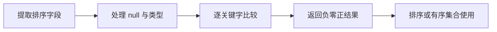

# Comparable 和 Comparator 有什么区别？

## 面试考察点

- 是否区分类型自身的自然顺序和外部排序策略。
- 能否写出安全的多字段比较器。
- 是否理解比较结果与有序集合去重的关系。

## 核心答案

> Comparable 由类自身实现 `compareTo`，定义唯一的自然顺序；Comparator 是独立策略，可以为同一类型提供多种排序方式。业务类型不便修改或存在多种排序规则时优先使用 Comparator。

比较器返回负数、零、正数分别表示小于、等于、大于，不应该用两个整数直接相减，因为可能溢出。

## 正确写法

使用 `Comparator.comparing`、`thenComparing` 和 `nullsFirst/nullsLast` 组合规则，可读性和边界处理更好。比较关系应满足反对称、传递和一致性，否则排序算法和 TreeSet 可能表现异常。

## 一段完整比较器

```java
Comparator<Employee> byDepartmentAndSalary =
    Comparator.comparing(Employee::department,
                         Comparator.nullsLast(String::compareTo))
              .thenComparing(Employee::salary, Comparator.reverseOrder())
              .thenComparingLong(Employee::id);
```

它先按部门升序且 null 放最后，再按工资降序，最后用唯一 ID 打破平局。最后的稳定唯一字段对分页、TreeSet 去重和可重复测试结果都很重要。

基本类型字段优先使用 `comparingInt`、`comparingLong`、`comparingDouble`，避免每次比较都装箱。昂贵的派生值不要在比较器中反复计算，可以先做 Schwartzian transform 式预计算或缓存排序键。

## 比较契约

一个正确比较器至少满足：

- 反对称：`sign(compare(a,b)) == -sign(compare(b,a))`。
- 传递：a > b 且 b > c，则 a > c。
- 相等一致：compare(a,b) 为 0 时，与 a 等价的比较结果应和 b 一致。
- 最好与 equals 一致，若不一致要在文档中明确。

违反传递性不仅结果“顺序奇怪”，排序实现还可能抛出 `Comparison method violates its general contract`。

## 为什么不能直接相减

```java
// 错误：可能整数溢出
(a, b) -> a.getScore() - b.getScore()

// 正确
Comparator.comparingInt(Player::getScore)
```

当 a 是 Integer.MAX_VALUE、b 是负数时，相减可能溢出为负值，颠倒大小关系。浮点数还要考虑 NaN、正负零，使用 `Double.compare` 更安全。

## 稳定排序是什么意思

稳定排序会保持“比较结果为 0”的元素原始相对顺序。Java 对对象列表的排序提供稳定性，但 PriorityQueue 和 TreeSet 的语义不同。若业务要求确定性输出，不应只依赖输入恰好稳定，最好添加明确 tiebreaker。

## 自然顺序设计

只有类型存在公认且长期稳定的唯一自然顺序时才实现 Comparable，例如日期按时间。员工可能按姓名、工号、入职时间或绩效排序，没有唯一答案，更适合提供多个命名 Comparator。

## 集合影响

TreeSet 和 TreeMap 以比较结果为 0 判断键是否重复。比较器若只比较姓名，两个 id 不同但同名的对象可能只保留一个，因此比较字段必须符合目标集合的唯一性语义。

## 常见误区

排序稳定性由算法和 API 契约决定，不是 Comparator 自己保证。比较器与 `equals` 不一致虽然语法允许，但容易让有序集合行为违背直觉。

## 高频追问与参考回答

### 追问：如何按多个字段排序？

先确定主排序字段，再通过 `thenComparing` 添加次级字段，并明确每个字段的升降序与 null 位置。

### 追问：reversed 应该放在哪里？

`comparing(...).reversed()` 会反转截至当前的整个比较器；只想反转某个字段时，把该字段自己的 Comparator 设为 reverseOrder，再 thenComparing 其他字段。

### 追问：Comparator 可以序列化吗？

只有比较器对象及捕获内容可序列化时才可能安全序列化。协议中保存比较器通常不是好设计，建议保存稳定排序规则标识并在接收端重建。

### 追问：TreeMap 使用的比较器可以后改吗？

不能原地替换。树结构按创建时规则组织；需要新规则应创建新 TreeMap 并重新插入所有数据。

## 总结

自然顺序属于类型，外部规则属于场景；无论哪种方式都要满足比较契约并与集合唯一性保持一致。

<!-- depth-standard:start -->
## 机制全景图

下面把「Comparable 和 Comparator 有什么区别？」从输入到结果压缩成一条可复述的主链路。面试时先用图建立全局坐标，再进入局部实现，能避免只背零散结论。



## 完整链路：从输入到结果

沿着「提取排序字段 → 处理 null 与类型 → 逐关键字比较 → 返回负零正结果 → 排序或有序集合使用」观察输入、状态与输出，下面每个阶段都对应一个可以在源码、日志或系统表中验证的位置。

### 1. 提取排序字段

Comparable 定义类型的自然顺序，适合全局稳定且唯一的默认语义。

### 2. 处理 null 与类型

Comparator 是外部策略，可组合字段、升降序和 null 规则，同一类型可以有多个业务顺序。

### 3. 逐关键字比较

比较应按主键、次键依次进行，避免直接相减产生整数溢出。

### 4. 返回负零正结果

返回 0 表示排序等价；在 TreeSet/TreeMap 中还决定唯一性，因此最好与 equals 语义协调。

### 5. 排序或有序集合使用

排序算法和有序集合假设比较器满足反对称、传递和一致性，违反契约可能得到异常或无序结果。

## 源码与实现定位

| 入口 | 阅读重点 |
| --- | --- |
| java.util.Comparator | comparing/thenComparing/nullsFirst |
| java.util.TimSort | 比较器契约异常检测 |

源码或系统表应按上表顺序追踪：先确认入口实际走到哪条路径，再用运行时数据验证，而不是仅凭类名或配置推测。

## 参数配置与可复现实验

```java
Comparator<Order> byPrice = Comparator.comparing(Order::price)
    .thenComparing(Order::id);
```

生成极值、null、相等主键和随机三元组，验证反对称与传递；对相减式比较器加入溢出样本。

## 验证步骤与预期结果

### 1. 固定输入和基线

先在没有故障注入的环境执行上述配置，固定数据规模、并发度、运行时版本和预热时间。以「传递性随机测试」为主基线，记录值应满足「10 万组三元组零失败」；同时保存 排序耗时与比较次数、compare 返回 0 的比例，使后续变化能够回到同一时间轴比较。

### 2. 从实现入口确认路径

在「java.util.Comparator」确认请求确实进入「comparing/thenComparing/nullsFirst」对应的实现，再沿「java.util.TimSort」观察「比较器契约异常检测」。如果入口路径都未命中，就不应继续调整下游参数，而应先检查调用条件、版本或路由是否与假设一致。

### 3. 注入本文特有的失败模式

优先复现「比较器不传递导致排序结果异常」，并把单一变量逐级放大，直到「传递性随机测试」越过「任意失败」。随后再分别验证「相减比较溢出」和「compare 为 0 与 equals 不一致导致 TreeSet 丢元素」，三类故障分开执行，避免多个变量同时变化而无法归因。

### 4. 执行止损和根因修复

第一轮只应用「禁止用减法返回比较结果」，确认它能控制影响范围；第二轮应用「添加唯一次键保持确定顺序」，验证核心链路恢复；最后落实「Comparator 加属性测试」，消除同类问题再次出现的条件。每一步都保留变更前后数据，不用“感觉变快了”替代测量。

### 5. 通过退出条件

实验只有同时满足三项才算通过：「传递性随机测试」回到「10 万组三元组零失败」、「compare=0 比例」回到「符合业务重复率」、「排序比较次数」回到「约 n log n」，并且业务结果差异为零。若性能恢复但结果不一致，仍应视为失败；若指标恢复后很快再次越线，则说明只完成了临时止损，没有消除根因。

## 量化基线

| 指标 | 样例基线/口径 | 风险线 | 结论 |
| --- | --- | --- | --- |
| 传递性随机测试 | 10 万组三元组零失败 | 任意失败 | 阻止上线 |
| compare=0 比例 | 符合业务重复率 | 异常偏高 | 补次键/唯一键 |
| 排序比较次数 | 约 n log n | 昂贵计算放大 | 预计算排序键 |

这些数值是实验口径或示例告警线，不是可复制到所有系统的固定答案；上线阈值应由本系统稳态、峰值和故障演练共同确定。

## 事故复盘：价格排序在大数值时顺序反转

比较器使用 (int)(a.price-b.price)，金额差超过 int 范围后溢出，且小数精度被截断。改为 Comparator.comparing(Order::price).thenComparing(Order::id)，同时明确 null 与同价顺序后，契约和可读性都改善。

| 失败模式 | 首要证据 | 第一处置动作 |
| --- | --- | --- |
| 比较器不传递导致排序结果异常 | 排序耗时与比较次数 | 禁止用减法返回比较结果 |
| 相减比较溢出 | compare 返回 0 的比例 | 添加唯一次键保持确定顺序 |
| compare 为 0 与 equals 不一致导致 TreeSet 丢元素 | 排序契约异常 | Comparator 加属性测试 |

## 发布与回滚检查点

- **发布前**：确认「java.util.Comparator」对应实现和上述配置在目标版本仍然有效，并保存「传递性随机测试」基线。
- **灰度中**：同时观察 排序耗时与比较次数、compare 返回 0 的比例、排序契约异常；任一指标越过表中风险线，就停止继续扩量。
- **回滚时**：先执行「禁止用减法返回比较结果」控制影响，再回退代码或参数；涉及持久状态时必须额外核对结果差异。
- **发布后**：至少覆盖一个完整峰值周期，确认「比较器不传递导致排序结果异常」没有再次出现，才关闭变更观察窗口。

## 方案对比与选型

| 方案 | 更适合的场景 | 主要收益 | 代价与边界 |
| --- | --- | --- | --- |
| Comparable | 类型有唯一自然顺序 | 调用简洁、有序容器默认可用 | 把业务口径固化进实体 |
| Comparator | 多个排序口径或外部类型 | 可组合、可注入 | 调用处需选择正确策略 |
| 预计算排序键 | 比较昂贵且数据批量排序 | 减少重复计算 | 占额外内存，键变化需同步 |

选型至少带上 元素数量、读写比例、遍历方式、并发度和内存预算，并用上面的量化基线验证；未知数据应明确为待测假设。

## 设计边界与工程取舍

> 排序只定义相对次序，不自动保证稳定性；需要同值保持输入顺序时，要选择稳定排序或显式加入唯一序号作为最后关键字。

工程落地遵循：先保证数据结构语义正确，再依据访问模式选择实现。回答时直接引用「java.util.Comparator」、配置实验和事故数据，比复述固定模板更有说服力。
<!-- depth-standard:end -->
