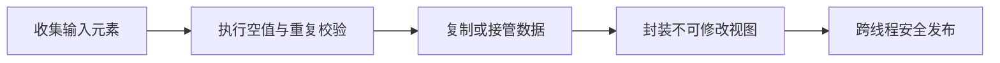

# 不可变集合和只读集合有什么区别？

## 面试考察点

- 是否区分不可修改视图与独立不可变副本。
- 能否解释浅不可变和元素对象可变的问题。
- 是否会用防御性复制保护接口边界。

## 核心答案

> `Collections.unmodifiableList` 返回原集合的只读视图，不能通过该视图修改，但原集合变化仍会反映出来；`List.copyOf` 或 `List.of` 产生不可修改的独立集合，更适合作为稳定快照。二者通常都只保证容器结构不可变，不保证元素对象不可变。

真正的深度不可变要求集合和其中可达的元素状态都不能被外部修改。

## 关键机制

不可修改视图把写操作转为 `UnsupportedOperationException`，读取仍委托给底层集合。防御性复制则切断容器结构共享，代价是 O(n) 的时间和额外内存。

## 三种常见写法对比

```java
List<String> source = new ArrayList<>(List.of("A", "B"));

List<String> view = Collections.unmodifiableList(source);
List<String> copy = List.copyOf(source);
List<String> literal = List.of("A", "B");

source.add("C");
// view 能看到 C，copy 和 literal 不受影响
```

`unmodifiableList` 是权限受限的窗口，`copyOf` 是当前内容快照，`of` 是直接构造不可修改集合。`copyOf` 如果输入本来就是兼容的不可修改集合，JDK 可能复用实例，因此不要依赖对象身份。

## 浅不可变与深不可变

```java
List<User> users = List.copyOf(mutableUsers);
users.get(0).setName("changed"); // 如果 User 可变，仍然能修改元素
```

容器不能增删并不保护元素。深度不可变通常需要元素本身是不可变值对象，构造时复制可变输入，并且 getter 不暴露内部数组、Date、集合等可变引用。

```java
public final class OrderSnapshot {
    private final List<OrderLine> lines;

    public OrderSnapshot(List<OrderLine> lines) {
        this.lines = List.copyOf(lines);
    }

    public List<OrderLine> lines() {
        return lines;
    }
}
```

前提是 OrderLine 也不可变。如果其中含 byte[]，仍需在构造和读取边界复制数组。

## 不可变对并发的价值

正确构造并安全发布后，不可变对象可以被多个线程无锁共享，因为状态不会再变化。配置中心常构造一整棵不可变配置，再通过 AtomicReference 一次替换；所有读取要么看到旧版本，要么看到新版本，不会看到更新一半。

这并不意味着创建不可变集合的过程自动线程安全。若一边复制 source，另一边无锁修改 source，复制结果仍可能不一致或抛异常。

## 大数据量下的方案

每次修改都复制百万元素代价很高。可以使用结构共享的持久化集合、按分片复制、事件溯源，或把稳定大主体与小变化层分开。不可变设计的目标是清晰所有权，不是机械地在每次写入复制整个世界。

## 实践边界

构造器接收集合时可先复制，getter 返回不可变集合，防止调用方越过对象不变量。高频大集合复制成本较高时，可采用持久化数据结构、版本化快照或明确所有权模型。

## 常见误区

`final List` 只表示引用不能重新赋值，列表仍可能修改；不可修改集合也不等于线程安全，若元素本身可变，多个线程仍可能竞争修改元素。

## 高频追问与参考回答

### 追问：List.of 能放 null 吗？

不能，工厂方法会拒绝 null。迁移旧代码时要先明确 null 是非法值还是需要其他表达方式。

### 追问：Collections.unmodifiableList 是线程安全的吗？

不是。它只禁止通过该视图写入，底层列表仍可能被其他引用并发修改；读取也需要原集合正确同步。

### 追问：copyOf 会复制元素对象吗？

不会，它复制的是元素引用，所以是浅复制。深复制需要逐个构造独立元素，并明确对象图中的共享边界。

### 追问：Stream.toList 返回的列表可修改吗？

现代 JDK 的 `Stream.toList()` 返回不可修改列表，但具体类型不是 API 契约。需要可变列表应显式收集到 `ArrayList`。

## 总结

只读视图限制当前入口，防御性复制隔离结构，深度不可变还要求元素不可变；回答时应明确所承诺的层级。

<!-- depth-standard:start -->
## 机制全景图

下面把「不可变集合和只读集合有什么区别？」从输入到结果压缩成一条可复述的主链路。面试时先用图建立全局坐标，再进入局部实现，能避免只背零散结论。



## 完整链路：从输入到结果

沿着「收集输入元素 → 执行空值与重复校验 → 复制或接管数据 → 封装不可修改视图 → 跨线程安全发布」观察输入、状态与输出，下面每个阶段都对应一个可以在源码、日志或系统表中验证的位置。

### 1. 收集输入元素

创建不可变集合前要决定是否允许 null、重复键和空集合，不同工厂方法的失败语义不同。

### 2. 执行空值与重复校验

List.of/Set.of/Map.of 在构造期执行严格校验，能够把数据错误提前暴露。

### 3. 复制或接管数据

真正不可变实现不暴露底层可变容器；仅包一层 unmodifiableView 仍会随原容器变化。

### 4. 封装不可修改视图

所有修改 API 都拒绝执行，但元素对象本身可能可变，所以集合不可变不等于对象图深度不可变。

### 5. 跨线程安全发布

构建完成后通过 final/volatile 或安全容器发布，读线程才能稳定看到完整快照。

## 源码与实现定位

| 入口 | 阅读重点 |
| --- | --- |
| java.util.ImmutableCollections | List.of/Map.of 紧凑实现 |
| java.util.List#copyOf | 不可变实例复用与浅拷贝 |

源码或系统表应按上表顺序追踪：先确认入口实际走到哪条路径，再用运行时数据验证，而不是仅凭类名或配置推测。

## 参数配置与可复现实验

```java
Map<String, Rule> snapshot = Map.copyOf(nextRules);
CURRENT.set(snapshot);
```

构造原 Map 后创建 unmodifiableMap 与 copyOf，继续修改原 Map，验证视图和快照差异；再修改元素内部字段验证浅不可变。

## 验证步骤与预期结果

### 1. 固定输入和基线

先在没有故障注入的环境执行上述配置，固定数据规模、并发度、运行时版本和预热时间。以「快照版本」为主基线，记录值应满足「内容哈希与版本一一对应」；同时保存 快照构建耗时、配置版本与内容哈希，使后续变化能够回到同一时间轴比较。

### 2. 从实现入口确认路径

在「java.util.ImmutableCollections」确认请求确实进入「List.of/Map.of 紧凑实现」对应的实现，再沿「java.util.List#copyOf」观察「不可变实例复用与浅拷贝」。如果入口路径都未命中，就不应继续调整下游参数，而应先检查调用条件、版本或路由是否与假设一致。

### 3. 注入本文特有的失败模式

优先复现「把只读视图当成不可变快照」，并把单一变量逐级放大，直到「快照版本」越过「同版本内容变化」。随后再分别验证「集合元素内部可变导致读结果变化」和「每次请求复制大集合造成分配压力」，三类故障分开执行，避免多个变量同时变化而无法归因。

### 4. 执行止损和根因修复

第一轮只应用「发布 Map.copyOf 新快照」，确认它能控制影响范围；第二轮应用「元素改为不可变值对象」，验证核心链路恢复；最后落实「用 AtomicReference/volatile 一次替换版本」，消除同类问题再次出现的条件。每一步都保留变更前后数据，不用“感觉变快了”替代测量。

### 5. 通过退出条件

实验只有同时满足三项才算通过：「快照版本」回到「内容哈希与版本一一对应」、「复制耗时」回到「只在配置更新发生」、「非法修改异常」回到「调用方目标为 0」，并且业务结果差异为零。若性能恢复但结果不一致，仍应视为失败；若指标恢复后很快再次越线，则说明只完成了临时止损，没有消除根因。

## 量化基线

| 指标 | 样例基线/口径 | 风险线 | 结论 |
| --- | --- | --- | --- |
| 快照版本 | 内容哈希与版本一一对应 | 同版本内容变化 | 仍共享可变底层 |
| 复制耗时 | 只在配置更新发生 | 进入请求热点 | 移动到发布路径 |
| 非法修改异常 | 调用方目标为 0 | 频繁捕获 UOE | 修复 API 契约 |

这些数值是实验口径或示例告警线，不是可复制到所有系统的固定答案；上线阈值应由本系统稳态、峰值和故障演练共同确定。

## 事故复盘：配置中心快照在读取过程中变化

服务把可变 HashMap 包成 unmodifiableMap 后发布，却继续复用原 Map 做增量更新，读线程看到同一“不可修改视图”内容变化。改为每次构建新 Map、使用 Map.copyOf 固化并原子替换引用后，版本与内容才一一对应。

| 失败模式 | 首要证据 | 第一处置动作 |
| --- | --- | --- |
| 把只读视图当成不可变快照 | 快照构建耗时 | 发布 Map.copyOf 新快照 |
| 集合元素内部可变导致读结果变化 | 配置版本与内容哈希 | 元素改为不可变值对象 |
| 每次请求复制大集合造成分配压力 | 集合复制分配量 | 用 AtomicReference/volatile 一次替换版本 |

## 发布与回滚检查点

- **发布前**：确认「java.util.ImmutableCollections」对应实现和上述配置在目标版本仍然有效，并保存「快照版本」基线。
- **灰度中**：同时观察 快照构建耗时、配置版本与内容哈希、集合复制分配量；任一指标越过表中风险线，就停止继续扩量。
- **回滚时**：先执行「发布 Map.copyOf 新快照」控制影响，再回退代码或参数；涉及持久状态时必须额外核对结果差异。
- **发布后**：至少覆盖一个完整峰值周期，确认「把只读视图当成不可变快照」没有再次出现，才关闭变更观察窗口。

## 方案对比与选型

| 方案 | 更适合的场景 | 主要收益 | 代价与边界 |
| --- | --- | --- | --- |
| List.of/Map.of | 固定少量元素和立即校验 | 简洁、真正不可修改 | 拒绝 null，工厂重载有数量边界 |
| copyOf | 从现有集合创建不可变快照 | 隔离后续结构修改 | 浅拷贝，元素仍可能可变 |
| unmodifiableView | 需要只读 API 但允许后台数据变化 | 无需复制 | 不是快照，底层变化会透出 |

选型至少带上 元素数量、读写比例、遍历方式、并发度和内存预算，并用上面的量化基线验证；未知数据应明确为待测假设。

## 设计边界与工程取舍

> 不可变集合主要约束容器结构；需要深度不可变时，元素也必须是值对象或在边界复制，并建立清晰的所有权规则。

工程落地遵循：先保证数据结构语义正确，再依据访问模式选择实现。回答时直接引用「java.util.ImmutableCollections」、配置实验和事故数据，比复述固定模板更有说服力。
<!-- depth-standard:end -->
