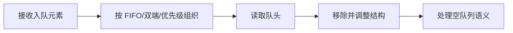

# Queue、Deque 和 PriorityQueue 应该怎么用？

## 面试考察点

- 是否区分抛异常与返回特殊值的两组队列 API。
- 能否用 Deque 实现队列和栈。
- 是否理解 PriorityQueue 只保证堆顶，不保证整体有序。

## 核心答案

> Queue 表示先进先出语义，Deque 支持两端插入删除并可替代旧的 Stack；PriorityQueue 基于二叉堆，每次能以 O(1) 查看最小或最大优先级元素，插入和删除堆顶为 O(log n)。

`add/remove/element` 失败时抛异常，`offer/poll/peek` 返回布尔值或 null；在容量受限和业务循环中通常优先使用后一组。

## 关键机制

PriorityQueue 的数组只满足父节点优先级不低于子节点，并非排序数组。遍历结果不保证顺序，要按优先级取出必须反复 `poll`，但这会消费队列。

## Queue API 两套语义

| 操作 | 失败抛异常 | 失败返回特殊值 |
| --- | --- | --- |
| 插入 | `add(e)` | `offer(e)` |
| 删除队头 | `remove()` | `poll()` |
| 查看队头 | `element()` | `peek()` |

对无界普通队列，add 和 offer 看起来差不多；对有界 BlockingQueue，offer 能通过 false、超时或阻塞版本明确表达容量不足，适合背压处理。

## ArrayDeque 为什么通用

ArrayDeque 使用循环数组维护头尾索引，两端增删摊销 O(1)，缓存局部性通常优于链表。它既能表达队列：

```java
Deque<Task> queue = new ArrayDeque<>();
queue.offerLast(task);
Task next = queue.pollFirst();
```

也能表达栈：

```java
Deque<Node> stack = new ArrayDeque<>();
stack.push(root);       // 等价于 addFirst
Node node = stack.pop();
```

方法名应和语义一致，队列代码使用 offer/poll，栈代码使用 push/pop，避免同一个 Deque 中混搭方向导致错误。

## PriorityQueue 的堆结构

最小堆中，索引 i 的子节点通常位于 `2i + 1` 和 `2i + 2`。插入把元素放到数组末尾并向上调整，删除堆顶后用末尾元素填补再向下调整，所以插入和 poll 都是 O(log n)，peek 是 O(1)。

```java
PriorityQueue<Job> jobs = new PriorityQueue<>(
    Comparator.comparingInt(Job::priority)
              .thenComparing(Job::createdAt)
);
```

比较器必须在元素进入队列后保持稳定。若修改 priority，堆不会自动重排；应删除再插入，或放入不可变调度条目。

## BlockingQueue 与背压

ArrayBlockingQueue 容量固定且数组连续；LinkedBlockingQueue 可设容量但默认很大；SynchronousQueue 不存元素，每次交付都要与消费者直接配对。线程池队列选择会决定系统是排队、扩线程还是拒绝任务。

有界队列能把过载变成可观察的 offer 失败或等待，而无界队列可能把问题推迟成延迟持续增长和 OOM。

## 选择原则

普通 FIFO 使用 ArrayDeque；两端操作或单调队列也用 Deque；任务调度、Top K 和多路归并适合 PriorityQueue；生产者消费者阻塞协调应选择 `BlockingQueue`。

## 常见误区

ArrayDeque 不允许 null，因为 null 被 API 用作“没有元素”的信号。PriorityQueue 默认也不是线程安全容器，并发场景可考虑 PriorityBlockingQueue。

## 高频追问与参考回答

### 追问：为什么推荐 ArrayDeque 替代 Stack？

Stack 继承 Vector，API 和同步设计较旧；ArrayDeque 的栈语义更明确，通常局部使用时性能也更合适。

### 追问：PriorityQueue 如何求 Top K？

维护容量为 K 的最小堆，遍历元素时大于堆顶才替换；最终堆中保留最大 K 个，复杂度 O(n log K)，比全量排序 O(n log n) 更适合 K 很小的情况。

### 追问：PriorityQueue 允许 null 吗？

不允许，因为 null 也被队列 API 用作“没有元素”的返回信号，且无法自然参与比较。

### 追问：SynchronousQueue 的容量是多少？

逻辑容量为 0，不保存任务。put 必须等待 take 配对，适合直接移交，但突发流量下必须由线程上限和拒绝策略保护。

## 总结

先按访问语义选择 Queue 或 Deque，再根据是否需要优先级、容量限制和线程协调选择具体实现。

<!-- depth-standard:start -->
## 机制全景图

下面把「Queue、Deque 和 PriorityQueue 应该怎么用？」从输入到结果压缩成一条可复述的主链路。面试时先用图建立全局坐标，再进入局部实现，能避免只背零散结论。



## 完整链路：从输入到结果

沿着「接收入队元素 → 按 FIFO/双端/优先级组织 → 读取队头 → 移除并调整结构 → 处理空队列语义」观察输入、状态与输出，下面每个阶段都对应一个可以在源码、日志或系统表中验证的位置。

### 1. 接收入队元素

选择队列前要明确顺序规则：普通 Queue 是 FIFO，Deque 支持两端，PriorityQueue 按优先级而非插入顺序。

### 2. 按 FIFO/双端/优先级组织

ArrayDeque 使用循环数组管理头尾索引，PriorityQueue 使用二叉堆维护最小或最大元素。

### 3. 读取队头

peek/element 以及 poll/remove 的差异在空队列时体现为返回 null 或抛异常，接口层应统一语义。

### 4. 移除并调整结构

堆删除队头后把末尾元素移到根并下沉，复杂度 O(log n)，读取队头 O(1)。

### 5. 处理空队列语义

优先级相同元素不保证稳定顺序；并发生产消费需要 BlockingQueue 或外部同步。

## 源码与实现定位

| 入口 | 阅读重点 |
| --- | --- |
| java.util.ArrayDeque | head/tail 环形数组 |
| java.util.PriorityQueue#siftUp/siftDown | 二叉堆调整 |

源码或系统表应按上表顺序追踪：先确认入口实际走到哪条路径，再用运行时数据验证，而不是仅凭类名或配置推测。

## 参数配置与可复现实验

```java
record Task(long dueAt, long sequence) {}
var q = new PriorityQueue<Task>(Comparator.comparingLong(Task::dueAt)
    .thenComparingLong(Task::sequence));
```

构造相同优先级任务验证稳定性，再以不同队列容量压测生产消费；记录队长、阻塞时间和内存。

## 验证步骤与预期结果

### 1. 固定输入和基线

先在没有故障注入的环境执行上述配置，固定数据规模、并发度、运行时版本和预热时间。以「队列深度」为主基线，记录值应满足「稳态围绕低水位」；同时保存 队列长度与增长速率、入队拒绝或阻塞时间，使后续变化能够回到同一时间轴比较。

### 2. 从实现入口确认路径

在「java.util.ArrayDeque」确认请求确实进入「head/tail 环形数组」对应的实现，再沿「java.util.PriorityQueue#siftUp/siftDown」观察「二叉堆调整」。如果入口路径都未命中，就不应继续调整下游参数，而应先检查调用条件、版本或路由是否与假设一致。

### 3. 注入本文特有的失败模式

优先复现「把 PriorityQueue 迭代结果当成排序结果」，并把单一变量逐级放大，直到「队列深度」越过「持续单调增长」。随后再分别验证「使用无界队列掩盖下游过载」和「用 null 同时表示合法元素和空队列」，三类故障分开执行，避免多个变量同时变化而无法归因。

### 4. 执行止损和根因修复

第一轮只应用「无界队列改为有界并定义拒绝」，确认它能控制影响范围；第二轮应用「优先级比较加入唯一序号」，验证核心链路恢复；最后落实「生产消费使用 BlockingQueue 而非手写等待」，消除同类问题再次出现的条件。每一步都保留变更前后数据，不用“感觉变快了”替代测量。

### 5. 通过退出条件

实验只有同时满足三项才算通过：「队列深度」回到「稳态围绕低水位」、「队头等待」回到「小于业务延迟 SLO」、「同优先级顺序」回到「由 sequence 确定」，并且业务结果差异为零。若性能恢复但结果不一致，仍应视为失败；若指标恢复后很快再次越线，则说明只完成了临时止损，没有消除根因。

## 量化基线

| 指标 | 样例基线/口径 | 风险线 | 结论 |
| --- | --- | --- | --- |
| 队列深度 | 稳态围绕低水位 | 持续单调增长 | 消费能力不足 |
| 队头等待 | 小于业务延迟 SLO | 超过 SLO 50% | 限流或扩容 |
| 同优先级顺序 | 由 sequence 确定 | 每次运行不同 | 补唯一次序 |

这些数值是实验口径或示例告警线，不是可复制到所有系统的固定答案；上线阈值应由本系统稳态、峰值和故障演练共同确定。

## 事故复盘：延迟任务执行顺序偶发错乱

任务只按执行时间比较，相同时间返回 0，但业务又要求同一时间按序号执行。PriorityQueue 不提供稳定性，导致回放顺序变化。比较器增加单调序号作为第二关键字，并把并发等待交给 DelayQueue 后，语义才完整。

| 失败模式 | 首要证据 | 第一处置动作 |
| --- | --- | --- |
| 把 PriorityQueue 迭代结果当成排序结果 | 队列长度与增长速率 | 无界队列改为有界并定义拒绝 |
| 使用无界队列掩盖下游过载 | 入队拒绝或阻塞时间 | 优先级比较加入唯一序号 |
| 用 null 同时表示合法元素和空队列 | 队头等待时长 | 生产消费使用 BlockingQueue 而非手写等待 |

## 发布与回滚检查点

- **发布前**：确认「java.util.ArrayDeque」对应实现和上述配置在目标版本仍然有效，并保存「队列深度」基线。
- **灰度中**：同时观察 队列长度与增长速率、入队拒绝或阻塞时间、队头等待时长；任一指标越过表中风险线，就停止继续扩量。
- **回滚时**：先执行「无界队列改为有界并定义拒绝」控制影响，再回退代码或参数；涉及持久状态时必须额外核对结果差异。
- **发布后**：至少覆盖一个完整峰值周期，确认「把 PriorityQueue 迭代结果当成排序结果」没有再次出现，才关闭变更观察窗口。

## 方案对比与选型

| 方案 | 更适合的场景 | 主要收益 | 代价与边界 |
| --- | --- | --- | --- |
| ArrayDeque | 单线程栈、队列和双端操作 | 连续存储、通常优于 Stack/LinkedList | 不支持 null，也不线程安全 |
| PriorityQueue | 每次取当前最高优先级元素 | 堆操作高效 | 遍历无序，同优先级不稳定 |
| BlockingQueue | 生产消费与背压 | 提供阻塞和容量控制 | 选型需权衡公平性、容量和锁开销 |

选型至少带上 元素数量、读写比例、遍历方式、并发度和内存预算，并用上面的量化基线验证；未知数据应明确为待测假设。

## 设计边界与工程取舍

> 队列解决的是排序和缓冲，不自动提供任务幂等、失败重试或持久化；进程内队列丢失可接受与否必须单独定义。

工程落地遵循：先保证数据结构语义正确，再依据访问模式选择实现。回答时直接引用「java.util.ArrayDeque」、配置实验和事故数据，比复述固定模板更有说服力。
<!-- depth-standard:end -->
