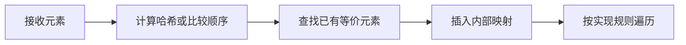

# HashSet、LinkedHashSet 和 TreeSet 有什么区别？

## 面试考察点

- 能否说明三种 Set 的底层结构和顺序语义。
- 是否理解 `equals/hashCode` 与比较器的去重依据。
- 能否根据业务要求选择合适实现。

## 核心答案

> HashSet 基于 HashMap，平均增删查接近 O(1) 且不保证顺序；LinkedHashSet 额外维护链表，保留插入顺序；TreeSet 基于红黑树，元素按自然顺序或比较器排序，操作复杂度 O(log n)。

HashSet 和 LinkedHashSet 主要通过 `hashCode` 定位、`equals` 判等；TreeSet 用 `compareTo` 或 `Comparator` 的结果是否为 0 判断重复。

## 选择原则

只要求去重时优先 HashSet；需要稳定输出插入顺序时选择 LinkedHashSet；需要有序遍历、范围查询或邻近元素查找时使用 TreeSet。

## 底层结构与复杂度

| 实现 | 底层结构 | contains/add/remove | 顺序 | 额外成本 |
| --- | --- | --- | --- | --- |
| HashSet | HashMap 的键 | 平均 O(1) | 无契约 | 桶数组与节点 |
| LinkedHashSet | HashMap + 双向链表 | 平均 O(1) | 插入顺序 | 每节点额外前后指针 |
| TreeSet | TreeMap 红黑树 | O(log n) | 比较器顺序 | 树旋转和比较成本 |

HashSet 实际把元素存为 HashMap 的 key，value 使用共享占位对象。LinkedHashSet 通过维护访问链保证稳定迭代，因此比 HashSet 多占一些内存，但非常适合“去重且保留输入顺序”。

## TreeSet 的导航能力

TreeSet 不只是排序输出，还实现 `NavigableSet`：

```java
NavigableSet<Integer> scores = new TreeSet<>(List.of(60, 75, 80, 90));
scores.floor(78);       // 75，小于等于目标的最大值
scores.ceiling(78);     // 80，大于等于目标的最小值
scores.subSet(70, true, 90, false); // [75, 80]
```

排行榜分段、时间范围、规则阈值等需要邻近或区间操作时，这些能力比“放入 HashSet 后每次排序”更自然。

## 可变键为什么危险

```java
Set<User> users = new HashSet<>();
User user = new User(1L, "old@example.com");
users.add(user);
user.setEmail("new@example.com"); // 若 email 参与 equals/hashCode
users.remove(user);               // 可能找不到原桶
```

TreeSet 也有类似问题：若对象加入后修改参与比较的字段，树的物理位置不会自动调整，集合顺序和查找都会失真。集合元素最好使用不可变唯一键，更新排序字段时先删除旧元素再重新加入。

## 去重规则是业务契约

按用户 ID 去重、按邮箱去重和按“姓名 + 生日”去重是不同业务含义。不要为了放入 Set 临时重写实体 equals；更明确的做法是构造去重键、使用 `Map<Key, Value>`，或给 TreeSet 传入局部 Comparator。

## 契约要求

放入 HashSet 的对象在集合生命周期内不应修改参与哈希的字段。TreeSet 的比较规则最好与 `equals` 一致，否则可能出现“equals 不同但集合认为重复”的现象。

## 常见误区

HashSet 的遍历顺序即使在一次运行中看似稳定，也不是公开契约。TreeSet 不是依靠哈希，因此修复 `hashCode` 不会改变它的去重结果。

## 高频追问与参考回答

### 追问：三种 Set 如何处理 null？

HashSet 和 LinkedHashSet 通常允许一个 null；TreeSet 使用自然排序时通常不能比较 null，自定义比较器是否支持取决于比较规则。

### 追问：LinkedHashSet 如何实现稳定顺序？

除了哈希桶，它还把所有节点连接成双向链表；迭代沿链表进行。删除需要同时维护哈希结构和链表链接。

### 追问：如何对一批对象按 ID 去重并保留第一次出现？

用 LinkedHashMap 的 ID 作为键并 `putIfAbsent`，最后取 values；这比只用 Set 更容易同时保留原对象和明确去重字段。

### 追问：TreeSet 的 compare 返回 0 有什么后果？

集合认为新元素与已有元素是同一个键，`add` 返回 false，不会同时保存。比较器必须包含业务唯一性需要的全部字段。

## 总结

选择 Set 时先明确去重规则，再看是否需要插入顺序、排序和范围能力。

<!-- depth-standard:start -->
## 机制全景图

下面把「HashSet、LinkedHashSet 和 TreeSet 有什么区别？」从输入到结果压缩成一条可复述的主链路。面试时先用图建立全局坐标，再进入局部实现，能避免只背零散结论。



## 完整链路：从输入到结果

沿着「接收元素 → 计算哈希或比较顺序 → 查找已有等价元素 → 插入内部映射 → 按实现规则遍历」观察输入、状态与输出，下面每个阶段都对应一个可以在源码、日志或系统表中验证的位置。

### 1. 接收元素

Set 的核心语义是不重复，但“相同”由 equals/hashCode 或排序比较器决定。

### 2. 计算哈希或比较顺序

HashSet 使用哈希定位，TreeSet 使用 compareTo/Comparator，LinkedHashSet 同时维护哈希与插入顺序链。

### 3. 查找已有等价元素

已有等价元素时 add 返回 false，调用方不应仅依赖最终 size 才发现重复。

### 4. 插入内部映射

多数 Set 实际委托给 Map 保存元素，Value 只是共享占位对象，因此键契约决定正确性。

### 5. 按实现规则遍历

遍历顺序分别是不保证、插入顺序和排序顺序；顺序要求必须写进接口契约。

## 源码与实现定位

| 入口 | 阅读重点 |
| --- | --- |
| java.util.HashSet | 内部 HashMap PRESENT 占位 |
| java.util.TreeMap#put | compare=0 决定键等价 |

源码或系统表应按上表顺序追踪：先确认入口实际走到哪条路径，再用运行时数据验证，而不是仅凭类名或配置推测。

## 参数配置与可复现实验

```java
Set<Tag> ordered = new LinkedHashSet<>();
ordered.addAll(input);
List<Tag> output = List.copyOf(ordered);
```

同一批含重复与同排序值数据分别装入三种 Set，核对元素数、遍历顺序、contains 延迟和内存。

## 验证步骤与预期结果

### 1. 固定输入和基线

先在没有故障注入的环境执行上述配置，固定数据规模、并发度、运行时版本和预热时间。以「去重后数量」为主基线，记录值应满足「等于业务唯一键数」；同时保存 去重前后元素数、比较器冲突样本，使后续变化能够回到同一时间轴比较。

### 2. 从实现入口确认路径

在「java.util.HashSet」确认请求确实进入「内部 HashMap PRESENT 占位」对应的实现，再沿「java.util.TreeMap#put」观察「compare=0 决定键等价」。如果入口路径都未命中，就不应继续调整下游参数，而应先检查调用条件、版本或路由是否与假设一致。

### 3. 注入本文特有的失败模式

优先复现「比较器返回 0 但 equals 不相等导致元素被吞」，并把单一变量逐级放大，直到「去重后数量」越过「TreeSet 少于 HashSet」。随后再分别验证「依赖 HashSet 偶然遍历顺序」和「元素可变后无法正常 remove」，三类故障分开执行，避免多个变量同时变化而无法归因。

### 4. 执行止损和根因修复

第一轮只应用「排序唯一性与 equals 口径对齐」，确认它能控制影响范围；第二轮应用「需要顺序时显式选 LinkedHashSet」，验证核心链路恢复；最后落实「元素入 Set 后禁止修改判重字段」，消除同类问题再次出现的条件。每一步都保留变更前后数据，不用“感觉变快了”替代测量。

### 5. 通过退出条件

实验只有同时满足三项才算通过：「去重后数量」回到「等于业务唯一键数」、「顺序稳定性」回到「LinkedHashSet 重放一致」、「单元素字节」回到「按实现测量」，并且业务结果差异为零。若性能恢复但结果不一致，仍应视为失败；若指标恢复后很快再次越线，则说明只完成了临时止损，没有消除根因。

## 量化基线

| 指标 | 样例基线/口径 | 风险线 | 结论 |
| --- | --- | --- | --- |
| 去重后数量 | 等于业务唯一键数 | TreeSet 少于 HashSet | 检查 comparator=0 |
| 顺序稳定性 | LinkedHashSet 重放一致 | HashSet 升级后变化 | 不要依赖未承诺顺序 |
| 单元素字节 | 按实现测量 | 链表/树开销超预算 | 换适合结构 |

这些数值是实验口径或示例告警线，不是可复制到所有系统的固定答案；上线阈值应由本系统稳态、峰值和故障演练共同确定。

## 事故复盘：用户标签导出顺序每日变化

服务使用 HashSet 去重后直接导出，测试数据较小时顺序看似稳定，扩容或 JDK 变化后顺序改变。业务实际要求首次出现顺序，因此替换为 LinkedHashSet，并增加顺序断言，而不是依赖 HashSet 当前实现。

| 失败模式 | 首要证据 | 第一处置动作 |
| --- | --- | --- |
| 比较器返回 0 但 equals 不相等导致元素被吞 | 去重前后元素数 | 排序唯一性与 equals 口径对齐 |
| 依赖 HashSet 偶然遍历顺序 | 比较器冲突样本 | 需要顺序时显式选 LinkedHashSet |
| 元素可变后无法正常 remove | 集合内存占用 | 元素入 Set 后禁止修改判重字段 |

## 发布与回滚检查点

- **发布前**：确认「java.util.HashSet」对应实现和上述配置在目标版本仍然有效，并保存「去重后数量」基线。
- **灰度中**：同时观察 去重前后元素数、比较器冲突样本、集合内存占用；任一指标越过表中风险线，就停止继续扩量。
- **回滚时**：先执行「排序唯一性与 equals 口径对齐」控制影响，再回退代码或参数；涉及持久状态时必须额外核对结果差异。
- **发布后**：至少覆盖一个完整峰值周期，确认「比较器返回 0 但 equals 不相等导致元素被吞」没有再次出现，才关闭变更观察窗口。

## 方案对比与选型

| 方案 | 更适合的场景 | 主要收益 | 代价与边界 |
| --- | --- | --- | --- |
| HashSet | 只需快速判重、不关心顺序 | 均摊 O(1)、额外开销较低 | 遍历顺序不稳定 |
| LinkedHashSet | 需要保持插入顺序 | 判重同时稳定输出 | 维护链表增加内存 |
| TreeSet | 需要排序、范围和邻近查询 | 有序且支持导航 API | O(log n)，比较器必须与相等语义协调 |

选型至少带上 元素数量、读写比例、遍历方式、并发度和内存预算，并用上面的量化基线验证；未知数据应明确为待测假设。

## 设计边界与工程取舍

> TreeSet 的唯一性由比较结果为 0 决定，不是再次调用 equals；比较器与领域相等性不一致时必须明确这是业务意图还是缺陷。

工程落地遵循：先保证数据结构语义正确，再依据访问模式选择实现。回答时直接引用「java.util.HashSet」、配置实验和事故数据，比复述固定模板更有说服力。
<!-- depth-standard:end -->
