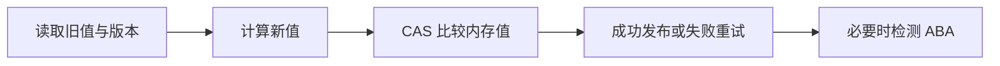

# CAS 的原理是什么？如何解决 ABA 问题？

## 面试考察点

- 是否理解比较并交换的三个操作数和原子语义。
- 能否说明 CAS、自旋与锁的不同成本。
- 是否知道 ABA 的业务含义及版本戳方案。

## 核心答案

> CAS 比较内存当前位置与预期值，相等时原子写入新值，否则失败重试。Java 原子类借助硬件原子指令和可见性语义实现无锁更新；竞争激烈时持续自旋会浪费 CPU，并不一定优于阻塞锁。

ABA 指值从 A 变为 B 又回到 A，CAS 只比较当前值会误以为没有变化。若中间变化有业务意义，应同时比较递增版本号，可使用 `AtomicStampedReference`。

## 关键机制

典型更新先读取旧值、计算新值，再循环 CAS。无锁意味着某个线程暂停不会占着互斥锁阻塞其他线程，但不代表没有重试、饥饿或复杂的内存回收问题。

## CAS 循环长什么样

```java
AtomicInteger stock = new AtomicInteger(10);

boolean reserve() {
    while (true) {
        int current = stock.get();
        if (current <= 0) return false;
        if (stock.compareAndSet(current, current - 1)) return true;
        // 竞争失败，重新读取并计算
    }
}
```

CAS 的三个参数是内存位置 V、预期值 A、新值 B。仅当 V 仍等于 A 时，硬件原子地写入 B 并返回成功。Java 的 `compareAndSet` 还提供与 volatile 读写相匹配的可见性语义，不是只比较一个裸 CPU 寄存器。

## ABA 到底会造成什么问题

以无锁栈为例，线程 1 读取头节点 A 和 next B 后暂停；线程 2 弹出 A、弹出 B，又把 A 压回栈顶。线程 1 恢复时发现头仍是 A，CAS 成功，却把 next 指向已经不属于原链路的 B，可能丢失节点。

若业务只关心当前数值，A -> B -> A 未必有害；若中间状态代表资源被占用、版本被修改或链表拓扑变更，就必须检测。版本戳把比较条件从“值 A”升级为“值 A 且版本 N”。

```java
AtomicStampedReference<String> ref =
    new AtomicStampedReference<>("A", 0);
```

版本并非越大越好，还要处理溢出、持久化和跨进程一致性。数据库通常用版本列，分布式系统常用 fencing token，解决的都是“旧持有者不能覆盖新状态”的同类问题。

## 自旋与锁的取舍

CAS 失败时自旋会继续占用 CPU。低冲突、短操作下，重试一次往往比线程阻塞和唤醒更快；高冲突下，很多线程反复失败会造成缓存一致性流量和 CPU 空转，吞吐反而下降。

常见缓解手段是退避、分段、批量合并、LongAdder 或改用锁。不能只用“无锁一定快”判断，需要观察失败率、CPU 利用率、P99 和热点分布。

## 原子类选择

| 需求 | 常用类型 | 注意点 |
| --- | --- | --- |
| 单个 int/long | AtomicInteger/AtomicLong | CAS 更新单值 |
| 高竞争累计 | LongAdder/LongAccumulator | 读取为汇总近似值 |
| 对象引用 | AtomicReference | 保护引用替换，不保护对象内部 |
| 版本/标记 | AtomicStampedReference / AtomicMarkableReference | 额外元数据与分配成本 |
| 多字段一致状态 | 不可变状态对象 + AtomicReference | 一次替换完整快照 |

## 常见业务误用

库存扣减可用 CAS 限制单个数字不为负，但“扣库存、创建订单、冻结优惠券”是多资源事务，单个 AtomicInteger 无法保证整体一致。应通过数据库条件更新、消息状态机或单分片串行化处理完整业务不变量。

## 适用边界

低冲突、状态小且更新逻辑简单时 CAS 很合适；高冲突或操作需要维护多个变量不变量时，锁通常更清楚。热点计数可用 LongAdder 分散竞争，但读取是汇总值。

## 常见误区

CAS 解决的是单次条件更新原子性，不能自动让一段复合业务逻辑成为事务。给引用加 `volatile` 也只能保证引用读写可见，不能保证对象内部多字段一致。

## 高频追问与参考回答

### 追问：LongAdder 为什么高并发下更快？

它把竞争分散到多个计数单元，更新线程更少争用同一位置，读取时再求和；代价是更多内存且 `sum()` 不代表严格瞬时快照。

### 追问：CAS 会有 ABA 之外的问题吗？

会。高竞争自旋、单线程长期失败造成饥饿、多变量一致性无法表达，以及无锁链表等结构的内存回收复杂性，都是实际工程挑战。

### 追问：weakCompareAndSet 和 compareAndSet 有何不同？

弱版本在某些平台允许无原因失败，调用方本就应在循环中重试；普通业务更常用语义直观的 compareAndSet。具体内存语义还需看所选 JDK API 变体。

### 追问：为什么自旋锁在单核机器上风险大？

持锁线程可能没有机会获得 CPU 运行并释放锁，而等待线程持续自旋占用唯一核心，造成活锁式浪费。

## 总结

CAS 是乐观条件更新，优势取决于冲突概率；ABA 只有在中间状态重要时才需版本、标记或更高层协议解决。

<!-- depth-standard:start -->
## 机制全景图

下面把「CAS 的原理是什么？如何解决 ABA 问题？」从输入到结果压缩成一条可复述的主链路。面试时先用图建立全局坐标，再进入局部实现，能避免只背零散结论。



## 完整链路：从输入到结果

沿着「读取旧值与版本 → 计算新值 → CAS 比较内存值 → 成功发布或失败重试 → 必要时检测 ABA」观察输入、状态与输出，下面每个阶段都对应一个可以在源码、日志或系统表中验证的位置。

### 1. 读取旧值与版本

CAS 操作以期望值、更新值和目标地址为输入，读取与条件写入作为单个原子步骤完成。

### 2. 计算新值

计算新值应是纯函数或可安全重试，因为失败线程可能多次执行更新逻辑。

### 3. CAS 比较内存值

实际值等于期望值时交换成功，并建立相应的 volatile 读写语义。

### 4. 成功发布或失败重试

竞争失败通常进入自旋；高冲突下反复 CAS 会浪费 CPU，退避、分段或锁可能更合适。

### 5. 必要时检测 ABA

ABA 表示值从 A 变 B 又回 A，纯值比较无法发现中间变化；版本戳或不可复用节点可保留历史信息。

## 源码与实现定位

| 入口 | 阅读重点 |
| --- | --- |
| VarHandle#compareAndSet | 原子比较交换与内存语义 |
| AtomicStampedReference | 引用+版本戳双字段 CAS |

源码或系统表应按上表顺序追踪：先确认入口实际走到哪条路径，再用运行时数据验证，而不是仅凭类名或配置推测。

## 参数配置与可复现实验

```java
AtomicStampedReference<Node> top = new AtomicStampedReference<>(null, 0);
int[] stamp = new int[1];
Node current = top.get(stamp);
```

构造 T1 暂停、T2 A→B→A 的确定调度，比较普通 AtomicReference 与带戳版本；高冲突下测 CAS 失败率。

## 验证步骤与预期结果

### 1. 固定输入和基线

先在没有故障注入的环境执行上述配置，固定数据规模、并发度、运行时版本和预热时间。以「CAS 失败率」为主基线，记录值应满足「<10% 示例」；同时保存 CAS 失败率、自旋次数，使后续变化能够回到同一时间轴比较。

### 2. 从实现入口确认路径

在「VarHandle#compareAndSet」确认请求确实进入「原子比较交换与内存语义」对应的实现，再沿「AtomicStampedReference」观察「引用+版本戳双字段 CAS」。如果入口路径都未命中，就不应继续调整下游参数，而应先检查调用条件、版本或路由是否与假设一致。

### 3. 注入本文特有的失败模式

优先复现「高竞争自旋导致 CPU 满载」，并把单一变量逐级放大，直到「CAS 失败率」越过「>30%」。随后再分别验证「CAS 回调含副作用被重复执行」和「忽略节点复用引发 ABA」，三类故障分开执行，避免多个变量同时变化而无法归因。

### 4. 执行止损和根因修复

第一轮只应用「副作用移出 CAS 更新函数」，确认它能控制影响范围；第二轮应用「ABA 敏感结构加版本戳」，验证核心链路恢复；最后落实「高冲突改锁/分段」，消除同类问题再次出现的条件。每一步都保留变更前后数据，不用“感觉变快了”替代测量。

### 5. 通过退出条件

实验只有同时满足三项才算通过：「CAS 失败率」回到「<10% 示例」、「单次自旋数」回到「少量重试」、「版本回绕」回到「生命周期内不可达」，并且业务结果差异为零。若性能恢复但结果不一致，仍应视为失败；若指标恢复后很快再次越线，则说明只完成了临时止损，没有消除根因。

## 量化基线

| 指标 | 样例基线/口径 | 风险线 | 结论 |
| --- | --- | --- | --- |
| CAS 失败率 | <10% 示例 | >30% | 自旋成本过高 |
| 单次自旋数 | 少量重试 | 无上限增长 | 加退避/锁 |
| 版本回绕 | 生命周期内不可达 | 接近上限 | 扩大版本或不复用节点 |

这些数值是实验口径或示例告警线，不是可复制到所有系统的固定答案；上线阈值应由本系统稳态、峰值和故障演练共同确定。

## 事故复盘：无锁栈在节点复用后丢失元素

线程 T1 读到栈顶 A 后暂停，T2 弹出 A、B 再把复用的 A 压回。T1 CAS 发现仍是 A 并成功，却把栈顶指向旧 next，导致新状态损坏。使用带版本的引用或避免节点立即复用可识别这次变化。

| 失败模式 | 首要证据 | 第一处置动作 |
| --- | --- | --- |
| 高竞争自旋导致 CPU 满载 | CAS 失败率 | 副作用移出 CAS 更新函数 |
| CAS 回调含副作用被重复执行 | 自旋次数 | ABA 敏感结构加版本戳 |
| 忽略节点复用引发 ABA | CPU 利用率 | 高冲突改锁/分段 |

## 发布与回滚检查点

- **发布前**：确认「VarHandle#compareAndSet」对应实现和上述配置在目标版本仍然有效，并保存「CAS 失败率」基线。
- **灰度中**：同时观察 CAS 失败率、自旋次数、CPU 利用率；任一指标越过表中风险线，就停止继续扩量。
- **回滚时**：先执行「副作用移出 CAS 更新函数」控制影响，再回退代码或参数；涉及持久状态时必须额外核对结果差异。
- **发布后**：至少覆盖一个完整峰值周期，确认「高竞争自旋导致 CPU 满载」没有再次出现，才关闭变更观察窗口。

## 方案对比与选型

| 方案 | 更适合的场景 | 主要收益 | 代价与边界 |
| --- | --- | --- | --- |
| AtomicReference | 引用状态且不关心中间历史 | API 简单、无锁更新 | 无法识别 ABA |
| AtomicStampedReference | 中间变化影响正确性 | 版本戳显式识别 ABA | 对象与比较成本更高 |
| 锁保护临界区 | 冲突高或状态更新复杂 | 易表达多变量不变量 | 线程可能阻塞且有调度成本 |

选型至少带上 并发线程数、临界区长度、阻塞比例和任务到达速率，并用上面的量化基线验证；未知数据应明确为待测假设。

## 设计边界与工程取舍

> 无锁不等于无竞争或一定更快；CAS 适合短小单变量状态更新，复杂不变量和高冲突负载常由锁获得更稳定尾延迟。

工程落地遵循：先建立 happens-before 与所有权边界，再谈吞吐和无锁优化。回答时直接引用「VarHandle#compareAndSet」、配置实验和事故数据，比复述固定模板更有说服力。
<!-- depth-standard:end -->
