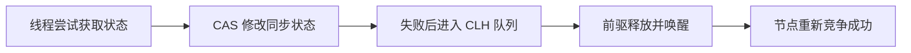

# synchronized、ReentrantLock 与 AQS 原理

## 两种锁怎么选

普通互斥同步优先使用 `synchronized`，语法简单且能自动释放锁。需要可中断获取、超时尝试、公平锁或多个条件队列时，使用 `ReentrantLock`。

```java
lock.lock();
try {
    updateState();
} finally {
    lock.unlock();
}
```

显式锁必须在 `finally` 中释放，否则异常会造成永久占锁。

## synchronized 锁住了什么

- 实例同步方法锁当前对象。
- 静态同步方法锁对应的 `Class` 对象。
- 同步代码块锁括号中指定的对象。

进入同步块不仅提供互斥，还建立 happens-before 关系：一次解锁先行发生于后续对同一监视器的加锁，因此锁内写入对后续持锁线程可见。

## 可重入与公平性

可重入表示线程持有锁时，可以再次获得同一把锁，内部会维护持有次数。`synchronized` 和 `ReentrantLock` 都可重入。

公平锁倾向于让等待时间最长的线程先获得锁，可以减少饥饿，但会降低吞吐量。非公平锁允许刚到达的线程竞争，减少线程切换，通常性能更高。公平也不等于绝对调度顺序。

## AQS 的核心模型

`AbstractQueuedSynchronizer` 使用一个 `state` 状态值和一个等待队列构建同步器。线程先通过 CAS 尝试修改状态；失败后包装为节点进入队列，并在合适时机被前驱节点唤醒。

独占模式同一时刻只允许一个线程成功，共享模式允许多个线程通过。`ReentrantLock`、`Semaphore`、`CountDownLatch` 等都基于 AQS，但对 `state` 的解释不同。

## Condition 条件队列

`Condition` 类似 `wait/notify`，但一把锁可以创建多个条件队列，让等待原因更加明确。

```java
while (queue.isEmpty()) {
    notEmpty.await();
}
var value = queue.remove();
notFull.signal();
```

条件判断必须使用 `while`，因为线程被唤醒后条件可能已被其他线程改变，也需要防御虚假唤醒。

## 常见并发问题

死锁通常满足互斥、占有且等待、不可剥夺和循环等待四个条件。工程上可以通过统一加锁顺序、缩小锁范围、使用 `tryLock` 超时和避免锁内慢 IO 降低风险。

锁粒度过大会限制并发，过小会增加协调复杂度。优化前应通过线程 dump、指标和压测确认竞争热点，不要仅凭感觉拆锁。

## 面试要点

1. `volatile` 不能替代锁完成复合操作的原子性。
2. `sleep` 不释放锁；`Object.wait` 会释放当前监视器并进入等待集。
3. `ReentrantLock` 不一定比 `synchronized` 快，应根据功能和可维护性选择。
4. AQS 是同步器框架，不是所有 Java 锁的唯一底层实现。

## 核心考点清单

- synchronized 自动释放监视器；ReentrantLock 必须在 finally 中 unlock。
- 两者都可重入，并通过解锁—加锁建立 happens-before。
- AQS 以 state、CAS 和同步队列构建独占或共享同步器。
- Condition 必须配合 while 检查条件，以处理竞争和虚假唤醒。

## 高频追问与参考回答

### 追问：公平锁一定公平吗？

公平锁倾向按等待顺序获取，但线程调度仍受操作系统影响；它减少饥饿却增加切换，吞吐通常低于非公平锁。

### 追问：sleep 和 wait 有何区别？

`sleep` 是 Thread 的时间等待且不释放已持有锁；`wait` 必须在监视器内调用，会释放该监视器并等待通知。

<!-- depth-standard:start -->
## 机制全景图

下面把「synchronized、ReentrantLock 与 AQS 原理」从输入到结果压缩成一条可复述的主链路。面试时先用图建立全局坐标，再进入局部实现，能避免只背零散结论。



## 完整链路：从输入到结果

沿着「线程尝试获取状态 → CAS 修改同步状态 → 失败后进入 CLH 队列 → 前驱释放并唤醒 → 节点重新竞争成功」观察输入、状态与输出，下面每个阶段都对应一个可以在源码、日志或系统表中验证的位置。

### 1. 线程尝试获取状态

AQS 用一个 volatile state 表示同步状态，具体子类解释 0/1、重入次数或许可数量。

### 2. CAS 修改同步状态

tryAcquire 由同步器实现，通过 CAS 或独占规则决定当前线程是否成功。

### 3. 失败后进入 CLH 队列

失败线程封装为节点加入双向等待队列，避免所有线程持续自旋消耗 CPU。

### 4. 前驱释放并唤醒

释放状态后检查后继节点并 unpark，条件队列的 signal 还要先把节点转移到同步队列。

### 5. 节点重新竞争成功

被唤醒不等于直接获得锁，线程仍需确认前驱和状态，处理取消与伪唤醒。

## 源码与实现定位

| 入口 | 阅读重点 |
| --- | --- |
| AbstractQueuedSynchronizer#acquire | tryAcquire、入队与 park |
| AbstractQueuedSynchronizer#release | state 释放与 unparkSuccessor |

源码或系统表应按上表顺序追踪：先确认入口实际走到哪条路径，再用运行时数据验证，而不是仅凭类名或配置推测。

## 参数配置与可复现实验

```java
lock.lockInterruptibly();
try { update(); }
finally { lock.unlock(); }
```

用 JFR Java Monitor Blocked/Thread Park 对比公平与非公平锁；注入中断、超时和取消验证队列可前进。

## 验证步骤与预期结果

### 1. 固定输入和基线

先在没有故障注入的环境执行上述配置，固定数据规模、并发度、运行时版本和预热时间。以「持锁 P99」为主基线，记录值应满足「短于 1ms 示例基线」；同时保存 锁等待时间、AQS 队列长度，使后续变化能够回到同一时间轴比较。

### 2. 从实现入口确认路径

在「AbstractQueuedSynchronizer#acquire」确认请求确实进入「tryAcquire、入队与 park」对应的实现，再沿「AbstractQueuedSynchronizer#release」观察「state 释放与 unparkSuccessor」。如果入口路径都未命中，就不应继续调整下游参数，而应先检查调用条件、版本或路由是否与假设一致。

### 3. 注入本文特有的失败模式

优先复现「忘记 finally unlock 造成永久占用」，并把单一变量逐级放大，直到「持锁 P99」越过「超过请求预算 10%」。随后再分别验证「在锁内执行慢 I/O 放大队列」和「错误实现 release 返回值导致不唤醒」，三类故障分开执行，避免多个变量同时变化而无法归因。

### 4. 执行止损和根因修复

第一轮只应用「I/O 移出锁内」，确认它能控制影响范围；第二轮应用「必须 finally 解锁」，验证核心链路恢复；最后落实「自定义同步器补取消/中断测试」，消除同类问题再次出现的条件。每一步都保留变更前后数据，不用“感觉变快了”替代测量。

### 5. 通过退出条件

实验只有同时满足三项才算通过：「持锁 P99」回到「短于 1ms 示例基线」、「AQS 队列长度」回到「稳态接近 0」、「park 次数」回到「与冲突一致」，并且业务结果差异为零。若性能恢复但结果不一致，仍应视为失败；若指标恢复后很快再次越线，则说明只完成了临时止损，没有消除根因。

## 量化基线

| 指标 | 样例基线/口径 | 风险线 | 结论 |
| --- | --- | --- | --- |
| 持锁 P99 | 短于 1ms 示例基线 | 超过请求预算 10% | 临界区过大 |
| AQS 队列长度 | 稳态接近 0 | 持续增长 | 竞争饱和 |
| park 次数 | 与冲突一致 | 无流量仍高 | 唤醒风暴 |

这些数值是实验口径或示例告警线，不是可复制到所有系统的固定答案；上线阈值应由本系统稳态、峰值和故障演练共同确定。

## 事故复盘：自定义限流器偶发永久等待

同步器在 release 时只修改 state，没有在状态变为可用时返回 true，AQS 因此不唤醒后继节点。修复需要遵守 acquire/release 返回值契约，并用中断、取消和超时场景测试队列清理。

| 失败模式 | 首要证据 | 第一处置动作 |
| --- | --- | --- |
| 忘记 finally unlock 造成永久占用 | 锁等待时间 | I/O 移出锁内 |
| 在锁内执行慢 I/O 放大队列 | AQS 队列长度 | 必须 finally 解锁 |
| 错误实现 release 返回值导致不唤醒 | park/unpark 频率 | 自定义同步器补取消/中断测试 |

## 发布与回滚检查点

- **发布前**：确认「AbstractQueuedSynchronizer#acquire」对应实现和上述配置在目标版本仍然有效，并保存「持锁 P99」基线。
- **灰度中**：同时观察 锁等待时间、AQS 队列长度、park/unpark 频率；任一指标越过表中风险线，就停止继续扩量。
- **回滚时**：先执行「I/O 移出锁内」控制影响，再回退代码或参数；涉及持久状态时必须额外核对结果差异。
- **发布后**：至少覆盖一个完整峰值周期，确认「忘记 finally unlock 造成永久占用」没有再次出现，才关闭变更观察窗口。

## 方案对比与选型

| 方案 | 更适合的场景 | 主要收益 | 代价与边界 |
| --- | --- | --- | --- |
| synchronized | 普通互斥且不需高级能力 | JVM 优化成熟、语法简单 | 不支持多个条件与可中断获取 |
| ReentrantLock | 需公平、超时、可中断或多个 Condition | 能力完整、观测更直接 | 必须 finally 解锁 |
| 自定义 AQS | 同步语义无法由现有工具表达 | 复用排队与唤醒框架 | 正确性复杂，维护和测试成本高 |

选型至少带上 并发线程数、临界区长度、阻塞比例和任务到达速率，并用上面的量化基线验证；未知数据应明确为待测假设。

## 设计边界与工程取舍

> AQS 提供排队骨架而非业务正确性；优先使用成熟同步器，自定义实现必须覆盖取消、中断、超时、重入和传播等边界。

工程落地遵循：先建立 happens-before 与所有权边界，再谈吞吐和无锁优化。回答时直接引用「AbstractQueuedSynchronizer#acquire」、配置实验和事故数据，比复述固定模板更有说服力。
<!-- depth-standard:end -->
