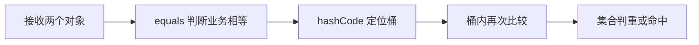

# ==、equals 和 hashCode 的区别？

## 核心答案

`==` 比较基本类型的值，比较引用类型时判断是否指向同一对象。`equals` 默认与 `==` 相同，但值对象通常会重写它。`hashCode` 为哈希容器提供桶定位依据。

## equals 与 hashCode 契约

两个对象 equals 相等，它们的 hashCode 必须相等；hashCode 相等，equals 不一定相等。重写 equals 时必须同时重写 hashCode。

## 常见错误

只重写 equals 会导致逻辑上相等的对象进入 HashSet 后仍然重复，或者无法从 HashMap 中正确取回。

## 总结

equals 决定逻辑相等，hashCode 优化查找；两者必须遵守一致性契约。

## 核心考点清单

1. 基本类型的 `==` 比较值；引用类型的 `==` 比较对象身份。
2. `Object.equals` 默认仍比较身份，值对象需要定义逻辑相等。
3. 相等对象必须有相同哈希值；哈希值相同的对象不一定相等。
4. `equals` 必须满足自反、对称、传递、一致，并对 `null` 返回 false。
5. 用作 HashMap 键的字段应尽量不可变，否则修改后可能无法找回。

## HashMap 为什么同时需要两者

查询时先用 `hashCode` 定位桶，再用 `equals` 确认具体键。哈希只是缩小范围，不是相等性的最终判断。只重写 `equals` 会让逻辑相等的对象落入不同桶，导致 `get` 失败或 `HashSet` 出现重复。

## 高频追问与参考回答

### 追问 1：hashCode 相同，equals 一定为 true 吗？

不一定。哈希空间有限，碰撞必然存在，所以命中桶后必须继续比较 `equals`。

### 追问 2：为什么不建议用可变对象作为键？

若参与哈希计算的字段在插入后变化，新哈希位置与原桶不一致，即使对象仍在 Map 中也可能无法查询和删除。

### 追问 3：BigDecimal 比较有什么陷阱？

`1.0` 与 `1.00` 使用 `compareTo` 数值相等，但 `equals` 还比较精度。金额逻辑必须明确需要数值相等还是严格对象相等。

<!-- depth-standard:start -->
## 机制全景图

下面把「==、equals 和 hashCode 的区别？」从输入到结果压缩成一条可复述的主链路。面试时先用图建立全局坐标，再进入局部实现，能避免只背零散结论。



## 完整链路：从输入到结果

沿着「接收两个对象 → equals 判断业务相等 → hashCode 定位桶 → 桶内再次比较 → 集合判重或命中」观察输入、状态与输出，下面每个阶段都对应一个可以在源码、日志或系统表中验证的位置。

### 1. 接收两个对象

比较开始前先处理同一引用、null 和类型兼容性，避免业务字段比较掩盖基本契约问题。

### 2. equals 判断业务相等

equals 必须满足自反、对称、传递、一致以及对 null 返回 false，继承层次尤其容易破坏对称性。

### 3. hashCode 定位桶

相等对象必须产生相同哈希值；不相等对象允许哈希冲突，哈希值只负责缩小候选范围。

### 4. 桶内再次比较

HashMap 先按哈希定位桶，再通过引用或 equals 确认键，冲突时还可能遍历链表或红黑树。

### 5. 集合判重或命中

Set 判重和 Map 查找依赖对象在存放期间保持相等性字段稳定，否则数据仍在集合中却可能无法再次找到。

## 源码与实现定位

| 入口 | 阅读重点 |
| --- | --- |
| java.lang.Object | equals/hashCode 默认身份语义 |
| java.util.HashMap#putVal/getNode | 哈希、桶定位、equals 确认顺序 |

源码或系统表应按上表顺序追踪：先确认入口实际走到哪条路径，再用运行时数据验证，而不是仅凭类名或配置推测。

## 参数配置与可复现实验

```java
record OrderKey(long tenantId, String orderNo) {}
Set<OrderKey> seen = new HashSet<>();
assert !seen.add(new OrderKey(1, "A-100"));
```

生成 100 万个键，分别使用恒定 hashCode 与 record 默认实现，比较桶冲突、put/get P99 和去重结果；测试必须包含字段修改后的查找。

## 验证步骤与预期结果

### 1. 固定输入和基线

先在没有故障注入的环境执行上述配置，固定数据规模、并发度、运行时版本和预热时间。以「相等对象样本」为主基线，记录值应满足「hashCode 必须完全相同」；同时保存 集合去重前后数量、HashMap 冲突与桶分布，使后续变化能够回到同一时间轴比较。

### 2. 从实现入口确认路径

在「java.lang.Object」确认请求确实进入「equals/hashCode 默认身份语义」对应的实现，再沿「java.util.HashMap#putVal/getNode」观察「哈希、桶定位、equals 确认顺序」。如果入口路径都未命中，就不应继续调整下游参数，而应先检查调用条件、版本或路由是否与假设一致。

### 3. 注入本文特有的失败模式

优先复现「只重写 equals 没有重写 hashCode」，并把单一变量逐级放大，直到「相等对象样本」越过「出现任意不一致」。随后再分别验证「把会变化的状态放入哈希键」和「父子类 equals 使用不同类型判断导致不对称」，三类故障分开执行，避免多个变量同时变化而无法归因。

### 4. 执行止损和根因修复

第一轮只应用「同时重写 equals/hashCode 并加入 EqualsVerifier 类测试」，确认它能控制影响范围；第二轮应用「把可变键替换为不可变 record」，验证核心链路恢复；最后落实「父子类相等改为组合或统一 canEqual 规则」，消除同类问题再次出现的条件。每一步都保留变更前后数据，不用“感觉变快了”替代测量。

### 5. 通过退出条件

实验只有同时满足三项才算通过：「相等对象样本」回到「hashCode 必须完全相同」、「百万键装载因子」回到「默认 0.75 下容量约 2^21」、「重复订单率」回到「唯一键口径应为 0」，并且业务结果差异为零。若性能恢复但结果不一致，仍应视为失败；若指标恢复后很快再次越线，则说明只完成了临时止损，没有消除根因。

## 量化基线

| 指标 | 样例基线/口径 | 风险线 | 结论 |
| --- | --- | --- | --- |
| 相等对象样本 | hashCode 必须完全相同 | 出现任意不一致 | 阻止上线并补契约测试 |
| 百万键装载因子 | 默认 0.75 下容量约 2^21 | 大量桶树化 | 检查哈希离散度 |
| 重复订单率 | 唯一键口径应为 0 | 出现非零 | 对照 equals 字段和数据库唯一键 |

这些数值是实验口径或示例告警线，不是可复制到所有系统的固定答案；上线阈值应由本系统稳态、峰值和故障演练共同确定。

## 事故复盘：订单去重集合出现重复记录

订单导入任务使用只重写 equals 的 DTO 放入 HashSet。相同订单号对象得到不同 hashCode，进入不同桶后不会互相比较，最终生成重复订单。修复不仅要同时重写两个方法，还要明确订单号是否稳定、空值如何处理，以及跨类型对象是否应该相等。

| 失败模式 | 首要证据 | 第一处置动作 |
| --- | --- | --- |
| 只重写 equals 没有重写 hashCode | 集合去重前后数量 | 同时重写 equals/hashCode 并加入 EqualsVerifier 类测试 |
| 把会变化的状态放入哈希键 | HashMap 冲突与桶分布 | 把可变键替换为不可变 record |
| 父子类 equals 使用不同类型判断导致不对称 | 业务唯一键重复率 | 父子类相等改为组合或统一 canEqual 规则 |

## 发布与回滚检查点

- **发布前**：确认「java.lang.Object」对应实现和上述配置在目标版本仍然有效，并保存「相等对象样本」基线。
- **灰度中**：同时观察 集合去重前后数量、HashMap 冲突与桶分布、业务唯一键重复率；任一指标越过表中风险线，就停止继续扩量。
- **回滚时**：先执行「同时重写 equals/hashCode 并加入 EqualsVerifier 类测试」控制影响，再回退代码或参数；涉及持久状态时必须额外核对结果差异。
- **发布后**：至少覆盖一个完整峰值周期，确认「只重写 equals 没有重写 hashCode」没有再次出现，才关闭变更观察窗口。

## 方案对比与选型

| 方案 | 更适合的场景 | 主要收益 | 代价与边界 |
| --- | --- | --- | --- |
| record/IDE 生成 | 值对象且参与比较字段明确 | 契约完整、维护成本低 | 字段变化时仍需审查语义 |
| 手写 equals/hashCode | 需要归一化或特殊业务键 | 可精确表达领域规则 | 容易漏字段或破坏契约 |
| 独立 Comparator/Key | 同一对象有多种排序或判重口径 | 不污染实体默认相等性 | 调用处必须始终使用同一口径 |

选型至少带上 对象创建率、调用频次、输入规模和 API 边界，并用上面的量化基线验证；未知数据应明确为待测假设。

## 设计边界与工程取舍

> 数据库主键相同不必然意味着两个内存对象在所有上下文都相等；相等性是领域契约，应明确比较字段、生命周期和跨类型规则。

工程落地遵循：优先保证语言语义、类型契约和向后兼容，再讨论微小性能收益。回答时直接引用「java.lang.Object」、配置实验和事故数据，比复述固定模板更有说服力。
<!-- depth-standard:end -->
