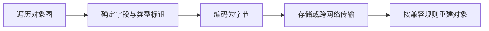

# Java 序列化有哪些方式和风险？

## 面试考察点

- 是否理解序列化解决的是对象跨进程或持久化表达问题。
- 能否比较 JDK 原生序列化、JSON、Protobuf 等方案。
- 是否关注协议演进和反序列化安全。

## 核心答案

> 序列化是把对象转换为可传输或保存的数据格式，反序列化执行逆过程。业务系统通常根据可读性、体积、性能、跨语言和兼容性选择协议，不应默认使用 JDK 原生序列化。

JDK 序列化依赖 `Serializable`，`serialVersionUID` 用于版本校验，`transient` 字段默认不参与序列化。它与 Java 类型绑定较深，且历史上存在危险的反序列化调用链。

## 关键机制

JSON 可读且生态成熟，但类型和体积控制较弱；Protobuf 使用 schema 和字段编号，体积小、跨语言，新增可选字段通常容易兼容，但修改字段语义或复用已删除编号会破坏协议。

## 常见方案对比

| 方案 | 可读性 | 跨语言 | 体积与速度 | 演进方式 | 常见场景 |
| --- | --- | --- | --- | --- | --- |
| JDK 原生 | 低 | 差 | 体积较大 | 依赖 Java 类结构 | 受控的短期内部数据，通常不推荐做公共协议 |
| JSON | 高 | 好 | 体积较大、解析成本中等 | 依靠字段约定 | HTTP API、配置、调试友好链路 |
| Protobuf | 低 | 好 | 紧凑且高效 | schema + 字段编号 | RPC、消息、跨语言高吞吐链路 |
| Avro | 中 | 好 | 紧凑 | schema 解析与注册 | 数据平台、事件流、批处理 |

选型不能只跑一次序列化 benchmark。链路中通常还包含压缩、网络、对象分配、Schema Registry 和灰度兼容，端到端指标才有意义。

## 协议演进规则

一个生产者和多个不同版本消费者会长期共存，协议必须允许滚动升级。常见原则包括：

- 新字段提供默认语义，旧消费者可忽略未知字段。
- 不改变已有字段编号、类型和业务含义。
- 删除的 Protobuf 字段编号标记为 reserved，永不复用。
- 枚举新增值时，消费者必须能处理未知值，而不是进入非法状态。
- 结构性大改使用新事件类型或主版本，避免一个布尔字段改变整条消息解释。

例如把金额从“元的浮点数”改成“分的整数”即使字段类型兼容，语义也不兼容。正确做法是新增 `amount_cent`，双写双读完成迁移，再逐步废弃旧字段。

## 反序列化安全

反序列化不是单纯的数据解析，它可能实例化类型、调用钩子或消耗巨大资源。外部入口应限制消息大小、嵌套深度、集合长度和可实例化类型，依赖库及时升级，并避免对不可信字节使用 JDK 原生对象反序列化。

JSON 也并非天然安全。开启任意多态类型解析可能让攻击者指定危险类；超深 JSON、超大数字和压缩炸弹也会造成 CPU 或内存耗尽。

## 事件设计案例

订单事件建议传递稳定事实，而不是直接序列化 ORM 实体：

```json
{
  "event_id": "evt_01",
  "event_type": "order.paid.v1",
  "occurred_at": "2026-07-22T10:00:00Z",
  "order_id": "O1001",
  "amount_cent": 9900,
  "currency": "CNY"
}
```

事件 ID 用于幂等，类型与版本确定解释方式，时间采用明确时区，金额避免浮点误差。消费者只依赖事件契约，不依赖生产者内部 Java 类名。

## 实践边界

- 网络入口只接收白名单类型和受控协议。
- 消息与缓存内容必须携带版本，支持灰度期间新旧消费者共存。
- 不把数据库实体直接当长期外部协议，避免内部字段变化外溢。

## 常见误区

序列化成功不代表协议可长期演进；性能也不能只看编码耗时，还要看数据体积、网络、GC 和 schema 管理成本。

## 高频追问与参考回答

### 追问：serialVersionUID 不一致会怎样？

JDK 反序列化会进行版本检查，不一致通常抛出 `InvalidClassException`。显式声明只能控制版本标识，不能自动解决字段语义不兼容。

### 追问：transient 字段一定不会被序列化吗？

它不会参与默认 JDK 序列化，但类可通过自定义 `writeObject/readObject` 处理数据；其他 JSON 或二进制框架也有自己的忽略规则，不能把 transient 当通用协议注解。

### 追问：为什么不直接把数据库实体发送到 Kafka？

实体包含持久化细节、懒加载关系和频繁变化字段，会让消费者与生产者内部模型强耦合。独立事件 DTO 更容易做最小披露、版本演进和长期治理。

### 追问：压缩应该放在序列化前还是后？

先序列化得到字节，再对批次或消息压缩。批量压缩通常比单条压缩效果好，但要限制解压后大小并评估 CPU 与延迟。

## 总结

序列化选型要同时考虑跨语言、性能、安全和版本治理，协议稳定性通常比单次编码速度更重要。

<!-- depth-standard:start -->
## 机制全景图

下面把「Java 序列化有哪些方式和风险？」从输入到结果压缩成一条可复述的主链路。面试时先用图建立全局坐标，再进入局部实现，能避免只背零散结论。



## 完整链路：从输入到结果

沿着「遍历对象图 → 确定字段与类型标识 → 编码为字节 → 存储或跨网络传输 → 按兼容规则重建对象」观察输入、状态与输出，下面每个阶段都对应一个可以在源码、日志或系统表中验证的位置。

### 1. 遍历对象图

序列化器从根对象遍历引用关系，循环引用、共享引用和懒加载代理都会影响结果与大小。

### 2. 确定字段与类型标识

协议需要决定字段编号、类型信息、空值和默认值；使用字段名更直观但体积通常更大。

### 3. 编码为字节

编码阶段还涉及字符集、压缩、校验和及大对象限制，不能只比较单条消息的理想吞吐。

### 4. 存储或跨网络传输

传输边界要定义最大报文、版本、加密和重放策略，避免不受信任数据直接进入对象构造。

### 5. 按兼容规则重建对象

反序列化必须处理缺失字段、未知字段和版本演进，并在创建对象前完成类型白名单与尺寸校验。

## 源码与实现定位

| 入口 | 阅读重点 |
| --- | --- |
| java.io.ObjectInputFilter | 原生反序列化类与尺寸过滤 |
| com.google.protobuf.UnknownFieldSet | Protobuf 未知字段兼容保留 |

源码或系统表应按上表顺序追踪：先确认入口实际走到哪条路径，再用运行时数据验证，而不是仅凭类名或配置推测。

## 参数配置与可复现实验

```java
var filter = ObjectInputFilter.Config.createFilter(
    "maxdepth=20;maxrefs=10000;java.base/*;com.acme.dto.*;!*"
);
```

准备旧版、新版和含未知字段三组消息，执行双向兼容测试；同时生成超深对象图和超大数组验证过滤器在分配前拒绝。

## 验证步骤与预期结果

### 1. 固定输入和基线

先在没有故障注入的环境执行上述配置，固定数据规模、并发度、运行时版本和预热时间。以「报文 P99 大小」为主基线，记录值应满足「小于 Broker/网关上限 50%」；同时保存 报文大小分布、序列化与反序列化耗时，使后续变化能够回到同一时间轴比较。

### 2. 从实现入口确认路径

在「java.io.ObjectInputFilter」确认请求确实进入「原生反序列化类与尺寸过滤」对应的实现，再沿「com.google.protobuf.UnknownFieldSet」观察「Protobuf 未知字段兼容保留」。如果入口路径都未命中，就不应继续调整下游参数，而应先检查调用条件、版本或路由是否与假设一致。

### 3. 注入本文特有的失败模式

优先复现「反序列化不可信类型导致代码执行风险」，并把单一变量逐级放大，直到「报文 P99 大小」越过「接近上限 80%」。随后再分别验证「没有版本策略导致历史数据无法读取」和「序列化超大对象造成内存峰值」，三类故障分开执行，避免多个变量同时变化而无法归因。

### 4. 执行止损和根因修复

第一轮只应用「拒绝 Java 原生序列化外部输入」，确认它能控制影响范围；第二轮应用「Schema 兼容检查加入 CI」，验证核心链路恢复；最后落实「设置报文、深度、引用数和类型白名单」，消除同类问题再次出现的条件。每一步都保留变更前后数据，不用“感觉变快了”替代测量。

### 5. 通过退出条件

实验只有同时满足三项才算通过：「报文 P99 大小」回到「小于 Broker/网关上限 50%」、「解码 P99」回到「低于端到端预算 10%」、「兼容失败数」回到「发布前为 0」，并且业务结果差异为零。若性能恢复但结果不一致，仍应视为失败；若指标恢复后很快再次越线，则说明只完成了临时止损，没有消除根因。

## 量化基线

| 指标 | 样例基线/口径 | 风险线 | 结论 |
| --- | --- | --- | --- |
| 报文 P99 大小 | 小于 Broker/网关上限 50% | 接近上限 80% | 拆消息或改紧凑协议 |
| 解码 P99 | 低于端到端预算 10% | 超过预算 20% | 定位字段与分配 |
| 兼容失败数 | 发布前为 0 | 灰度出现任意失败 | 停止扩量并回滚 Schema |

这些数值是实验口径或示例告警线，不是可复制到所有系统的固定答案；上线阈值应由本系统稳态、峰值和故障演练共同确定。

## 事故复盘：消息升级后旧消费者无法解析

订单事件把 Java 类名和完整对象直接写入消息。服务重构包名后，历史消息无法反序列化，回放链路中断。改用稳定事件 Schema、字段编号与兼容性检查，并把领域对象和传输 DTO 分离后，生产者与消费者才能独立演进。

| 失败模式 | 首要证据 | 第一处置动作 |
| --- | --- | --- |
| 反序列化不可信类型导致代码执行风险 | 报文大小分布 | 拒绝 Java 原生序列化外部输入 |
| 没有版本策略导致历史数据无法读取 | 序列化与反序列化耗时 | Schema 兼容检查加入 CI |
| 序列化超大对象造成内存峰值 | 兼容性失败数 | 设置报文、深度、引用数和类型白名单 |

## 发布与回滚检查点

- **发布前**：确认「java.io.ObjectInputFilter」对应实现和上述配置在目标版本仍然有效，并保存「报文 P99 大小」基线。
- **灰度中**：同时观察 报文大小分布、序列化与反序列化耗时、兼容性失败数；任一指标越过表中风险线，就停止继续扩量。
- **回滚时**：先执行「拒绝 Java 原生序列化外部输入」控制影响，再回退代码或参数；涉及持久状态时必须额外核对结果差异。
- **发布后**：至少覆盖一个完整峰值周期，确认「反序列化不可信类型导致代码执行风险」没有再次出现，才关闭变更观察窗口。

## 方案对比与选型

| 方案 | 更适合的场景 | 主要收益 | 代价与边界 |
| --- | --- | --- | --- |
| JSON | 外部接口、调试和异构系统 | 可读、生态成熟 | 体积较大且类型约束较弱 |
| Protobuf/Avro | 高吞吐消息与明确 Schema | 紧凑、兼容规则清晰 | 需要 Schema 管理与代码生成 |
| Java 原生序列化 | 封闭遗留场景 | 接入简单 | 安全风险高、跨版本脆弱，不适合外部输入 |

选型至少带上 对象创建率、调用频次、输入规模和 API 边界，并用上面的量化基线验证；未知数据应明确为待测假设。

## 设计边界与工程取舍

> 序列化格式是长期接口契约，不应等同于某个语言的内存对象；跨服务消息必须优先考虑版本演进、信任边界和可回放性。

工程落地遵循：优先保证语言语义、类型契约和向后兼容，再讨论微小性能收益。回答时直接引用「java.io.ObjectInputFilter」、配置实验和事故数据，比复述固定模板更有说服力。
<!-- depth-standard:end -->
