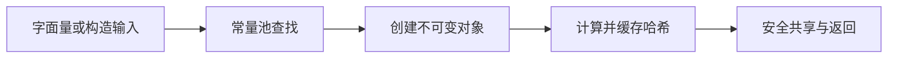

# String 为什么被 final 修饰且不可变？

## 面试考察点

- **语言基础：**是否理解 `final` 修饰类、引用和字段时的区别。
- **设计思想：**能否从安全、缓存、线程安全和性能解释不可变性。
- **源码理解：**知道 JDK 8 使用 `char[]`，JDK 9 以后主要使用 `byte[]` 存储。

## 核心答案

> **一句话回答：**String 类被 final 修饰是为了禁止继承和篡改行为；String 对象不可变，是因为内部数据不对外暴露，所有看似修改的方法都会返回新对象。

需要区分两个概念：`final class String` 表示 String 不能被继承；字符串不可变来自类的整体封装设计，并不只是因为某个字段加了 final。

## 为什么设计成不可变对象？

### 1. 字符串常量池可以安全复用

多个引用可能指向常量池中的同一个字符串。如果字符串可以修改，一个引用的操作会影响所有共享者，常量池也就失去了意义。

### 2. 适合作为 HashMap 的键

String 会缓存哈希值。内容不可变意味着哈希值稳定，放入 HashMap 后不会因为内容变化而找不到原来的桶。

### 3. 天然线程安全

不可变对象没有写操作，多个线程可以安全共享同一个 String 实例，不需要额外加锁。

### 4. 提升安全性

类名、文件路径、网络地址和数据库连接参数经常使用字符串传递。不可变可以防止参数在校验后被修改。

## final 到底保证了什么？

final 引用保证引用不能重新指向另一个对象，并不自动保证对象内部状态不可变。

```java
final List<String> list = new ArrayList<>();
list.add("Java");              // 合法：对象内部可以修改
// list = new ArrayList<>();   // 非法：引用不能重新赋值
```

因此 String 的不可变性来自：类不能继承、内部字段私有、没有暴露修改方法，并且修改操作返回新对象。

## String、StringBuilder 与 StringBuffer

| 类型 | 是否可变 | 线程安全 | 典型场景 |
| --- | --- | --- | --- |
| String | 不可变 | 是 | 少量拼接、常量、Map 键 |
| StringBuilder | 可变 | 否 | 单线程大量拼接 |
| StringBuffer | 可变 | 是 | 多线程共享拼接对象 |

## 高频追问

### String 真的是绝对不可变吗？

正常 Java API 语义下不可变。反射、Unsafe 等特殊手段可能突破封装，但这不属于常规业务使用。

### 字符串拼接一定产生新对象吗？

编译期常量可能被直接折叠；运行期拼接通常借助 StringBuilder，最终生成新的 String。

## 总结

回答时先区分“final 类”和“不可变对象”，再从常量池、哈希稳定、线程安全和安全性解释设计收益，最后补充 StringBuilder 的适用场景。

## 核心考点清单

- `final class` 禁止继承，但不可变性来自私有状态与不暴露修改能力的整体设计。
- 字符串常量池依赖内容不可变才能安全共享。
- 不可变使哈希缓存稳定，并让 String 天然适合做 Map 的键。
- 字符串拼接在编译期常量折叠、运行期 `StringBuilder` 与 `invokedynamic` 下表现不同。

## 高频追问与参考回答

### 追问：StringBuilder 与 StringBuffer 怎么选？

单线程局部拼接优先 StringBuilder；StringBuffer 方法带同步但通常不应靠它解决复杂并发逻辑。固定少量字面量拼接交给编译器即可。

### 追问：new String("abc") 创建几个对象？

不能脱离常量池状态机械回答。字面量对应的池对象可能在类加载阶段已存在，执行 `new` 会明确创建一个新的堆对象。

<!-- depth-standard:start -->
## 机制全景图

下面把「String 为什么被 final 修饰且不可变？」从输入到结果压缩成一条可复述的主链路。面试时先用图建立全局坐标，再进入局部实现，能避免只背零散结论。



## 完整链路：从输入到结果

沿着「字面量或构造输入 → 常量池查找 → 创建不可变对象 → 计算并缓存哈希 → 安全共享与返回」观察输入、状态与输出，下面每个阶段都对应一个可以在源码、日志或系统表中验证的位置。

### 1. 字面量或构造输入

编译期字面量会进入运行时常量池，运行期输入则先以普通对象存在，两者的创建时机与对象数量不同。

### 2. 常量池查找

intern 会查询字符串池并返回池中规范引用，但它不是通用去重工具，调用成本和池容量都要评估。

### 3. 创建不可变对象

不可变性来自 final 类、私有存储和不暴露原地修改能力的组合，而不只是字段被 final 修饰。

### 4. 计算并缓存哈希

内容不变使 hashCode 可以缓存，也保证对象作为 HashMap 键后不会因内容变化而落入错误桶。

### 5. 安全共享与返回

所有拼接、替换和截取操作都返回新对象，因此实例可跨线程共享，但高频修改会产生额外分配。

## 源码与实现定位

| 入口 | 阅读重点 |
| --- | --- |
| java.lang.String | value、coder、hash 字段及 equals/hashCode 实现 |
| java.lang.invoke.StringConcatFactory | JDK 9+ invokedynamic 字符串拼接策略 |

源码或系统表应按上表顺序追踪：先确认入口实际走到哪条路径，再用运行时数据验证，而不是仅凭类名或配置推测。

## 参数配置与可复现实验

```java
var text = new StringBuilder(64);
for (int i = 0; i < 100_000; i++) text.append(i);
String result = text.toString();
```

用 JFR 的 Object Allocation in New TLAB 对比循环加号与预估容量 StringBuilder；固定输入和预热轮次，确认分配下降而结果一致。

## 验证步骤与预期结果

### 1. 固定输入和基线

先在没有故障注入的环境执行上述配置，固定数据规模、并发度、运行时版本和预热时间。以「10 万次数字拼接」为主基线，记录值应满足「记录总分配字节」；同时保存 对象分配速率、Young GC 次数与停顿，使后续变化能够回到同一时间轴比较。

### 2. 从实现入口确认路径

在「java.lang.String」确认请求确实进入「value、coder、hash 字段及 equals/hashCode 实现」对应的实现，再沿「java.lang.invoke.StringConcatFactory」观察「JDK 9+ invokedynamic 字符串拼接策略」。如果入口路径都未命中，就不应继续调整下游参数，而应先检查调用条件、版本或路由是否与假设一致。

### 3. 注入本文特有的失败模式

优先复现「在循环中使用加号造成分配风暴」，并把单一变量逐级放大，直到「10 万次数字拼接」越过「分配量增加 5 倍以上」。随后再分别验证「把 final 引用误认为对象绝对不可变」和「用 intern 处理无界用户输入造成池压力」，三类故障分开执行，避免多个变量同时变化而无法归因。

### 4. 执行止损和根因修复

第一轮只应用「把循环拼接改为单个 Builder 并预估容量」，确认它能控制影响范围；第二轮应用「移除无界 intern，保留明确枚举集合」，验证核心链路恢复；最后落实「冻结键对象与字符集并回放失败样本」，消除同类问题再次出现的条件。每一步都保留变更前后数据，不用“感觉变快了”替代测量。

### 5. 通过退出条件

实验只有同时满足三项才算通过：「10 万次数字拼接」回到「记录总分配字节」、「字符串池条目」回到「只监控受控字面量/枚举」、「缓存键命中率」回到「应与业务基线稳定」，并且业务结果差异为零。若性能恢复但结果不一致，仍应视为失败；若指标恢复后很快再次越线，则说明只完成了临时止损，没有消除根因。

## 量化基线

| 指标 | 样例基线/口径 | 风险线 | 结论 |
| --- | --- | --- | --- |
| 10 万次数字拼接 | 记录总分配字节 | 分配量增加 5 倍以上 | 先检查中间 String 与数组扩容 |
| 字符串池条目 | 只监控受控字面量/枚举 | 随用户输入持续增长 | 停止无界 intern |
| 缓存键命中率 | 应与业务基线稳定 | 发布后突降 | 检查键内容、编码和可变来源 |

这些数值是实验口径或示例告警线，不是可复制到所有系统的固定答案；上线阈值应由本系统稳态、峰值和故障演练共同确定。

## 事故复盘：订单签名偶发校验失败

某支付系统把可变字符缓冲区转换后的结果作为签名缓存键，后续又复用了缓冲区，导致日志中的原文与缓存命中不一致。排查时应确认真正进入 Map 的对象类型、创建时机和编码步骤；改为不可变 String 值并在边界固定字符集后，签名键才具有稳定语义。

| 失败模式 | 首要证据 | 第一处置动作 |
| --- | --- | --- |
| 在循环中使用加号造成分配风暴 | 对象分配速率 | 把循环拼接改为单个 Builder 并预估容量 |
| 把 final 引用误认为对象绝对不可变 | Young GC 次数与停顿 | 移除无界 intern，保留明确枚举集合 |
| 用 intern 处理无界用户输入造成池压力 | 字符串拼接热点栈 | 冻结键对象与字符集并回放失败样本 |

## 发布与回滚检查点

- **发布前**：确认「java.lang.String」对应实现和上述配置在目标版本仍然有效，并保存「10 万次数字拼接」基线。
- **灰度中**：同时观察 对象分配速率、Young GC 次数与停顿、字符串拼接热点栈；任一指标越过表中风险线，就停止继续扩量。
- **回滚时**：先执行「把循环拼接改为单个 Builder 并预估容量」控制影响，再回退代码或参数；涉及持久状态时必须额外核对结果差异。
- **发布后**：至少覆盖一个完整峰值周期，确认「在循环中使用加号造成分配风暴」没有再次出现，才关闭变更观察窗口。

## 方案对比与选型

| 方案 | 更适合的场景 | 主要收益 | 代价与边界 |
| --- | --- | --- | --- |
| String | 只读文本、少量拼接和 Map 键 | 不可变、可共享、API 通用 | 循环修改会产生中间对象 |
| StringBuilder | 单线程局部大量拼接 | 可变且无同步开销 | 不能跨线程无保护共享 |
| StringBuffer | 遗留接口要求共享可变缓冲区 | 方法级同步 | 锁粒度粗，通常不解决完整并发流程 |

选型至少带上 对象创建率、调用频次、输入规模和 API 边界，并用上面的量化基线验证；未知数据应明确为待测假设。

## 设计边界与工程取舍

> String 在正常 Java API 语义下不可变，但反射或 Unsafe 可突破封装；工程设计不能依赖这些非常规行为，也不应把敏感明文长期保存在不可回收的字符串中。

工程落地遵循：优先保证语言语义、类型契约和向后兼容，再讨论微小性能收益。回答时直接引用「java.lang.String」、配置实验和事故数据，比复述固定模板更有说服力。
<!-- depth-standard:end -->
