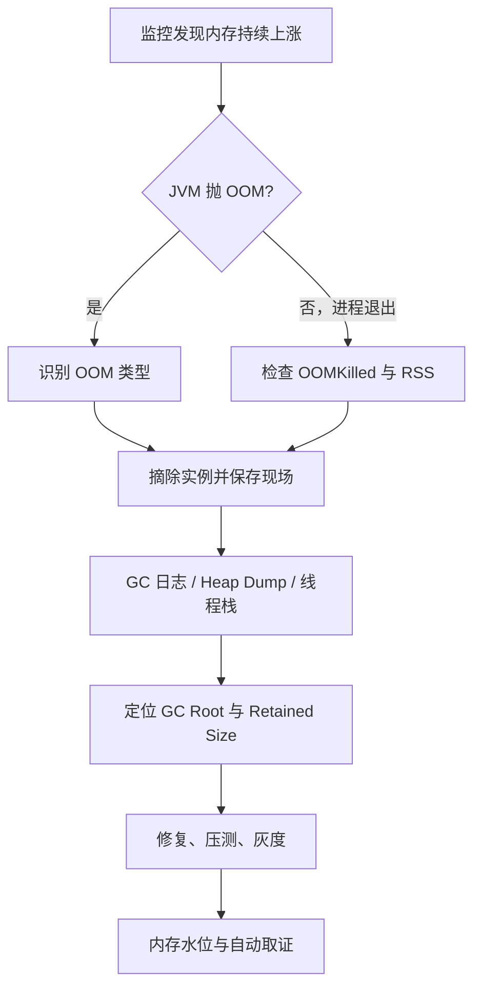

# 线上遇到 OOM 怎么排查和处理？

## 先说结论

> 线上 OOM 首先要保障业务并保存现场，结合异常类型判断 Heap、Metaspace、Direct Memory、线程或 Native Memory 哪个区域耗尽；然后通过 Heap Dump、GC 日志、对象直方图、线程栈和容器指标定位根因，修复后还要压测、灰度并建立内存水位和自动取证机制。

## 先看一个线上案例

> 某营销系统发布新版本后运行约 8 小时，Pod 内存持续上涨，老年代占用从 40% 增长到 90%，Full GC 越来越频繁但每次回收很少，最后出现 `OutOfMemoryError: Java heap space` 并被容器重启。分析 Heap Dump 后发现一个用于保存活动规则的本地 ConcurrentHashMap 占据约 65% Retained Heap，Key 中包含活动 ID 和用户分群版本，但旧版本发布后从未清理。修复方式是使用有容量和过期策略的缓存、发布后主动失效旧版本，并增加缓存大小和老年代增长告警。

回答案例时要突出证据链：为什么判断是泄漏、哪个对象占用、谁持有它、为什么无法回收，以及修复后如何证明问题消失。

## 事故现象



常见监控变化：

```text
堆使用量呈单向阶梯上涨
        ↓
Young GC 频率上升
        ↓
对象不断晋升到老年代
        ↓
Full GC 频繁且回收比例很低
        ↓
请求延迟升高、线程堆积
        ↓
Java heap space / 容器 OOMKilled
```

如果每次 Full GC 后老年代基线都继续升高，通常说明存活对象集合不断增长，需要重点检查泄漏或无界缓存。

## 第一步：确认是 JVM OOM 还是容器 OOMKilled

两者表现和证据不同：

- JVM 主动抛出 `OutOfMemoryError`，应用日志通常有具体错误类型和栈。
- 容器超过 Cgroup 内存限制时，可能被操作系统直接 Kill，Java 来不及打印 OOM，也未必生成 Heap Dump。
- 物理机内存不足时，系统 OOM Killer 可能选择并终止 Java 进程。

因此同时检查应用日志、Pod 状态、退出码、容器事件、RSS、JVM Heap 和节点系统日志。只看 Java Heap 还有余量，不能排除 Direct Memory、线程栈或 Native Memory 把容器撑爆。

## 第二步：先止损

根据业务影响选择：

- 从负载均衡摘除异常实例。
- 临时扩容实例，把流量分摊到更多副本。
- 降级高内存功能，例如大查询、报表导出和全量缓存加载。
- 限制请求体、查询范围、并发和批次大小。
- 回滚最近发布版本或配置。
- 在保留足够健康实例的前提下滚动重启。

不能同时重启所有实例。若每个实例都在相近时间泄漏，批量重启可能短暂恢复后再次同时 OOM。

## 第三步：保存现场

优先保存：

- 完整 OOM 异常及其线程栈。
- GC 日志和 OOM 前后的监控曲线。
- Heap Dump 或对象直方图。
- 线程 Dump。
- JVM 参数、JDK 版本和容器资源限制。
- RSS、Heap、Metaspace、Direct Buffer Pool 和线程数。
- 近期发布、流量和配置变更。

建议提前配置：

```text
-XX:+HeapDumpOnOutOfMemoryError
-XX:HeapDumpPath=/data/dump
-Xlog:gc*:file=/data/logs/gc.log:time,level,tags
```

具体 GC 日志参数因 JDK 版本不同而变化。Dump 目录必须有足够空间，且 Heap Dump 可能包含用户数据、令牌和业务内容，需要严格控制访问与清理。

## 不要在故障现场随意做什么

- 不要连续多次生成完整 Heap Dump，Dump 会触发停顿并占用大量磁盘。
- 不要在磁盘已接近满时直接 Dump。
- 不要执行代价未知的全量对象遍历命令。
- 不要先修改堆大小再删除所有现场证据。
- 不要把含敏感数据的 Dump 上传到公共网站分析。

## OOM 类型与排查方向

### 1. Java heap space

对象无法在 Java 堆中分配。可能是：

- 无界缓存或集合。
- Listener、ThreadLocal、ClassLoader 持有对象。
- 大文件或大结果集一次加载到内存。
- 请求并发过高，瞬时在途对象太多。
- 堆本身配置过小。

### 2. GC overhead limit exceeded

JVM 花大量时间 GC，却回收极少空间。通常已经接近堆耗尽，根因排查与 Heap OOM 类似，不能只关闭该限制。

### 3. Metaspace

类元数据耗尽，常见于动态生成大量类、重复创建 ClassLoader、热部署泄漏、脚本或代理框架无界生成类。重点分析类数量和 ClassLoader 保留关系。

### 4. Direct buffer memory

NIO、Netty 等使用堆外直接内存，可能因缓冲区泄漏、分配速率过高或上限不合理导致。Heap Dump 不一定能直接展示全部 Direct Memory 内容，要结合 Buffer Pool 指标和 Native Memory 分析。

### 5. Unable to create new native thread

系统无法创建新线程，可能是线程数失控、`-Xss` 太大、进程用户限制或系统内存不足。重点查看线程数量、线程池配置、线程 Dump 和系统限制。

### 6. Requested array size exceeds VM limit

代码尝试创建超过 JVM 限制的数组，通常是长度计算错误或一次读取数据过大，不是简单增加堆能解决。

### 7. Kill process or exit code 137

常见于容器或系统 OOM Killer。需要比较 Cgroup Limit 与进程 RSS，并检查 Heap 之外的内存，而不是只分析 `Xmx`。

## 如何判断泄漏还是容量不足

### 更像内存泄漏

- Full GC 后老年代基线持续上升。
- 同类对象数量随运行时间单向增长。
- 流量回落后内存仍不下降。
- Heap Dump 中少量对象拥有巨大 Retained Size。
- 重启后按相似时间规律再次 OOM。

### 更像容量不足或流量峰值

- 内存随并发同步上升，流量下降后能回收。
- 对象类型正常，只是在途请求数量太多。
- Full GC 后能释放大量空间。
- 批次、返回结果或请求体明显超过设计值。

即使是容量不足，也要先检查能否通过流式处理、分页和限流降低单请求内存，而不是直接扩大堆。

## Heap Dump 怎么分析

可以使用 Eclipse MAT、JDK Mission Control、VisualVM 或商业分析工具。常用步骤：

1. 查看 Histogram，找实例数和 Shallow Size 异常的类型。
2. 查看 Dominator Tree，按 Retained Size 排序。
3. 对大对象执行 Path to GC Roots。
4. 排除弱引用、软引用等不代表强持有的路径。
5. 对照代码确认谁创建、谁应清理、为什么生命周期异常。

## Shallow Size 和 Retained Size

- Shallow Size：对象自身占用的内存，不包含它引用的对象。
- Retained Size：如果该对象被回收，可以连带释放的对象总量。

一个 HashMap 对象自身很小，但可能强引用百万个业务对象，因此 Retained Size 巨大。定位泄漏更应关注支配关系和 Retained Size。

## 案例中的证据链

分析结果可能表现为：

```text
RuleCache 单例
   ↓ 强引用
ConcurrentHashMap
   ↓
数十万个 RuleSnapshot
   ↓
用户分群条件、表达式树、字符串
```

Path to GC Roots 显示 Map 被 Spring 单例 Bean 持有，实例生命周期与应用一致。业务每次发布规则都增加新版本 Key，却没有过期、容量和删除逻辑，所以旧快照永远可达。

## 修复方案

### 1. 缓存必须有边界

使用成熟缓存库并设置：

- 最大容量或最大权重。
- 基于访问或写入时间的过期。
- 淘汰统计和命中率。
- 加载失败与穿透保护。

### 2. 主动失效旧版本

规则新版本生效后，异步删除旧版本；若并发请求仍可能使用旧版本，可使用引用计数、短暂宽限期或版本快照切换。

### 3. 避免一次加载全量数据

导出、查询和文件处理采用分页、游标或流式方式。限制单次查询行数、文件大小和请求体。

### 4. 增加背压

内存密集任务使用有界队列、有限线程池和拒绝策略。无界线程池和无界任务队列会把下游变慢转化为内存溢出。

## 修复后如何验证

1. 使用接近生产的数据规模和流量回放。
2. 运行时间要覆盖原来 OOM 所需时间。
3. 比较老年代在 Full GC 后的基线。
4. 观察缓存元素数、权重和淘汰次数。
5. 对比 GC 次数、暂停和分配速率。
6. 在灰度实例运行足够时间后再扩大范围。
7. 验证降级和容量限制不会破坏业务正确性。

## 如果暂时不能修代码

可以临时：

- 限制相关功能流量。
- 定时滚动重启，但必须保留现场并明确这是临时方案。
- 调低缓存容量或缩短过期时间。
- 增加实例数量减少单实例在途对象。
- 适度增加内存争取修复时间。

扩大 `Xmx` 可能让泄漏更晚发生，也可能让 Full GC 停顿更长。它只能作为有监控、有期限的临时措施。

## 长期治理

- 监控 Heap、Old Gen、Metaspace、Direct Buffer、RSS 和线程数。
- 告警关注 Full GC 后基线，而不只看瞬时使用率。
- 对缓存元素数和重量设置业务指标。
- 所有批量接口设置行数、大小和执行时间上限。
- 压测包含大请求、下游变慢和突发并发。
- 定期演练 OOM 自动取证和实例摘除。
- Heap Dump 加密保存并设置自动清理周期。

## 容易踩坑的地方

- OOM 就是堆太小。
- 重启恢复后事故已经结束。
- Heap Dump 中最大的对象一定是泄漏对象。
- Full GC 能解决所有 OOM。
- `System.gc()` 可以主动修复内存问题。
- 容器 Limit 等于可全部分配给 `Xmx`。
- 看到 exit code 137 就只增加堆。

## 常见问题

### 追问 1：线上 OOM 后能直接重启吗？

业务严重受损时可以先摘除并重启止损，但重启前应尽可能保存异常、GC 日志、指标和 Dump。没有证据的重启会让根因难以定位，并可能重复发生。

### 追问 2：Heap Dump 文件太大怎么办？

先确认磁盘空间和业务影响。可以在健康副本充足时摘除目标实例再 Dump，或先获取对象直方图和 Native Memory 指标。不要在高峰期连续生成多个完整 Dump。

### 追问 3：为什么 Full GC 后内存还是很高？

可能大量对象仍被 GC Roots 强引用，属于真实存活对象或泄漏；也可能观察的是 RSS 而非 Heap，Native Memory 和已提交内存不会随着一次 GC 立即归还操作系统。

### 追问 4：如何排查 ThreadLocal 泄漏？

在 Heap Dump 中查看线程、ThreadLocalMap 和 Entry 的引用链，确认线程池中的长生命周期线程是否持有大对象。使用后应在 finally 中调用 remove。

### 追问 5：容器 OOMKilled 但 Heap 只有 60% 是为什么？

容器限制统计整个进程和相关内存，包括 Direct Memory、线程栈、Metaspace、Code Cache、JVM Native 结构以及部分文件映射，不只看 Java Heap。

### 追问 6：内存泄漏修复后如何证明有效？

使用同等数据和流量运行超过原故障周期，观察 Full GC 后老年代基线稳定、目标对象数量有界、缓存淘汰正常，并在灰度中持续验证 RSS 与 GC 指标。
