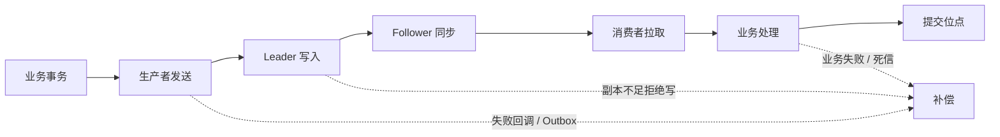

# Kafka 怎么保证消息不丢失？

## 一句话回答

> Kafka 消息不丢失不是一个参数可以保证的，需要同时保证生产者发送成功、Broker 副本可靠保存、消费者业务成功后再提交位点，并对最终失败建立重试、补偿、告警和故障演练。

## 面试考察点

- 能否把端到端链路拆成生产者、Broker、消费者和业务系统。
- 是否理解 `acks=all` 必须与副本数、ISR 和最小同步副本一起配置。
- 是否知道发送成功、写入 Leader、写入副本和业务处理成功是不同状态。
- 能否正确解释消费位点提交时机。
- 是否具备处理超时、进程崩溃、磁盘故障和机房故障的完整方案。

## 消息可能在哪些环节丢失



```text
业务事务
   ↓
生产者缓冲与网络发送
   ↓
Kafka Leader 写入
   ↓
Follower 副本同步
   ↓
消费者拉取
   ↓
业务处理与位点提交
```

任何箭头都可能失败。讨论“不丢失”之前，必须定义消息从哪里产生、以哪个系统为事实源，以及什么状态算最终成功。

## 生产者端怎么保证

### 1. 正确设置确认级别

- `acks=0`：不等待 Broker 确认，吞吐高但发送失败不容易发现。
- `acks=1`：Leader 写入后返回，Leader 突然故障且副本未同步时可能丢失。
- `acks=all`：等待 ISR 中满足条件的副本确认，可靠性最高。

生产环境的关键消息通常使用 `acks=all`，但它不是绝对保证，还要配合副本配置。

### 2. 开启幂等生产者

网络超时后，生产者无法确认 Broker 是否已经写入，通常需要重试。不开启幂等时，重试可能写入重复消息；幂等生产者使用 Producer ID 和序列号，让 Broker 对单个生产者会话的重复批次去重。

幂等生产者解决的是 Kafka 写入重试重复，不会自动保证数据库与 Kafka 双写一致，也不会让消费业务幂等。

### 3. 处理最终发送失败

异步 `send` 不代表消息一定成功。必须检查回调、Future 或框架提供的发送结果：

```java
producer.send(record, (metadata, exception) -> {
    if (exception != null) {
        log.error("kafka send failed, key={}", record.key(), exception);
        // 进入可靠补偿流程，而不是只打印日志
    }
});
```

重试必须有上限。达到重试上限后，应落入本地事件表、补偿队列或告警系统，不能静默丢弃。

### 4. 避免进程退出丢失缓冲消息

生产者会在客户端批量缓冲。应用优雅关闭时应停止接收新请求、等待正在发送的消息完成，再关闭 Producer。强制 `kill -9`、容器超时退出或机器掉电仍需依赖业务事实源补偿。

## Broker 端怎么保证

### 1. 设置合理副本数

关键 Topic 通常至少配置 3 个副本，并分布到不同 Broker 和故障域。单副本 Topic 即使使用 `acks=all`，也只有 Leader 一份数据。

### 2. 配置最小同步副本

`min.insync.replicas` 规定使用 `acks=all` 时至少需要多少个 ISR 副本保持同步。例如副本数为 3、最小同步副本为 2，可以容忍一个副本暂时离线；若同步副本不足，Broker 拒绝写入，而不是冒险接受只有一份的数据。

```text
replication.factor = 3
min.insync.replicas = 2
producer acks = all
```

这组配置用一部分可用性换取数据安全。副本不足时业务会收到写入失败，所以生产者必须正确处理失败。

### 3. 禁止不安全 Leader 选举

落后太多的副本不在 ISR 中。若允许它在 Leader 故障时成为新 Leader，可能丢失尚未同步的数据。关键集群应避免以数据丢失换可用性，并通过容量和运维保证 ISR 稳定。

### 4. 监控副本健康

必须持续关注：

- Under Replicated Partitions。
- ISR 频繁收缩和扩张。
- Offline Partitions。
- Broker 磁盘使用率与请求延迟。
- Controller 和 Leader 频繁切换。

副本参数正确但磁盘长期接近满载，仍可能在故障时失去保护能力。

## 消费者端怎么保证

### 1. 业务成功后再提交位点

如果先提交位点再执行业务，消费者崩溃后 Kafka 会认为消息已经消费，业务结果却没有产生，形成真正的消息丢失。

推荐顺序：

```text
拉取消息 → 处理业务 → 业务成功 → 提交位点
```

这样崩溃时可能重复消费，但不会因为位点超前而跳过消息。重复问题通过幂等解决。

### 2. 批量消费不能越过失败消息

一批包含 100 条消息，若第 50 条失败，却提交了第 100 条的位点，第 50 条不会再次收到。应按分区维护连续成功位点，失败时停止推进该分区或使用可控的重试、死信策略。

### 3. 正确处理再均衡

再均衡前应停止接收新任务、等待已领取消息在合理时间内完成，并提交已连续处理成功的位点。若业务线程与 poll 线程分离，需要记录每个分区的完成水位，不能简单提交最后拉取位置。

### 4. 下游失败不能直接吞掉

数据库超时、第三方接口失败或数据格式异常都要有明确策略：有限重试、延迟重试、死信队列、人工补偿。捕获异常后只记录日志并返回成功，相当于主动丢失消息。

## 数据库与 Kafka 双写怎么保证

业务先写数据库再发送 Kafka，会出现数据库成功但发送失败；先发 Kafka 再写数据库，则可能消息成功但业务事务失败。

常见解决方案是 Transactional Outbox：

```text
同一个数据库事务：写业务表 + 写事件表
                       ↓
后台投递任务读取事件表
                       ↓
发送 Kafka，成功后标记已投递
```

数据库事务保证业务状态和事件同时存在。投递任务可以重试，消费者仍需幂等。也可以通过 Binlog CDC 把数据库变更转换为 Kafka 消息。

## Kafka 事务适用什么场景

Kafka 事务可以将多分区写入和消费位点提交组成原子操作，适合 Kafka-to-Kafka 的处理链路。例如消费原 Topic、转换后写入目标 Topic，并同时提交源位点。

它不能直接把普通 MySQL 事务和 Kafka 写入变成一个全局事务。跨系统仍需要 Outbox、幂等和补偿。

## 消息保留与误操作风险

消息可能不是在发送链路丢失，而是消费前已经超过保留时间或 Topic 被误删。需要根据最大故障恢复时间设置保留周期和磁盘容量，并限制删除 Topic、缩短保留时间等高风险权限。

## 线上排查流程

1. 根据业务消息 ID 查询生产端是否创建事件。
2. 检查发送回调、重试和最终失败记录。
3. 根据 Topic、Partition、Offset 确认 Broker 中是否存在。
4. 检查副本、ISR 和 Leader 切换历史。
5. 检查消费者位点是否已经越过目标消息。
6. 检查业务日志、幂等表和死信队列。
7. 明确是未生产、未写入、已过期、位点超前还是业务处理失败。

## 常见误区

- `acks=all` 不等于绝对不丢，它依赖副本和 ISR 配置。
- 自动提交位点不等于自动保证业务成功。
- Kafka 保存了消息，不代表数据库和第三方业务结果成功。
- 无限重试不是可靠性，会造成阻塞和重试风暴。
- 副本不能替代跨集群备份和业务补偿。

## 核心考点清单

- 端到端可靠性必须覆盖生产、存储、消费和业务落地。
- 生产端使用 `acks=all`、幂等、有限重试并处理最终失败。
- Broker 使用多副本、合理 ISR 和最小同步副本。
- 消费端在业务成功后提交位点，宁可重复，不要位点超前。
- 数据库与 Kafka 一致性优先使用 Outbox 或 CDC。
- 配置之外还需要监控、补偿、权限控制和故障演练。

## 高频追问与参考回答

### 追问 1：acks=all 后 Leader 宕机还会丢吗？

若副本数、ISR 和最小同步副本配置合理，已确认消息会存在于足够副本中，可由同步副本接任 Leader。但若允许不安全选举、磁盘同时损坏或跨故障域部署不合理，仍可能丢失。

### 追问 2：为什么通常选择至少一次而不是最多一次？

最多一次可能在位点先提交、业务后失败时丢消息。至少一次允许失败后重放，再通过业务幂等消除重复，通常更符合关键业务可靠性要求。

### 追问 3：发送超时意味着消息没进 Kafka 吗？

不一定。Broker 可能已经写入，只是响应丢失。生产者需要重试和幂等，不能根据超时直接认定失败或生成新的业务消息 ID。

### 追问 4：消费者处理成功但提交位点失败怎么办？

消息会再次消费，因此业务必须幂等。下次处理识别已完成后返回成功，再推进位点。

### 追问 5：如何证明系统真的不丢消息？

通过业务唯一 ID 建立生产、Kafka、消费和业务结果的全链路审计，定期对账，并演练 Broker 宕机、网络超时、消费者崩溃和数据库失败，而不是只检查配置。

<!-- depth-standard:start -->
## 完整链路：从输入到结果

沿着「业务事务形成待发送事件 → 生产者带幂等与确认发送 → Broker 在 ISR 内复制 → 消费者处理业务副作用 → 提交位点并通过对账闭环」观察输入、状态与输出，下面每个阶段都对应一个可以在源码、日志或系统表中验证的位置。

### 1. 业务事务形成待发送事件

数据库状态与发送动作之间用 Outbox 或 CDC 形成可恢复证据，避免提交后进程崩溃丢消息。

### 2. 生产者带幂等与确认发送

生产者启用幂等、acks=all 和有界重试，超时按结果未知处理而不是生成新业务请求。

### 3. Broker 在 ISR 内复制

replication.factor 与 min.insync.replicas 共同决定故障时写入是否继续以及能承受几个副本损失。

### 4. 消费者处理业务副作用

消费者先完成业务事务，最终写入点用唯一约束或状态机幂等，不能把内存处理完成当成成功。

### 5. 提交位点并通过对账闭环

offset 在业务成功后提交，投递记录、业务结果和位点按事件 ID 对账，修复长期差异。

## 源码与实现定位

| 入口 | 阅读重点 |
| --- | --- |
| Outbox 表/binlog | 业务提交到事件证据 |
| Producer/Replica/Consumer 指标 | 端到端确认 |

源码或系统表应按上表顺序追踪：先确认入口实际走到哪条路径，再用运行时数据验证，而不是仅凭类名或配置推测。

## 参数配置与可复现实验

```text
acks=all; enable.idempotence=true; min.insync.replicas=2
```

在数据库提交、发送、Broker 确认、业务提交各窗口 kill 进程并按 event_id 对账。

## 验证步骤与预期结果

### 1. 固定输入和基线

先在没有故障注入的环境执行上述配置，固定数据规模、并发度、运行时版本和预热时间。以「Outbox 未投递」为主基线，记录值应满足「记录分区基线」；同时保存 Outbox 未投递数、生产确认与错误率，使后续变化能够回到同一时间轴比较。

### 2. 从实现入口确认路径

在「Outbox 表/binlog」确认请求确实进入「业务提交到事件证据」对应的实现，再沿「Producer/Replica/Consumer 指标」观察「端到端确认」。如果入口路径都未命中，就不应继续调整下游参数，而应先检查调用条件、版本或路由是否与假设一致。

### 3. 注入本文特有的失败模式

优先复现「生产者超时后换业务 ID 重发造成重复」，并把单一变量逐级放大，直到「Outbox 未投递」越过「超过基线 2 倍」。随后再分别验证「ISR 不足仍允许不干净选主」和「消费先提交 offset 后写数据库」，三类故障分开执行，避免多个变量同时变化而无法归因。

### 4. 执行止损和根因修复

第一轮只应用「事务 Outbox/CDC」，确认它能控制影响范围；第二轮应用「生产端 all+幂等」，验证核心链路恢复；最后落实「消费唯一约束+对账」，消除同类问题再次出现的条件。每一步都保留变更前后数据，不用“感觉变快了”替代测量。

### 5. 通过退出条件

实验只有同时满足三项才算通过：「Outbox 未投递」回到「记录分区基线」、「P99 延迟」回到「小于业务预算」、「端到端差异」回到「0」，并且业务结果差异为零。若性能恢复但结果不一致，仍应视为失败；若指标恢复后很快再次越线，则说明只完成了临时止损，没有消除根因。

## 量化基线

| 指标 | 样例基线/口径 | 风险线 | 结论 |
| --- | --- | --- | --- |
| Outbox 未投递 | 记录分区基线 | 超过基线 2 倍 | 发送窗口 |
| P99 延迟 | 小于业务预算 | 突破预算 | 发送窗口 |
| 端到端差异 | 0 | 任意非零 | 停止并对账 |

这些数值是实验口径或示例告警线，不是可复制到所有系统的固定答案；上线阈值应由本系统稳态、峰值和故障演练共同确定。

## 事故复盘：数据库提交成功但 Kafka 中没有订单事件

服务在事务提交后同步 send，进程在两步间崩溃。Kafka 配置再可靠也看不到未发送事件。把事件写入同库 Outbox，由独立发布器重试并记录 broker offset 后消除窗口。

| 失败模式 | 首要证据 | 第一处置动作 |
| --- | --- | --- |
| 生产者超时后换业务 ID 重发造成重复 | Outbox 未投递数 | 事务 Outbox/CDC |
| ISR 不足仍允许不干净选主 | 生产确认与错误率 | 生产端 all+幂等 |
| 消费先提交 offset 后写数据库 | ISR/URP | 消费唯一约束+对账 |

## 发布与回滚检查点

- **发布前**：确认「Outbox 表/binlog」对应实现和上述配置在目标版本仍然有效，并保存「Outbox 未投递」基线。
- **灰度中**：同时观察 Outbox 未投递数、生产确认与错误率、ISR/URP；任一指标越过表中风险线，就停止继续扩量。
- **回滚时**：先执行「事务 Outbox/CDC」控制影响，再回退代码或参数；涉及持久状态时必须额外核对结果差异。
- **发布后**：至少覆盖一个完整峰值周期，确认「生产者超时后换业务 ID 重发造成重复」没有再次出现，才关闭变更观察窗口。

## 方案对比与选型

| 方案 | 更适合的场景 | 主要收益 | 代价与边界 |
| --- | --- | --- | --- |
| 同步 send + 回调 | 低频且业务可接受明确失败 | 链路简单 | 数据库提交与发送仍有双写窗口 |
| 事务 Outbox | 数据库状态必须对应事件 | 本地事务原子、可重试对账 | 投递延迟与表治理 |
| CDC 读取 binlog | 多服务统一捕获数据库变更 | 业务侵入低、顺序证据强 | 运维、Schema 演进和回放复杂 |

选型至少带上 消息速率、峰值带宽、分区数、消息大小和积压恢复时间，并用上面的量化基线验证；未知数据应明确为待测假设。

## 设计边界与工程取舍

> “不丢消息”必须定义确认边界和故障模型；跨数据库与 Kafka 的可靠性只能由持久事件、幂等和对账共同完成。

工程落地遵循：可靠性来自生产、Broker、消费和业务幂等的完整闭环。回答时直接引用「Outbox 表/binlog」、配置实验和事故数据，比复述固定模板更有说服力。
<!-- depth-standard:end -->
