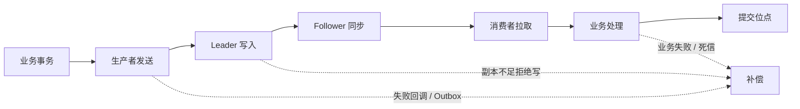

# Kafka 怎么保证消息不丢失？

## 先说结论

> Kafka 消息不丢失不是一个参数可以保证的，需要同时保证生产者发送成功、Broker 副本可靠保存、消费者业务成功后再提交位点，并对最终失败建立重试、补偿、告警和故障演练。

## 消息可能在哪些环节丢失



```text
业务事务
   ↓
生产者缓冲与网络发送
   ↓
Kafka Leader 写入
   ↓
Follower 副本同步
   ↓
消费者拉取
   ↓
业务处理与位点提交
```

任何箭头都可能失败。讨论“不丢失”之前，必须定义消息从哪里产生、以哪个系统为事实源，以及什么状态算最终成功。

## 生产者端怎么保证

### 1. 正确设置确认级别

- `acks=0`：不等待 Broker 确认，吞吐高但发送失败不容易发现。
- `acks=1`：Leader 写入后返回，Leader 突然故障且副本未同步时可能丢失。
- `acks=all`：等待 ISR 中满足条件的副本确认，可靠性最高。

生产环境的关键消息通常使用 `acks=all`，但它不是绝对保证，还要配合副本配置。

### 2. 开启幂等生产者

网络超时后，生产者无法确认 Broker 是否已经写入，通常需要重试。不开启幂等时，重试可能写入重复消息；幂等生产者使用 Producer ID 和序列号，让 Broker 对单个生产者会话的重复批次去重。

幂等生产者解决的是 Kafka 写入重试重复，不会自动保证数据库与 Kafka 双写一致，也不会让消费业务幂等。

### 3. 处理最终发送失败

异步 `send` 不代表消息一定成功。必须检查回调、Future 或框架提供的发送结果：

```java
producer.send(record, (metadata, exception) -> {
    if (exception != null) {
        log.error("kafka send failed, key={}", record.key(), exception);
        // 进入可靠补偿流程，而不是只打印日志
    }
});
```

重试必须有上限。达到重试上限后，应落入本地事件表、补偿队列或告警系统，不能静默丢弃。

### 4. 避免进程退出丢失缓冲消息

生产者会在客户端批量缓冲。应用优雅关闭时应停止接收新请求、等待正在发送的消息完成，再关闭 Producer。强制 `kill -9`、容器超时退出或机器掉电仍需依赖业务事实源补偿。

## Broker 端怎么保证

### 1. 设置合理副本数

关键 Topic 通常至少配置 3 个副本，并分布到不同 Broker 和故障域。单副本 Topic 即使使用 `acks=all`，也只有 Leader 一份数据。

### 2. 配置最小同步副本

`min.insync.replicas` 规定使用 `acks=all` 时至少需要多少个 ISR 副本保持同步。例如副本数为 3、最小同步副本为 2，可以容忍一个副本暂时离线；若同步副本不足，Broker 拒绝写入，而不是冒险接受只有一份的数据。

```text
replication.factor = 3
min.insync.replicas = 2
producer acks = all
```

这组配置用一部分可用性换取数据安全。副本不足时业务会收到写入失败，所以生产者必须正确处理失败。

### 3. 禁止不安全 Leader 选举

落后太多的副本不在 ISR 中。若允许它在 Leader 故障时成为新 Leader，可能丢失尚未同步的数据。关键集群应避免以数据丢失换可用性，并通过容量和运维保证 ISR 稳定。

### 4. 监控副本健康

必须持续关注：

- Under Replicated Partitions。
- ISR 频繁收缩和扩张。
- Offline Partitions。
- Broker 磁盘使用率与请求延迟。
- Controller 和 Leader 频繁切换。

副本参数正确但磁盘长期接近满载，仍可能在故障时失去保护能力。

## 消费者端怎么保证

### 1. 业务成功后再提交位点

如果先提交位点再执行业务，消费者崩溃后 Kafka 会认为消息已经消费，业务结果却没有产生，形成真正的消息丢失。

推荐顺序：

```text
拉取消息 → 处理业务 → 业务成功 → 提交位点
```

这样崩溃时可能重复消费，但不会因为位点超前而跳过消息。重复问题通过幂等解决。

### 2. 批量消费不能越过失败消息

一批包含 100 条消息，若第 50 条失败，却提交了第 100 条的位点，第 50 条不会再次收到。应按分区维护连续成功位点，失败时停止推进该分区或使用可控的重试、死信策略。

### 3. 正确处理再均衡

再均衡前应停止接收新任务、等待已领取消息在合理时间内完成，并提交已连续处理成功的位点。若业务线程与 poll 线程分离，需要记录每个分区的完成水位，不能简单提交最后拉取位置。

### 4. 下游失败不能直接吞掉

数据库超时、第三方接口失败或数据格式异常都要有明确策略：有限重试、延迟重试、死信队列、人工补偿。捕获异常后只记录日志并返回成功，相当于主动丢失消息。

## 数据库与 Kafka 双写怎么保证

业务先写数据库再发送 Kafka，会出现数据库成功但发送失败；先发 Kafka 再写数据库，则可能消息成功但业务事务失败。

常见解决方案是 Transactional Outbox：

```text
同一个数据库事务：写业务表 + 写事件表
                       ↓
后台投递任务读取事件表
                       ↓
发送 Kafka，成功后标记已投递
```

数据库事务保证业务状态和事件同时存在。投递任务可以重试，消费者仍需幂等。也可以通过 Binlog CDC 把数据库变更转换为 Kafka 消息。

## Kafka 事务适用什么场景

Kafka 事务可以将多分区写入和消费位点提交组成原子操作，适合 Kafka-to-Kafka 的处理链路。例如消费原 Topic、转换后写入目标 Topic，并同时提交源位点。

它不能直接把普通 MySQL 事务和 Kafka 写入变成一个全局事务。跨系统仍需要 Outbox、幂等和补偿。

## 消息保留与误操作风险

消息可能不是在发送链路丢失，而是消费前已经超过保留时间或 Topic 被误删。需要根据最大故障恢复时间设置保留周期和磁盘容量，并限制删除 Topic、缩短保留时间等高风险权限。

## 线上排查流程

1. 根据业务消息 ID 查询生产端是否创建事件。
2. 检查发送回调、重试和最终失败记录。
3. 根据 Topic、Partition、Offset 确认 Broker 中是否存在。
4. 检查副本、ISR 和 Leader 切换历史。
5. 检查消费者位点是否已经越过目标消息。
6. 检查业务日志、幂等表和死信队列。
7. 明确是未生产、未写入、已过期、位点超前还是业务处理失败。

## 容易踩坑的地方

- `acks=all` 不等于绝对不丢，它依赖副本和 ISR 配置。
- 自动提交位点不等于自动保证业务成功。
- Kafka 保存了消息，不代表数据库和第三方业务结果成功。
- 无限重试不是可靠性，会造成阻塞和重试风暴。
- 副本不能替代跨集群备份和业务补偿。

## 常见问题

### 追问 1：acks=all 后 Leader 宕机还会丢吗？

若副本数、ISR 和最小同步副本配置合理，已确认消息会存在于足够副本中，可由同步副本接任 Leader。但若允许不安全选举、磁盘同时损坏或跨故障域部署不合理，仍可能丢失。

### 追问 2：为什么通常选择至少一次而不是最多一次？

最多一次可能在位点先提交、业务后失败时丢消息。至少一次允许失败后重放，再通过业务幂等消除重复，通常更符合关键业务可靠性要求。

### 追问 3：发送超时意味着消息没进 Kafka 吗？

不一定。Broker 可能已经写入，只是响应丢失。生产者需要重试和幂等，不能根据超时直接认定失败或生成新的业务消息 ID。

### 追问 4：消费者处理成功但提交位点失败怎么办？

消息会再次消费，因此业务必须幂等。下次处理识别已完成后返回成功，再推进位点。

### 追问 5：如何证明系统真的不丢消息？

通过业务唯一 ID 建立生产、Kafka、消费和业务结果的全链路审计，定期对账，并演练 Broker 宕机、网络超时、消费者崩溃和数据库失败，而不是只检查配置。
