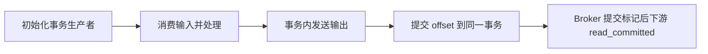

# Kafka 事务和 Exactly-Once 语义如何实现？

## 面试考察点

- 是否区分幂等生产者与事务生产者。
- 能否解释 Kafka-to-Kafka 的原子读处理写。
- 是否知道外部数据库不自动纳入 Kafka 事务。

## 核心答案

> 幂等生产者通过 Producer ID、序列号和 Broker 去重，避免单会话重试造成分区内重复；Kafka 事务可把多分区写入和消费位点提交放进同一事务。消费者使用 `read_committed` 时只读取已提交事务，从而支持 Kafka 内部处理链路的 Exactly-Once。

Exactly-Once 是有范围的语义，不代表发送邮件、调用支付接口或写普通数据库也会自动恰好执行一次。

## 事务流程

生产者配置稳定且唯一的 transactional.id，初始化事务、发送结果记录，再把来源消费位点加入事务并提交。实例故障后，新的 epoch 会隔离旧生产者，防止僵尸实例继续写入。

## Kafka 内事务的完整链路

```text
消费 input-topic offset N
      ↓
处理并写 output-topic 记录
      ↓
把 N+1 位点加入同一事务
      ↓
commitTransaction
      ↓
read_committed 消费者同时看到输出和新位点
```

若事务提交失败或生产者崩溃，输出记录对 read_committed 消费者不可见，来源位点也不会推进，重启后可安全重新处理。它将“输出写入”和“输入进度”绑定在 Kafka 内部，而不是把任意外部副作用放进一个魔法全局事务。

## 幂等与事务的关系

幂等生产者主要解决协议重试导致的同一记录重复写入，范围是一个 producer 会话与分区；事务在此基础上组织多个分区写入、消费位点提交和失败隔离。开启事务不意味着应用主动执行两次业务 send 会自动合并，两次不同的业务操作仍是两条记录。

transactional.id 必须对同一逻辑生产者稳定且在并发实例之间不冲突。新实例使用相同 ID 会提高 epoch 并 fenced 旧实例，避免网络分区时两个“同一身份”同时写入。

## 消费者隔离级别

默认消费者可能读取未提交事务写入的数据边界；设置 `isolation.level=read_committed` 后会跳过已中止事务并等待未完成事务的稳定边界。这个选择会影响延迟和可见性，整个需要 Exactly-Once 的下游链路都应保持一致的隔离设置。

## 外部系统为什么仍需 Outbox

```text
数据库事务提交成功
        ↓
Outbox 表记录 order.paid 事件
        ↓
CDC/投递器发布 Kafka
        ↓
消费者以事件 ID/版本幂等落库
```

Kafka 事务无法原子提交 MySQL 的订单更新和 Kafka topic 写入。Outbox 把“业务状态”和“待投递事件”放到同一数据库事务，之后通过可重试的异步投递收敛；消费者同样需要唯一约束或状态机处理重复。

## 性能和运维成本

事务维护协调器状态、超时、marker 写入和额外 RPC，会增加延迟和资源使用。应只用于需要 Kafka-to-Kafka 原子处理的链路，并监控事务超时、abort、fencing、未完成事务和 broker 资源。长事务会阻塞 read_committed 消费进度，事务范围应尽量短。

## 外部系统一致性

写数据库并发 Kafka 消息通常采用 Outbox、CDC 或业务幂等。消费者落库使用唯一键、版本状态机和事务，把“处理结果”和“去重记录”原子提交。

## 常见误区

事务会增加请求、延迟和状态管理成本，不应用于所有普通发送。消费者若使用默认隔离级别，可能看到未提交或已中止事务相关的数据边界，必须按链路要求配置。

## 高频追问与参考回答

### 追问：幂等生产者能防止应用重复调用 send 吗？

不能。它主要去除协议重试的重复；应用主动发送两次不同记录仍会写入，业务重复需要业务键和下游幂等处理。

### 追问：Exactly-Once 是否等于消息只处理一次？

不是。处理代码可能重跑，Exactly-Once 描述的是在规定范围内对可见输出的等价效果。跨数据库、邮件、支付等副作用仍需要业务幂等和补偿。

### 追问：事务超时会发生什么？

协调器会中止长时间未完成事务，生产者后续提交失败，需要终止当前处理并重新初始化或恢复。事务内不能包含长时间阻塞操作。

### 追问：read_uncommitted 适合什么场景？

不要求事务隔离、追求最低延迟或用于诊断时可使用；但它可能看到之后被中止的记录，业务必须能容忍或自行过滤。

## 总结

Kafka 事务解决 Kafka 内部多写与位点的原子性，跨外部系统仍要靠本地事务、可靠事件和业务幂等闭环。

<!-- depth-standard:start -->
## 机制全景图

下面把「Kafka 事务和 Exactly-Once 语义如何实现？」从输入到结果压缩成一条可复述的主链路。面试时先用图建立全局坐标，再进入局部实现，能避免只背零散结论。



## 完整链路：从输入到结果

沿着「初始化事务生产者 → 消费输入并处理 → 事务内发送输出 → 提交 offset 到同一事务 → Broker 提交标记后下游 read_committed」观察输入、状态与输出，下面每个阶段都对应一个可以在源码、日志或系统表中验证的位置。

### 1. 初始化事务生产者

transactional.id 让 Broker 识别生产者世代并 fencing 旧实例，避免僵尸生产者继续提交。

### 2. 消费输入并处理

消费-处理-生产循环把输出记录和输入 offset 放入一个 Kafka 事务。

### 3. 事务内发送输出

sendOffsetsToTransaction 绑定当前消费组元数据，使输入进度与输出结果共同提交。

### 4. 提交 offset 到同一事务

Broker 追加事务提交/中止标记，失败重试通过幂等序列号避免日志重复。

### 5. Broker 提交标记后下游 read_committed

read_committed 消费者跳过未提交和已中止记录，但数据库、HTTP 等外部副作用不在 Kafka 事务内。

## 源码与实现定位

| 入口 | 阅读重点 |
| --- | --- |
| TransactionCoordinator | 事务状态与 marker |
| ProducerStateManager | PID/epoch fencing |

源码或系统表应按上表顺序追踪：先确认入口实际走到哪条路径，再用运行时数据验证，而不是仅凭类名或配置推测。

## 参数配置与可复现实验

```text
isolation.level=read_committed
processing.guarantee=exactly_once_v2
```

在 sendOffsetsToTransaction 前后 kill 进程，核对输入位点与输出原子性。

## 验证步骤与预期结果

### 1. 固定输入和基线

先在没有故障注入的环境执行上述配置，固定数据规模、并发度、运行时版本和预热时间。以「transaction abort」为主基线，记录值应满足「记录分区基线」；同时保存 事务提交/中止率、producer fencing，使后续变化能够回到同一时间轴比较。

### 2. 从实现入口确认路径

在「TransactionCoordinator」确认请求确实进入「事务状态与 marker」对应的实现，再沿「ProducerStateManager」观察「PID/epoch fencing」。如果入口路径都未命中，就不应继续调整下游参数，而应先检查调用条件、版本或路由是否与假设一致。

### 3. 注入本文特有的失败模式

优先复现「把 Kafka EOS 延伸解释到数据库」，并把单一变量逐级放大，直到「transaction abort」越过「超过基线 2 倍」。随后再分别验证「transactional.id 多实例冲突互相 fencing」和「事务过长超过 timeout」，三类故障分开执行，避免多个变量同时变化而无法归因。

### 4. 执行止损和根因修复

第一轮只应用「稳定唯一 transactional.id」，确认它能控制影响范围；第二轮应用「事务时长小于 timeout」，验证核心链路恢复；最后落实「外部数据库仍做幂等」，消除同类问题再次出现的条件。每一步都保留变更前后数据，不用“感觉变快了”替代测量。

### 5. 通过退出条件

实验只有同时满足三项才算通过：「transaction abort」回到「记录分区基线」、「P99 延迟」回到「小于业务预算」、「端到端差异」回到「0」，并且业务结果差异为零。若性能恢复但结果不一致，仍应视为失败；若指标恢复后很快再次越线，则说明只完成了临时止损，没有消除根因。

## 量化基线

| 指标 | 样例基线/口径 | 风险线 | 结论 |
| --- | --- | --- | --- |
| transaction abort | 记录分区基线 | 超过基线 2 倍 | 事务失败 |
| P99 延迟 | 小于业务预算 | 突破预算 | 事务失败 |
| 端到端差异 | 0 | 任意非零 | 停止并对账 |

这些数值是实验口径或示例告警线，不是可复制到所有系统的固定答案；上线阈值应由本系统稳态、峰值和故障演练共同确定。

## 事故复盘：流处理输出不重复但数据库仍重复更新

Kafka Streams 输出 Topic 使用 EOS，随后消费者调用数据库普通 INSERT，重放时仍重复。EOS 边界只覆盖 Kafka 内部；数据库需唯一业务键、幂等 upsert 或 Outbox/CDC 协调。

| 失败模式 | 首要证据 | 第一处置动作 |
| --- | --- | --- |
| 把 Kafka EOS 延伸解释到数据库 | 事务提交/中止率 | 稳定唯一 transactional.id |
| transactional.id 多实例冲突互相 fencing | producer fencing | 事务时长小于 timeout |
| 事务过长超过 timeout | read_committed 延迟 | 外部数据库仍做幂等 |

## 发布与回滚检查点

- **发布前**：确认「TransactionCoordinator」对应实现和上述配置在目标版本仍然有效，并保存「transaction abort」基线。
- **灰度中**：同时观察 事务提交/中止率、producer fencing、read_committed 延迟；任一指标越过表中风险线，就停止继续扩量。
- **回滚时**：先执行「稳定唯一 transactional.id」控制影响，再回退代码或参数；涉及持久状态时必须额外核对结果差异。
- **发布后**：至少覆盖一个完整峰值周期，确认「把 Kafka EOS 延伸解释到数据库」没有再次出现，才关闭变更观察窗口。

## 方案对比与选型

| 方案 | 更适合的场景 | 主要收益 | 代价与边界 |
| --- | --- | --- | --- |
| 幂等生产者 | 只防生产重试写重复 | 默认易用、开销低 | 不原子绑定多个分区与消费位点 |
| Kafka 事务/EOS | consume-transform-produce 全在 Kafka | 位点与输出原子 | 事务开销、超时与隔离级别复杂 |
| 业务幂等/Outbox | 副作用跨数据库或外部系统 | 覆盖最终资源 | 需要状态表、重试和对账 |

选型至少带上 消息速率、峰值带宽、分区数、消息大小和积压恢复时间，并用上面的量化基线验证；未知数据应明确为待测假设。

## 设计边界与工程取舍

> Exactly-once 必须说明边界；Kafka EOS 可以保证 Kafka 读写闭环一次生效，边界外仍需要幂等和可恢复协议。

工程落地遵循：可靠性来自生产、Broker、消费和业务幂等的完整闭环。回答时直接引用「TransactionCoordinator」、配置实验和事故数据，比复述固定模板更有说服力。
<!-- depth-standard:end -->
