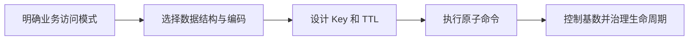

# Redis 有哪些数据结构？分别适合什么场景？

## 一句话回答

> Redis 不只是 Key-Value 缓存，它提供 String、Hash、List、Set、Sorted Set、Bitmap、HyperLogLog、Geo、Stream 等结构。选型要同时考虑访问模式、时间复杂度、元素数量、单元素大小、持久化成本和集群分片限制。

## 面试考察点

- 能否区分 Redis 对外数据类型和内部编码。
- 是否知道常用命令的复杂度与阻塞风险。
- 能否根据业务访问模式选择结构，而不是全部使用 String JSON。
- 是否理解大 Key、热 Key 和 Hash Slot 的影响。
- 能否说明 Bitmap、HyperLogLog 和 Stream 的适用边界。

## Redis Key 的设计原则

推荐使用具有层次但不过长的命名：

```text
业务:模块:实体:标识
order:detail:10001
user:profile:9527
activity:stock:20260722:sku123
```

Key 需要：

- 能定位业务归属，方便监控和清理。
- 长度适中，海量长 Key 会浪费内存。
- 避免包含密码、手机号等敏感明文。
- 设计明确 TTL，不让临时数据永久驻留。
- 在 Redis Cluster 中需要多 Key 原子操作时，合理使用 Hash Tag。

## String

String 是最基础类型，可以保存字符串、整数、浮点数或二进制数据，单 Value 不应无限增大。

典型场景：

- 缓存序列化对象。
- 计数器和限流计数。
- 分布式锁的锁值。
- Session、验证码和临时令牌。
- 使用位操作保存 Bitmap。

```text
SET user:token:9527 abc EX 1800
INCR article:view:1001
SET activity:stock:sku1 10000
```

`INCR` 在单 Key 上原子，适合简单计数。但读取后再由客户端计算并 SET 不是原子操作，复合逻辑应使用 Lua 或事务能力。

## String 缓存对象的优缺点

把整个用户对象序列化为 JSON，读取简单、一次网络往返即可获得全部字段。但修改一个字段需要重写整个对象，也无法只读取局部字段。

对象较小、总是整体读写时适合 String；字段独立更新且经常只读部分字段时，可以考虑 Hash。

## Hash

Hash 在一个 Redis Key 下保存多个 Field-Value：

```text
HSET user:9527 name "Tom" level 8 city "Shanghai"
HGET user:9527 level
HINCRBY user:9527 level 1
```

适合：

- 用户资料、商品属性等字段集合。
- 需要局部读取和局部更新的对象。
- 同一业务实体下的小型计数集合。

Hash 的字段通常不能独立设置 TTL，过期作用于整个 Key。若字段生命周期差异大，应拆分 Key 或使用其他模型。

## List

List 是有序字符串序列，支持两端插入和弹出：

```text
LPUSH task:queue task-1
RPOP task:queue
LRANGE feed:user:9527 0 19
```

适合简单队列、最新记录列表和固定长度历史：

```text
LPUSH user:9527:history event
LTRIM user:9527:history 0 99
```

但 List 不具备 Kafka 式消费组、持久 Offset、重放和大规模消息治理。可靠消息队列更适合 Redis Stream、Kafka 或专业 MQ。

不要对超大 List 执行 `LRANGE 0 -1`，一次返回所有元素会阻塞 Redis 和网络。

## Set

Set 保存无序、不重复成员，支持交集、并集和差集：

```text
SADD article:1001:likes user1 user2
SISMEMBER article:1001:likes user1
SINTER user:1:tags user:2:tags
```

典型场景：

- 用户关注、点赞和去重。
- 标签集合。
- 共同好友、共同兴趣。
- 抽奖候选集合。

大集合直接执行交集可能消耗大量 CPU。应限制集合规模、在从库或离线系统计算，或提前维护结果。

## Sorted Set

Sorted Set 的成员唯一，每个成员有一个 Score，并按 Score 排序：

```text
ZADD game:rank 9800 user1 9200 user2
ZREVRANGE game:rank 0 99 WITHSCORES
ZRANK game:rank user1
```

典型场景：

- 排行榜。
- 按时间排序的任务。
- 延迟队列。
- 滑动窗口限流。
- 用户活跃度排名。

延迟队列可以把执行时间作为 Score，消费者查询到期元素。但多消费者抢占、失败重试和可靠删除需要 Lua 或专门状态设计，复杂场景应使用专业延迟消息能力。

## Bitmap

Bitmap 基于 String 的位操作，用一个 Bit 表示某个状态：

```text
SETBIT sign:202607 userId 1
GETBIT sign:202607 userId
BITCOUNT sign:202607
```

适合用户 ID 相对连续、状态只有是/否的签到、活跃和布尔标记。一亿用户每天一个 Bitmap 理论数据体约 12MB，比保存一亿个字符串节省很多。

若用户 ID 极度稀疏且最大值很大，会产生巨大空洞，应该先做紧凑映射或使用 Set。

## HyperLogLog

HyperLogLog 用固定较小内存估算集合基数：

```text
PFADD page:uv:20260722 user1 user2
PFCOUNT page:uv:20260722
```

适合 UV、独立设备数等允许小误差的统计。它不能列出具体成员，也不能用于要求精确结果的计费和财务场景。

## Geo

Geo 用于存储经纬度并进行附近和距离查询：

```text
GEOADD shops 121.47 31.23 shop1
GEOSEARCH shops FROMLONLAT 121.48 31.22 BYRADIUS 5 km
```

适合附近门店、骑手和车辆的粗粒度查询。复杂地图路径、行政区域和高精度空间分析应使用专业 GIS 数据库。

## Stream

Stream 是 Redis 的日志型消息结构，支持消息 ID、消费者组、Pending List 和 ACK：

```text
XADD order:events * orderId 1001 status PAID
XREADGROUP GROUP order-group consumer-1 COUNT 10 STREAMS order:events >
XACK order:events order-group message-id
```

适合中小规模事件流、任务队列和需要消费者组的场景。生产使用时需要处理：

- Pending 消息认领。
- 消费者故障与超时。
- Stream 长度裁剪。
- 消息幂等。
- Redis 内存和持久化压力。

超大吞吐、长期消息保留和跨机房消息系统通常更适合 Kafka。

## Bitfield

Bitfield 可以在一个 String 中按指定宽度读写整数，适合压缩保存多个小范围状态。例如游戏属性、用户日状态，但可读性和维护成本较高，应有明确编码协议。

## 内部编码为什么重要

Redis 会根据数据量和元素大小选择紧凑编码或常规结构。例如小 Hash、List、ZSet 可能使用紧凑的 Listpack，超过阈值后转换为哈希表、双向结构或跳表等。

内部编码是实现细节，版本之间会变化。工程上应关注元素数量、单元素大小和命令复杂度，不应依赖某个版本固定实现。

## 时间复杂度与阻塞风险

Redis 命令大多很快，但单线程执行命令时，O(N) 操作的 N 很大就会阻塞其他请求。

高风险操作包括：

- `KEYS *` 扫描全库。
- 对大集合执行 `SMEMBERS`、`HGETALL`。
- 超长 List 全量 `LRANGE`。
- 大集合交集、并集和差集。
- 删除特别大的 Key。

使用 `SCAN`、`HSCAN`、`SSCAN`、`ZSCAN` 分批遍历。删除大 Key 可使用异步删除命令或先拆分，但仍需评估后台释放内存的压力。

## Big Key 怎么定义

Big Key 不只看字节大小，也看元素数量和访问命令：

- 数十 MB 的 String 是 Big Key。
- 包含百万成员的小元素 Hash 也是 Big Key。
- 高频访问的中等 Key 还可能同时是 Hot Key。

Big Key 会造成网络阻塞、主从同步延迟、迁移困难和删除抖动。应在设计阶段拆分，并定期扫描内存分布。

## Hot Key 怎么处理

热点商品、首页配置或活动库存可能集中访问单个 Key：

- 在应用内增加短 TTL 本地缓存。
- 使用只读副本分担读请求。
- 对可拆数据使用 Key 分片。
- 限流和请求合并。
- 将超级热点业务隔离到独立实例。

写热点无法通过普通读副本解决。库存等原子写 Key 拆分会增加一致性复杂度，必须先确认单 Key 已成为真实瓶颈。

## Redis Cluster 中的多 Key 操作

Redis Cluster 将 Key 映射到 16384 个 Slot。多 Key 原子命令通常要求 Key 位于同一 Slot，可使用 Hash Tag：

```text
order:{1001}:detail
order:{1001}:items
```

花括号中的内容参与 Slot 计算。Hash Tag 使用过度会把大量 Key 集中到一个 Slot，造成数据倾斜。

## 数据结构选型表

| 需求 | 推荐结构 | 注意点 |
| --- | --- | --- |
| 对象整体缓存 | String | 修改需要整体重写 |
| 对象字段更新 | Hash | TTL 作用于整个 Key |
| 简单双端队列 | List | 不适合复杂可靠消息 |
| 去重和关系集合 | Set | 大集合运算可能阻塞 |
| 排行榜和时间排序 | ZSet | Score 精度和大 Key |
| 大量布尔状态 | Bitmap | ID 稀疏会浪费空间 |
| 近似 UV | HyperLogLog | 有误差，不能取成员 |
| 附近位置 | Geo | 不替代专业 GIS |
| 消费组消息流 | Stream | Pending、裁剪和幂等 |

## 常见误区

- Redis 所有命令都是 O(1)。
- 所有对象都序列化成 JSON String 最简单。
- Set 做交集一定很快，不考虑成员数量。
- Stream 可以无成本替代 Kafka。
- `SCAN` 完全没有性能影响。
- Big Key 只指 Value 字节很大。
- Cluster 使用 Hash Tag 越多越好。

## 核心考点清单

- Redis 对外类型和内部编码是两个层次。
- String 适合整体对象和计数，Hash 适合字段级读写。
- Set 处理去重关系，ZSet 处理带 Score 排序。
- Bitmap、HyperLogLog 分别适合布尔状态和近似基数。
- Stream 支持消费者组，但仍要治理 Pending、幂等和内存。
- O(N) 命令作用于大 Key 时会阻塞 Redis。
- 选型要同时考虑复杂度、内存、TTL、分片和运维。

## 高频追问与参考回答

### 追问 1：String 和 Hash 缓存对象怎么选？

对象总是整体读写、字段少时使用 String 简单；需要局部字段更新和读取时使用 Hash。还要考虑序列化成本、TTL 粒度和对象大小。

### 追问 2：为什么 Redis 快？

数据主要在内存，核心命令的数据结构高效；事件循环减少锁竞争和线程切换；网络协议和实现经过优化。但大 Key、慢命令和网络仍会让 Redis 变慢。

### 追问 3：排行榜为什么使用 ZSet？

成员唯一、Score 有序，能高效完成分数更新、排名和区间查询。相同 Score 的顺序还要结合成员字典序和业务是否需要额外排序规则。

### 追问 4：Bitmap 一亿用户需要多少内存？

一亿位约为 12MB，不包括 Key 和对象元数据。前提是用户 ID 紧凑连续，若最大 ID 极大但实际用户很少会浪费空间。

### 追问 5：如何发现 Big Key？

使用 Redis 自带内存分析能力、采样扫描和监控工具，在低峰期检查 Value 字节和集合元素数。线上避免直接执行会遍历全库或读取整个大 Value 的命令。

### 追问 6：List、Stream 和 Kafka 怎么选？

List 适合简单临时队列；Stream 适合 Redis 内中小规模、需要消费组和 ACK 的消息；Kafka 更适合高吞吐、长期保留、重放和大型消息生态。

<!-- depth-standard:start -->
## 机制全景图

「Redis 有哪些数据结构？分别适合什么场景？」的实现链路如下，节点可与后面的源码和运行证据逐一对应。



## 源码与实现定位

| 入口 | 阅读重点 |
| --- | --- |
| src/t_hash.c/t_zset.c | Hash/ZSet 编码与命令 |
| OBJECT ENCODING/MEMORY USAGE | 实际编码与字节 |

源码或系统表应按上表顺序追踪：先确认入口实际走到哪条路径，再用运行时数据验证，而不是仅凭类名或配置推测。

## 参数配置与可复现实验

```shell
OBJECT ENCODING key
MEMORY USAGE key SAMPLES 10
```

对相同业务数据使用 Hash、JSON String、ZSet，比较字节、命令时延与超过编码阈值后的突变。

## 验证步骤与预期结果

### 1. 固定输入和基线

先在没有故障注入的环境执行上述配置，固定数据规模、并发度、运行时版本和预热时间。以「Value P99」为主基线，记录值应满足「<业务上限」；同时保存 每类 Key 数量、Value 大小分位值，使后续变化能够回到同一时间轴比较。

### 2. 从实现入口确认路径

在「src/t_hash.c/t_zset.c」确认请求确实进入「Hash/ZSet 编码与命令」对应的实现，再沿「OBJECT ENCODING/MEMORY USAGE」观察「实际编码与字节」。如果入口路径都未命中，就不应继续调整下游参数，而应先检查调用条件、版本或路由是否与假设一致。

### 3. 注入本文特有的失败模式

优先复现「用 KEYS 扫描生产全库」，并把单一变量逐级放大，直到「Value P99」越过「>1MB示例」。随后再分别验证「集合无上限演变为大 Key」和「TTL 同秒到期引发负载尖峰」，三类故障分开执行，避免多个变量同时变化而无法归因。

### 4. 执行止损和根因修复

第一轮只应用「按访问模式换结构」，确认它能控制影响范围；第二轮应用「Key 加版本与 TTL」，验证核心链路恢复；最后落实「大集合按时间/租户拆分」，消除同类问题再次出现的条件。每一步都保留变更前后数据，不用“感觉变快了”替代测量。

### 5. 通过退出条件

实验只有同时满足三项才算通过：「Value P99」回到「<业务上限」、「成员数」回到「有生命周期上限」、「编码转换点」回到「容量测试覆盖」，并且业务结果差异为零。若性能恢复但结果不一致，仍应视为失败；若指标恢复后很快再次越线，则说明只完成了临时止损，没有消除根因。

## 量化基线

| 指标 | 样例基线/口径 | 风险线 | 结论 |
| --- | --- | --- | --- |
| Value P99 | <业务上限 | >1MB示例 | Big Key |
| 成员数 | 有生命周期上限 | 持续无界 | 拆窗口 |
| 编码转换点 | 容量测试覆盖 | 生产突变 | 调模型/阈值 |

这些数值是实验口径或示例告警线，不是可复制到所有系统的固定答案；上线阈值应由本系统稳态、峰值和故障演练共同确定。

## 事故复盘：排行榜更新正确但内存持续增长

ZSet 保存所有历史用户且从不淘汰，成员数增长到数千万，备份与故障恢复都变慢。按赛季分 Key、只保留活跃窗口并把历史落到持久存储后，实时榜才保持可控。

| 失败模式 | 首要证据 | 第一处置动作 |
| --- | --- | --- |
| 用 KEYS 扫描生产全库 | 每类 Key 数量 | 按访问模式换结构 |
| 集合无上限演变为大 Key | Value 大小分位值 | Key 加版本与 TTL |
| TTL 同秒到期引发负载尖峰 | 命令复杂度与延迟 | 大集合按时间/租户拆分 |

## 发布与回滚检查点

- **发布前**：确认「src/t_hash.c/t_zset.c」对应实现和上述配置在目标版本仍然有效，并保存「Value P99」基线。
- **灰度中**：同时观察 每类 Key 数量、Value 大小分位值、命令复杂度与延迟；任一指标越过表中风险线，就停止继续扩量。
- **回滚时**：先执行「按访问模式换结构」控制影响，再回退代码或参数；涉及持久状态时必须额外核对结果差异。
- **发布后**：至少覆盖一个完整峰值周期，确认「用 KEYS 扫描生产全库」没有再次出现，才关闭变更观察窗口。

## 设计边界与工程取舍

> 数据结构选择要同时满足操作语义和生命周期；能用 Redis 表达不代表应把无界历史或复杂分析长期放在 Redis。
<!-- depth-standard:end -->
